# LLMWiki 企业级知识库平台 — 完整架构设计

**项目代号**：LLMWiki | **文档版本**：v1.0（2026-08-28）
**设计哲学**：「Markdown 是唯一真相之源；知识不是被检索的，是被持续编译的。」
本文档聚焦架构设计，不涉及具体代码实现。

---

## 目录

1. [总体架构概览](#1-总体架构概览)
2. [服务拆分与模块设计](#2-服务拆分与模块设计)
3. [Brain Compiler 编译引擎详细设计](#3-brain-compiler-编译引擎详细设计)
4. [权限模型详细设计](#4-权限模型详细设计)
5. [数据架构设计](#5-数据架构设计)
6. [核心流程设计](#6-核心流程设计)
7. [接口设计](#7-接口设计)
8. [部署架构](#8-部署架构)
9. [可观测性设计](#9-可观测性设计)
10. [安全设计](#10-安全设计)
11. [项目目录结构](#11-项目目录结构)

---

## 1. 总体架构概览

### 1.1 系统全局架构图

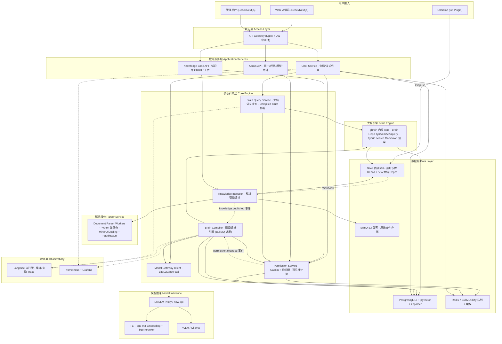

### 1.2 分层说明

| 层次 | 职责 | 组件 |
|---|---|---|
| **接入层** | 统一入口、SSL 卸载、负载均衡、JWT 验证、限流 | Nginx |
| **应用服务层** | 直接面向客户端的业务 API，处理 HTTP 请求/SSE 流式 | Chat Service、Admin API、KB API |
| **核心引擎层** | 系统差异化逻辑：编译编排、权限计算、大脑查询、模型路由 | Brain Compiler、Brain Query、Permission Service、Model Gateway Client |
| **大脑引擎** | 单人 Brain Repo 全循环：ingest → query → maintain | gbrain (npm) |
| **解析服务** | 多格式文档 → Markdown 转换 | Python Workers (MinerU/Docling/PaddleOCR) |
| **数据层** | 持久化存储（关系/向量/文件/版本化知识） | PostgreSQL+pgvector、Redis、Gitea、MinIO |
| **模型推理** | LLM/Embedding/Reranker 统一网关 | LiteLLM、TEI、vLLM/Ollama |
| **观测层** | 全链路 Trace、指标监控、告警 | Langfuse、Prometheus+Grafana |

### 1.3 核心设计原则

| 原则 | 描述 |
|---|---|
| **编译优于检索** | 回答来自编译好的 Compiled Truth，而非临时碎片拼装 |
| **每人一脑** | 每个用户拥有独立 Brain Repo（Git 版本化），编译产物按用户物理隔离 |
| **权限即视图边界** | 权限变更立即触发该用户大脑重编译，撤销类变更最高优先级 |
| **双保险安全** | 编译视图隔离 + 查询时权限过滤，防编译滞后窗口越权 |
| **索引是编译产物** | 向量/全文索引随时可从 Brain Repo 重建，换模型/损坏不丢知识 |
| **异步最终一致** | 编译流水线异步执行，懒编译保证查询不阻塞 |
| **成本可控** | dirty 合并去重、优先级调度、编译 LLM 配额、Langfuse 成本监控 |

---

## 2. 服务拆分与模块设计

### 2.1 服务依赖关系图

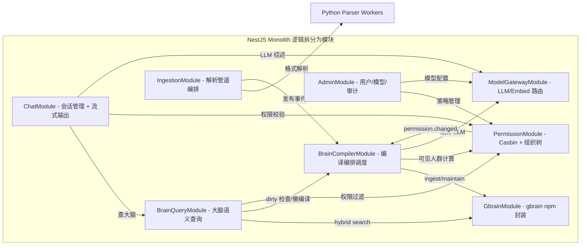

### 2.2 各服务/模块详细职责

#### 2.2.1 Chat Service（ChatModule）

| 子模块 | 职责 |
|---|---|
| **SessionManager** | 会话 CRUD、会话历史存取（PG + Redis 热缓存） |
| **StreamOrchestrator** | SSE 流式输出编排：Brain Query → LLM 综述 → 流式推送 |
| **CitationAligner** | 引用三级回溯对齐：答案 [n] ↔ 知识页 Compiled Truth 段落 ↔ Timeline 证据条目 ↔ 原始文档 |
| **QueryRewriter** | (P1) 结合会话历史的指代消解与查询改写 |
| **KBScopeResolver** | 知识库范围选择器逻辑：默认「我可见的全部」，支持用户勾选子集 |

#### 2.2.2 Brain Query Service（BrainQueryModule）

| 子模块 | 职责 |
|---|---|
| **TopicLocator** | 问题 → 大脑主题页定位（gbrain hybrid search：语义 + 关键词，仅在该用户大脑范围内） |
| **DirtyChecker** | 检查命中主题页是否为 dirty，是则触发懒编译后再回答 |
| **TruthComposer** | 从 Compiled Truth 提取作答素材，组织为 LLM prompt context |
| **EvidenceLinker** | 证据链对齐：知识页 → Timeline 条目 → 原始文档元数据 |

#### 2.2.3 Brain Compiler Service（BrainCompilerModule）★ 核心差异化

| 子模块 | 职责 |
|---|---|
| **TriggerHandler** | 监听三类触发事件：knowledge.published / permission.changed / dream.cron |
| **DirtyQueueManager** | 管理 dirty(user, topic) 队列（BullMQ）：合并去重、优先级排序 |
| **CompileScheduler** | 调度策略：权限收缩 > 懒编译 > 活跃用户/热点主题 > 夜间全量 |
| **CompileExecutor** | 执行编译四步骤：READ → GATHER → WRITE → SYNC |
| **CostController** | 编译 LLM 用量配额管理、批量合并、Langfuse 成本追踪 |
| **DreamCycleRunner** | 夜间 Dream Cycle：矛盾检测、过期提醒、同主题合并、孤儿清理、交叉引用修复 |

#### 2.2.4 Knowledge Ingestion Service（IngestionModule）

| 子模块 | 职责 |
|---|---|
| **UploadHandler** | 文件上传接收、MinIO 原始文件存储 |
| **ParseRouter** | 按文件类型路由到对应解析器（MinerU/Docling/PaddleOCR/原生 Markdown） |
| **ParseJobManager** | 解析任务队列管理（BullMQ），状态机：上传 → 解析中 → 已解析 → 索引中 → 已发布 |
| **GitCommitter** | 解析后的 Markdown commit 到源知识库 Gitea 仓库 |
| **WebhookReceiver** | 接收 Gitea Webhook（Obsidian push 触发），解析新增/变更文件 |
| **PublishEmitter** | 发布 knowledge.published 事件，触发 Brain Compiler |

#### 2.2.5 Permission Service（PermissionModule）

| 子模块 | 职责 |
|---|---|
| **CasbinEngine** | node-casbin 封装，RBAC with Domains 策略求值 |
| **OrgTreeManager** | 组织树 CRUD、物化路径维护、祖先链计算 |
| **VisibilityCalculator** | visible_kbs(user) 计算：个人库 ∪ 组织库继承 ∪ 行业库 ACL |
| **GrantManager** | 行业库 ACL 授权管理（user/role/org × 有效期） |
| **PermEventEmitter** | 权限变更事件发布（permission.changed），通知 Brain Compiler |
| **CacheManager** | Redis 可见性缓存（TTL + 权限变更即时失效） |

#### 2.2.6 Admin Service（AdminModule）

| 子模块 | 职责 |
|---|---|
| **UserManager** | 用户 CRUD、LDAP/OIDC 同步 |
| **OrgManager** | 组织架构管理（代理 PermissionModule） |
| **ModelConfigManager** | LLM/Embedding/Reranker 三类模型的供应商与模型配置、连接测试 |
| **AuditLogger** | 审计日志记录（登录、查询、知识变更、编译记录、权限变更） |
| **KBManager** | 三级知识库 CRUD、管理员任免 |

#### 2.2.7 Model Gateway（ModelGatewayModule）

| 子模块 | 职责 |
|---|---|
| **ProviderRegistry** | 供应商注册与连接管理 |
| **ModelRouter** | 按用途路由（编译用 LLM / 查询用 LLM / Embedding / Reranker） |
| **ConnectionTester** | 模型连接测试（最小请求验证） |
| **UsageTracker** | Token 用量统计，编译/查询分别计费 |

#### 2.2.8 gbrain Module（GbrainModule）

| 子模块 | 职责 |
|---|---|
| **BrainRepoManager** | Brain Repo 生命周期管理（创建/同步/归档/删除） |
| **IngestAdapter** | 封装 gbrain ingest：实体检测 → Truth 重写 → Timeline 追加 → 交叉引用 |
| **SearchAdapter** | 封装 gbrain hybrid search（vector + FTS + RRF 融合） |
| **MaintainAdapter** | 封装 gbrain maintain：矛盾检测、过期检查、合并、孤儿清理 |
| **EmbedAdapter** | 封装 gbrain embed：增量向量化与 FTS 索引更新 |

#### 2.2.9 Document Parser Workers（Python 微服务）

| 子模块 | 职责 |
|---|---|
| **DoclingSvc** | Docling 引擎：docx/pptx/html → Markdown（默认主引擎） |
| **MinerUSvc** | MinerU 引擎：复杂 PDF（扫描件/表格/公式） → Markdown |
| **OCRSvc** | PaddleOCR：图片 → 文本 |
| **ParseAPI** | FastAPI HTTP 接口，接收文件 URL + 配置 → 返回 Markdown 结果 |

#### 2.2.10 前端应用（Next.js）

| 页面/模块 | 职责 |
|---|---|
| **ChatView** | 对话界面：消息列表、流式输出、引用面板、知识库选择器 |
| **KBExplorer** | 知识库浏览：目录树、Markdown 阅读器、文件上传、搜索 |
| **AdminConsole** | 管理后台：用户/组织/角色/知识库/模型/审计 |
| **BrainViewer** | (P2) 个人大脑可视化：主题图谱、Compiled Truth 阅读、Timeline 浏览 |

---

## 3. Brain Compiler 编译引擎详细设计

> Brain Compiler 是系统的**核心差异化**组件。它将无序的碎片知识面向每一个人持续编译为结构化的「Compiled Truth + Timeline 证据链」，这是 LLMWiki 与所有检索式 RAG 产品的本质区别。

### 3.1 编译触发器设计

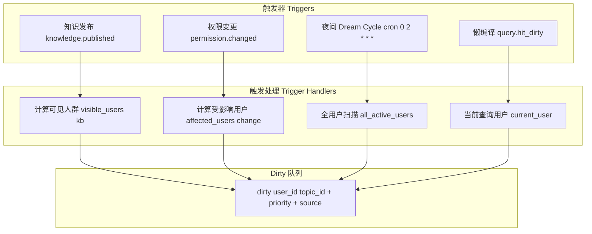

**触发器详细规则**：

| 触发器 | 事件载荷 | 处理逻辑 | 优先级 |
|---|---|---|---|
| **knowledge.published** | `{kb_id, doc_id, topics[], action: create/update/delete}` | 权限中心计算 `visible_users(kb_id)` → 对每用户标记 `dirty(user, topic)` | NORMAL |
| **permission.changed (授权)** | `{user_id, kb_ids[], action: grant}` | 新可见知识编译进该用户大脑（增量） | NORMAL |
| **permission.changed (撤销)** | `{user_id, kb_ids[], action: revoke}` | 该用户大脑中对应内容**即时移出** | **CRITICAL** |
| **permission.changed (调岗/组织)** | `{user_ids[], org_change}` | 受影响用户全量 dirty | HIGH |
| **dream.cron** | `{cycle_type: nightly}` | 全用户 maintain 扫描 | LOW |
| **query.hit_dirty** | `{user_id, topic_id}` | 先增量编译再回答（同步等待） | **IMMEDIATE** |

### 3.2 Dirty 队列模型与调度策略

**队列数据结构**（BullMQ Job）：

```
DirtyJob {
  user_id:      string      // 目标用户
  topic_id:     string      // 受影响主题
  source:       enum        // KNOWLEDGE_PUBLISH | PERMISSION_GRANT | PERMISSION_REVOKE |
                            // ORG_CHANGE | DREAM | LAZY_QUERY
  priority:     number      // 1(CRITICAL) ~ 5(LOW)
  kb_ids:       string[]    // 涉及的源知识库
  doc_ids:      string[]    // 涉及的源文档（可合并）
  created_at:   timestamp
  merged_count: number      // 合并去重计数
}
```

**调度优先级**（从高到低）：

| 优先级 | 类型 | 说明 |
|---|---|---|
| P1 CRITICAL | 权限撤销 | 安全合规，必须 5 分钟内完成 |
| P2 IMMEDIATE | 懒编译（查询触发） | 用户正在等待，同步阻塞 |
| P3 HIGH | 调岗/组织调整 | 影响面大，尽快处理 |
| P4 NORMAL | 知识发布/授权 | 常规编译，30 分钟内完成 |
| P5 LOW | 夜间 Dream | 低峰时段全量整理 |

**成本控制策略**：

| 策略 | 描述 |
|---|---|
| **合并去重** | 同一 (user, topic) 在队列中只保留一条，合并 doc_ids |
| **批量编译** | 同用户多主题合并为单次 gbrain 调用（减少上下文加载） |
| **活跃优先** | 近 7 天有查询行为的用户优先编译 |
| **冷用户延迟** | 超过 30 天无活动的用户仅在夜间 Dream 编译 |
| **懒编译兜底** | 未编译的主题在被查询时实时编译 |
| **编译配额** | 每用户每日编译 LLM token 上限（可配置） |
| **分级模型** | 增量编译用轻量模型，Dream 全量整理用重模型 |

### 3.3 编译执行流程

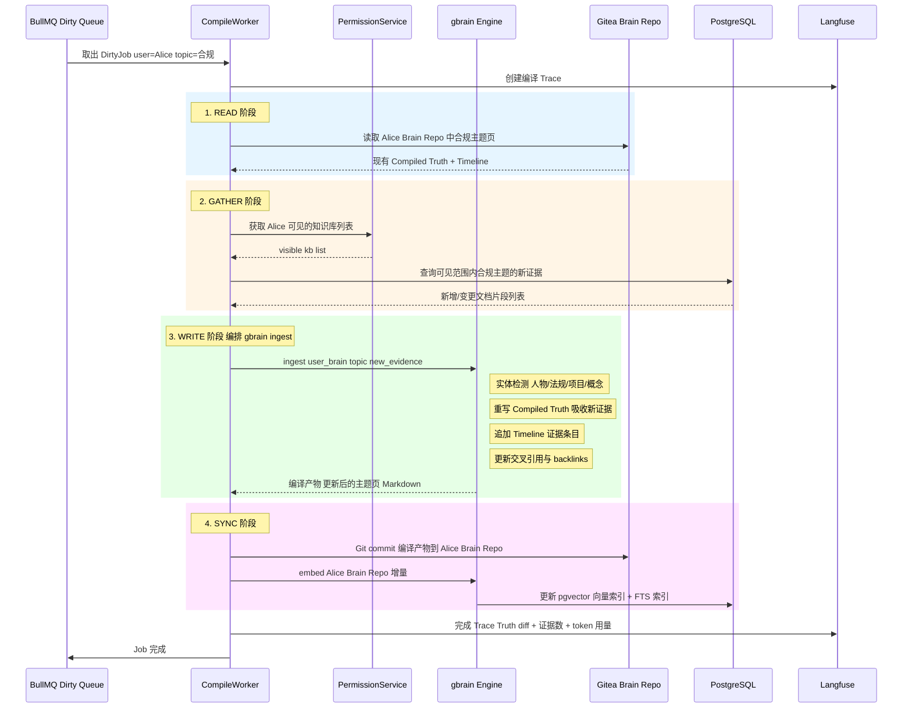

### 3.4 编译状态机

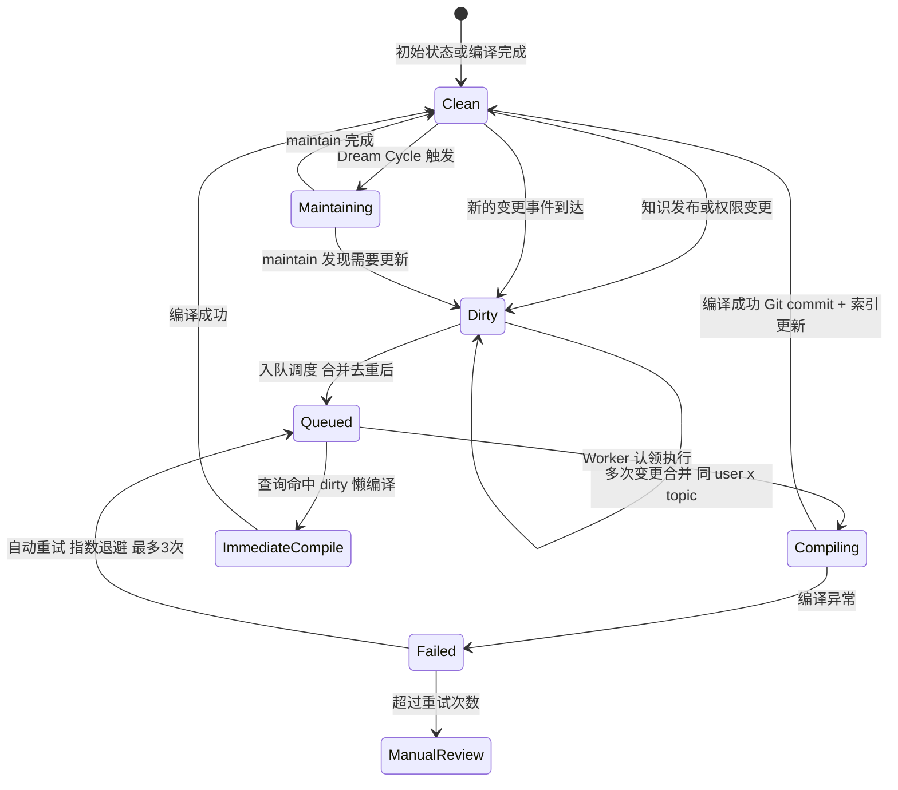

### 3.5 与 gbrain 的集成接口

gbrain 作为 npm 包直接在 NestJS 进程内调用，无网络开销。Brain Compiler 是 gbrain 的**多租户编排层**——把 gbrain 的单人循环放大到 N 人并行。

| gbrain 接口 | Brain Compiler 调用场景 | 说明 |
|---|---|---|
| `brain.init(repoPath)` | 用户首次查询/注册时 | 初始化个人 Brain Repo |
| `brain.ingest(signal)` | 编译执行 WRITE 阶段 | 实体检测→Truth→Timeline→交叉引用 |
| `brain.query(question, options)` | Brain Query 主题定位 | hybrid search（vector + FTS + RRF） |
| `brain.maintain(options)` | Dream Cycle | 矛盾检测/过期/合并/孤儿清理 |
| `brain.sync()` | 编译执行 SYNC 阶段 | Brain Repo Git 同步 |
| `brain.embed(options)` | 编译执行 SYNC 阶段 | 增量向量化 + FTS 索引更新 |

### 3.6 权限撤销快速通道

权限撤销涉及数据安全合规，必须在 **5 分钟内**完成重编译，且查询侧权限过滤始终生效（双保险）。

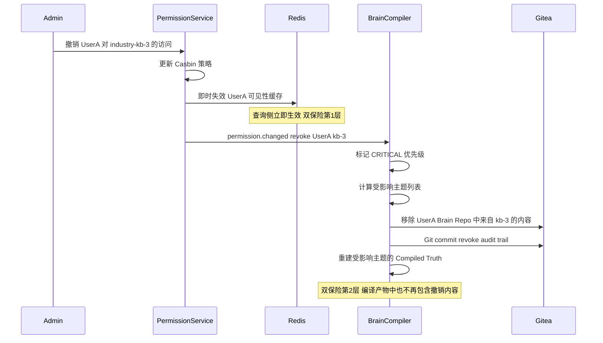

---

## 4. 权限模型详细设计

### 4.1 Casbin 模型定义

```ini
[request_definition]
r = sub, dom, obj, act

[policy_definition]
p = sub, dom, obj, act

[role_definition]
g = _, _, _

[policy_effect]
e = some(where (p.eft == allow))

[matchers]
m = g(r.sub, p.sub, r.dom) && (r.dom == p.dom || keyMatch(r.dom, p.dom)) && r.obj == p.obj && r.act == p.act
```

**约定**：
- `dom` = 知识库标识 `kb:{type}:{id}`
- `obj` = 操作对象（`kb` / `doc` / `admin`）
- `act` = 操作动作（`read` / `write` / `manage`）
- 个人库**不走策略**：服务层硬编码 `owner == user_id` 才可见

### 4.2 三级知识库可见性计算

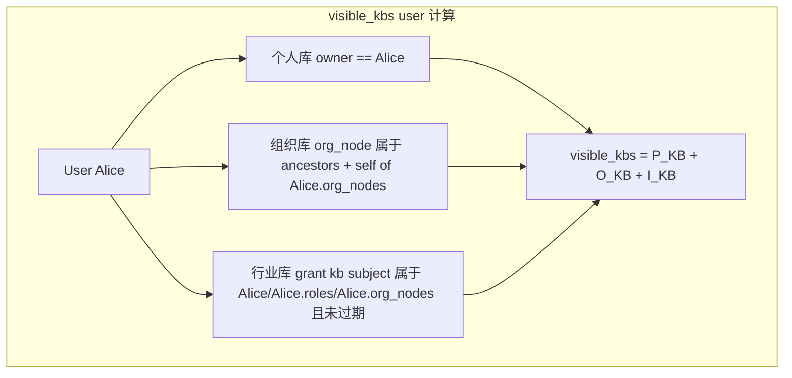

**组织库继承规则**：

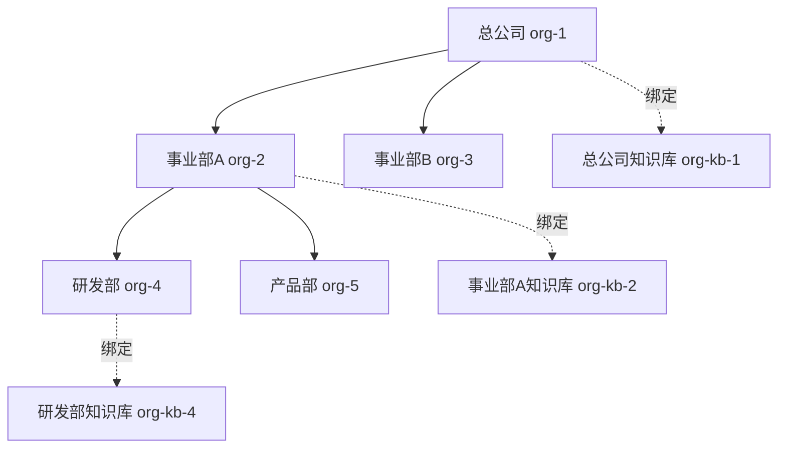

**可见性规则**：
- 研发部员工可见：org-kb-4 + org-kb-2 + org-kb-1（本级 + 所有上级）
- 事业部B员工可见：org-kb-1（仅总公司级）
- 所有人不可见其他人的个人库

### 4.3 权限变更事件流

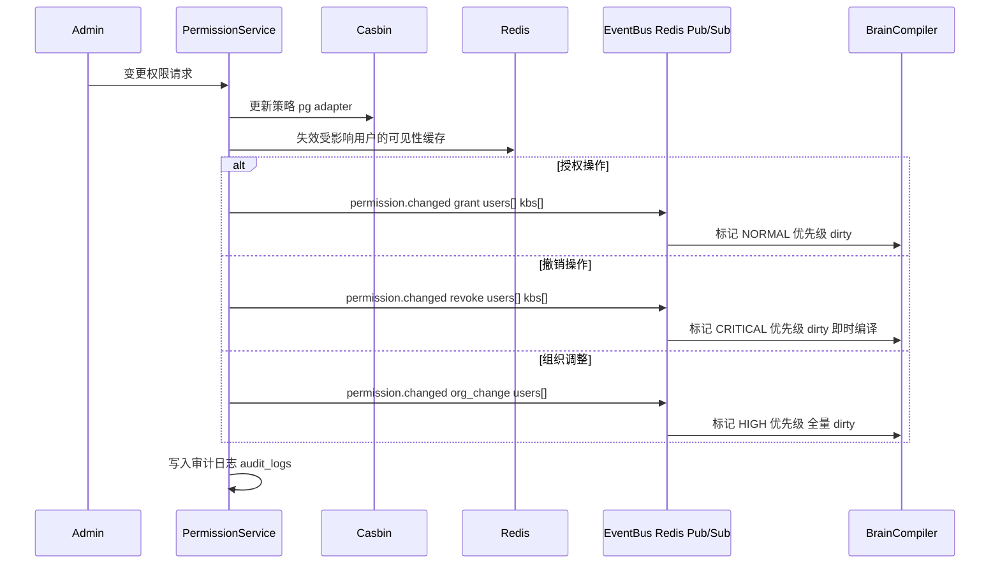

### 4.4 权限缓存策略

| 缓存项 | Key 格式 | TTL | 失效触发 |
|---|---|---|---|
| 用户可见知识库列表 | `perm:visible:{user_id}` | 10 分钟 | 该用户相关权限变更事件 |
| 组织树祖先链 | `org:ancestors:{org_id}` | 1 小时 | 组织树结构变更 |
| 行业库有效授权 | `grant:active:{kb_id}` | 5 分钟 | 授权变更/过期 |
| Casbin 策略缓存 | node-casbin 内置 Watcher | - | PG 策略表变更通知 |

---

## 5. 数据架构设计

### 5.1 ER 图

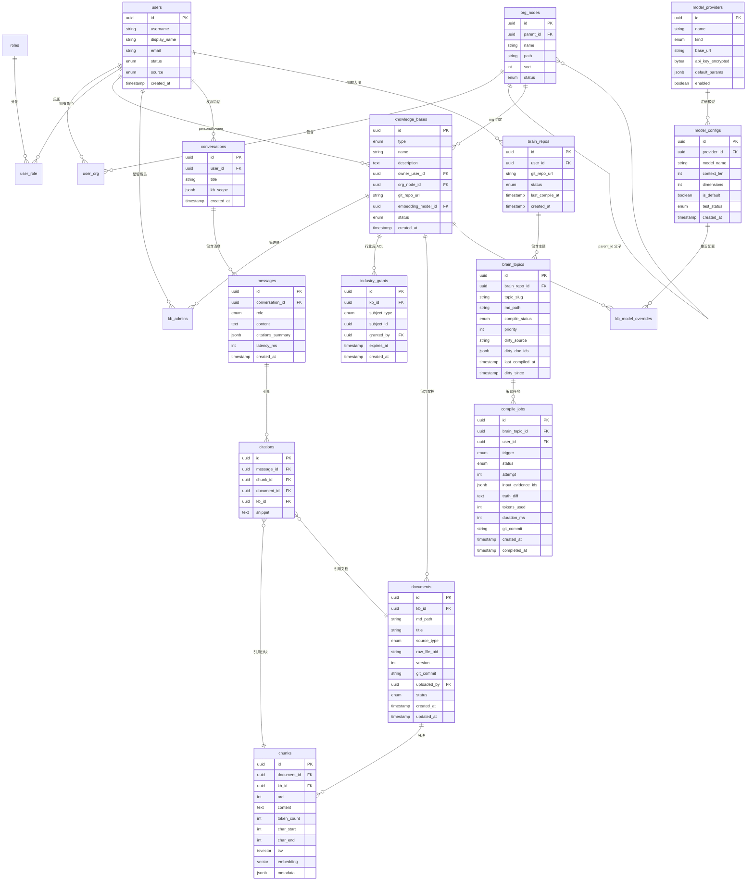

### 5.2 索引策略

| 表 | 索引 | 类型 | 用途 |
|---|---|---|---|
| `chunks` | `embedding` | HNSW (pgvector) | 向量语义检索，lists=100, ef_construction=200 |
| `chunks` | `tsv` | GIN | 全文检索（zhparser 中文分词） |
| `chunks` | `(kb_id, document_id)` | B-tree | 按库/文档过滤 |
| `brain_topics` | `(brain_repo_id, compile_status)` | B-tree | dirty 主题快速查找 |
| `brain_topics` | `(user_id, topic_slug)` | B-tree UNIQUE | 主题唯一性 |
| `compile_jobs` | `(user_id, status, created_at)` | B-tree | 编译任务查询 |
| `org_nodes` | `path` | B-tree (ltree) | 组织树祖先/后代查询 |
| `industry_grants` | `(kb_id, subject_type, subject_id)` | B-tree | ACL 查询 |
| `industry_grants` | `expires_at` | B-tree | 过期授权清理 |
| `documents` | `(kb_id, status)` | B-tree | 文档列表查询 |

### 5.3 Git 仓库存储方案

**两类仓库**：

| 仓库类型 | 命名规则 | 内容 | 写入者 |
|---|---|---|---|
| **源知识库 Repo** | `kb-{type}-{id}` | 管理员维护的原始 Markdown（解析后） | 管理员(Obsidian/Web)、Ingestion Service |
| **个人大脑 Repo** | `brain-{user_id}` | 编译产物：Compiled Truth + Timeline + 实体页 + 交叉引用 | Brain Compiler（自动） |

**大脑 Repo 目录结构**：

```
brain-alice/
├── topics/
│   ├── 数据合规/
│   │   ├── _truth.md          # Compiled Truth（顶部结论）
│   │   ├── _timeline.md       # Timeline（证据链，按时间倒序）
│   │   └── _refs.md           # 交叉引用与 backlinks
│   ├── 项目管理/
│   │   ├── _truth.md
│   │   ├── _timeline.md
│   │   └── _refs.md
│   └── ...
├── entities/
│   ├── 人物/
│   │   └── 张三.md            # 实体页
│   ├── 法规/
│   │   └── 数据出境管理办法.md
│   └── ...
├── _index.md                   # 大脑总索引
└── _meta.json                  # 编译元数据
```

### 5.4 数据分区与归档策略

| 数据 | 分区策略 | 归档策略 |
|---|---|---|
| `chunks` | 按 `kb_id` 范围分区 | 知识库归档时冻结分区 |
| `messages` | 按 `created_at` 月度分区 | 大于12 个月归档至冷存储 |
| `compile_jobs` | 按 `created_at` 月度分区 | 大于6 个月压缩归档 |
| `audit_logs` | 按 `created_at` 月度分区 | 留存 1 年以上 |
| 个人大脑 Repo | - | 冷用户（大于90 天无活动）Repo 归档压缩 |

---

## 6. 核心流程设计

### 6.1 知识摄入全流程

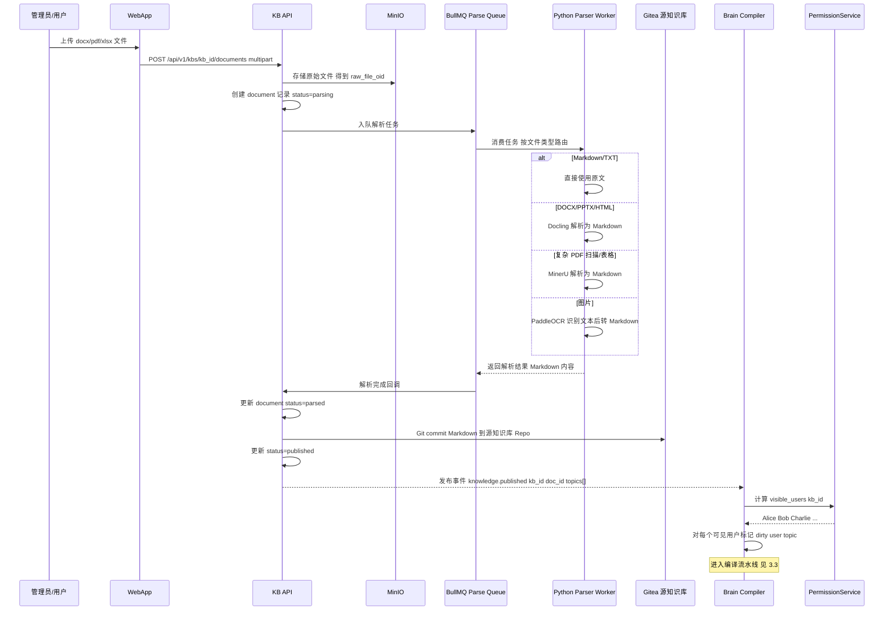

### 6.2 对话查询全流程

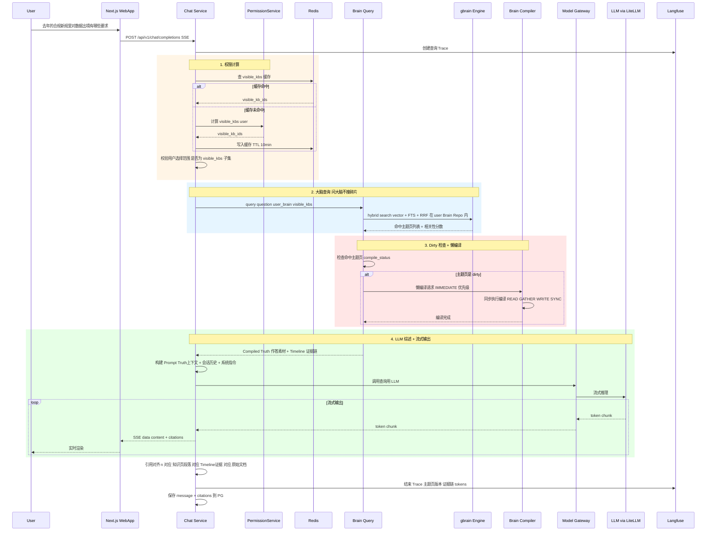

### 6.3 权限变更处理全流程

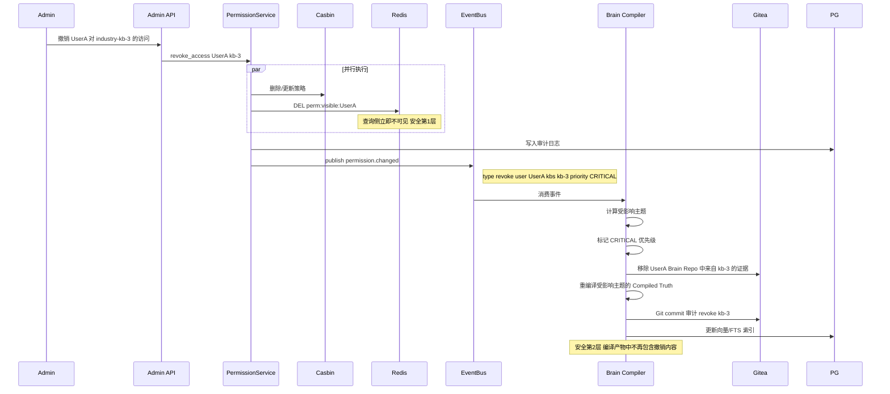

### 6.4 异常处理与回退策略

| 场景 | 处理策略 |
|---|---|
| **文档解析失败** | 标记 document status=failed，通知上传者，支持手动重试或更换解析引擎 |
| **编译失败（LLM 异常）** | 指数退避重试（1s→4s→16s，max 3 次）→ 标记 ManualReview → 该主题降级为碎片检索 |
| **编译产物校验失败** | 引用未指向真实证据→回滚本次编译→标记需人工审核 |
| **懒编译超时（>10s）** | 降级为碎片检索回答（仅用源知识库 chunks），异步继续编译 |
| **权限缓存不一致** | 查询侧始终做 Casbin 实时校验作为兜底，缓存仅用于加速 |
| **Gitea 不可用** | 队列暂停，编译任务等待恢复，查询使用最后已知状态 |
| **LLM 限流/配额耗尽** | 编译队列降速，查询侧使用已有 Compiled Truth（可能不是最新） |

---

## 7. 接口设计

### 7.1 RESTful API 概览

#### 认证接口 `/api/v1/auth`

| 方法 | 路径 | 描述 | 请求 | 响应 |
|---|---|---|---|---|
| POST | `/login` | 登录 | `{username, password}` | `{access_token, refresh_token, user}` |
| POST | `/refresh` | 刷新 Token | `{refresh_token}` | `{access_token}` |
| POST | `/logout` | 登出 | - | `204` |
| GET | `/oidc/callback` | OIDC 回调 | query params | redirect |

#### 对话接口 `/api/v1/chat`

| 方法 | 路径 | 描述 | 请求 | 响应 |
|---|---|---|---|---|
| POST | `/completions` | 对话流式输出 | `{message, conversation_id?, kb_scope?}` | SSE stream |
| GET | `/conversations` | 会话列表 | query: `page, limit` | `{items[], total}` |
| GET | `/conversations/:id` | 会话详情含消息 | - | `{conversation, messages[]}` |
| DELETE | `/conversations/:id` | 删除会话 | - | `204` |

#### 知识库接口 `/api/v1/kbs`

| 方法 | 路径 | 描述 | 请求 | 响应 |
|---|---|---|---|---|
| GET | `/` | 可见知识库列表 | query: `type, page, limit` | `{items[], total}` |
| POST | `/` | 创建知识库 | `{name, type, org_node_id?, description}` | `{kb}` |
| GET | `/:id` | 知识库详情 | - | `{kb, admins[], stats}` |
| PUT | `/:id` | 更新知识库信息 | `{name, description}` | `{kb}` |
| DELETE | `/:id` | 删除/归档知识库 | - | `204` |
| POST | `/:id/documents` | 上传文档 | multipart: files[] | `{documents[]}` |
| GET | `/:id/documents` | 文档列表 | query: `status, page` | `{items[], total}` |
| GET | `/:id/documents/:docId` | 文档详情/阅读 | - | `{document, markdown_content}` |
| DELETE | `/:id/documents/:docId` | 删除文档 | - | `204` |
| POST | `/:id/admins` | 添加管理员 | `{user_ids[]}` | `{admins[]}` |
| DELETE | `/:id/admins/:userId` | 移除管理员 | - | `204` |

#### 行业库授权接口 `/api/v1/kbs/:id/grants`

| 方法 | 路径 | 描述 | 请求 | 响应 |
|---|---|---|---|---|
| GET | `/` | 授权列表 | - | `{grants[]}` |
| POST | `/` | 添加授权 | `{subject_type, subject_id, expires_at?}` | `{grant}` |
| DELETE | `/:grantId` | 撤销授权 | - | `204` |

#### 大脑接口 `/api/v1/brain`

| 方法 | 路径 | 描述 | 请求 | 响应 |
|---|---|---|---|---|
| GET | `/status` | 个人大脑编译状态 | - | `{topics[], dirty_count, last_compile}` |
| GET | `/topics` | 大脑主题列表 | query: `page, status` | `{items[]}` |
| GET | `/topics/:slug` | 主题详情 | - | `{truth, timeline[], refs[]}` |

#### 管理接口 `/api/v1/admin`

| 方法 | 路径 | 描述 |
|---|---|---|
| CRUD | `/users` | 用户管理 |
| CRUD | `/orgs` | 组织树管理 |
| CRUD | `/roles` | 角色管理 |
| CRUD | `/models/providers` | 模型供应商管理 |
| CRUD | `/models/configs` | 模型配置管理 |
| POST | `/models/configs/:id/test` | 模型连接测试 |
| GET | `/audit/logs` | 审计日志查询 |
| GET | `/compile/stats` | 编译统计仪表盘 |

### 7.2 SSE 流式接口设计

**请求**：`POST /api/v1/chat/completions`

```json
{
  "message": "去年行业的合规新规里对数据出境有哪些要求？",
  "conversation_id": "uuid-or-null",
  "kb_scope": ["kb-org-12", "kb-industry-3"],
  "stream": true
}
```

**响应**（SSE 事件流）：

```
event: meta
data: {"conversation_id": "uuid", "message_id": "uuid", "brain_topics_hit": ["数据合规"]}

event: delta
data: {"content": "根据"}

event: delta
data: {"content": "《数据出境安全管理办法》"}

event: citation
data: {"index": 1, "topic_slug": "数据合规", "truth_section": "...",
       "timeline_entry": {"source_kb": "industry-kb-3", "doc_title": "管理办法解读.md",
       "raw_file_oid": "minio-key"}}

event: delta
data: {"content": "第七条规定……[1]"}

event: done
data: {"total_tokens": 1234, "latency_ms": 850, "citations_count": 3}
```

### 7.3 内部事件总线设计

事件总线基于 Redis Pub/Sub + BullMQ 实现。关键事件同时写入 `audit_logs` 表确保持久化。

| 事件名 | 载荷 | 生产者 | 消费者 |
|---|---|---|---|
| `knowledge.published` | `{kb_id, doc_id, topics[], action, user_id}` | IngestionModule | BrainCompiler |
| `knowledge.deleted` | `{kb_id, doc_id, user_id}` | IngestionModule | BrainCompiler |
| `permission.changed` | `{type: grant/revoke/org_change, users[], kbs[], priority}` | PermissionModule | BrainCompiler |
| `compile.completed` | `{user_id, topic_id, job_id, truth_version}` | BrainCompiler | Langfuse, AuditLogger |
| `compile.failed` | `{user_id, topic_id, job_id, error, attempt}` | BrainCompiler | AlertManager, AuditLogger |
| `document.parse_completed` | `{doc_id, kb_id, status}` | ParseWorker | IngestionModule |
| `document.parse_failed` | `{doc_id, kb_id, error}` | ParseWorker | IngestionModule, AlertManager |
| `model.config_changed` | `{kind, model_id, action}` | AdminModule | ModelGateway |
| `user.login` | `{user_id, ip, method}` | AuthModule | AuditLogger |

---

## 8. 部署架构

### 8.1 Docker Compose 部署架构（500 人以内）

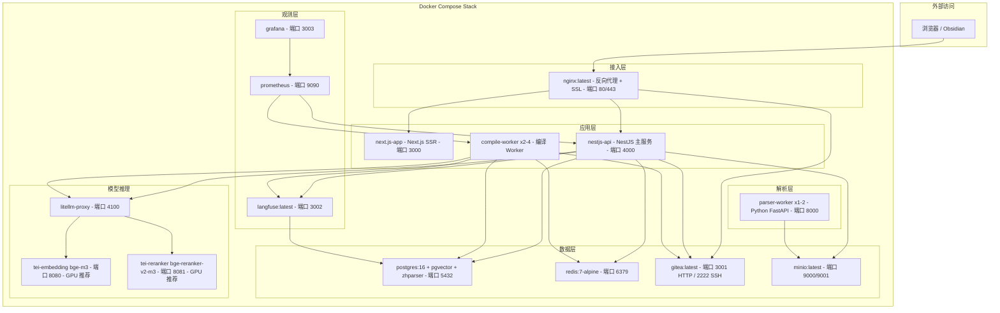

### 8.2 容器资源配置建议

| 容器 | CPU | 内存 | GPU | 存储 | 实例数 |
|---|---|---|---|---|---|
| nginx | 0.5 | 256MB | - | - | 1 |
| next.js-app | 1 | 512MB | - | - | 1 |
| nestjs-api | 2 | 2GB | - | - | 1 |
| compile-worker | 2 | 2GB | - | - | 2~4 (按用户规模) |
| parser-worker | 4 | 8GB | (可选) | - | 1~2 |
| PostgreSQL | 4 | 8GB | - | SSD 100GB+ | 1 |
| Redis | 1 | 2GB | - | 1GB | 1 |
| Gitea | 1 | 1GB | - | SSD 50GB+ | 1 |
| MinIO | 1 | 1GB | - | HDD 200GB+ | 1 |
| LiteLLM | 0.5 | 512MB | - | - | 1 |
| TEI-Embedding | 2 | 4GB | 1x GPU | 10GB model | 1 |
| TEI-Reranker | 2 | 4GB | 1x GPU | 10GB model | 1 |
| Langfuse | 1 | 1GB | - | - | 1 |
| **合计（最低配置）** | **约22 核** | **约35GB** | **2x GPU** | **约370GB** | |

### 8.3 Kubernetes 演进方案概要

| 维度 | Docker Compose（500人以内） | Kubernetes（500人以上） |
|---|---|---|
| 编排 | docker-compose.yml | Helm Chart |
| 扩缩容 | 手动调整副本数 | HPA（基于 BullMQ 队列积压自动扩 compile-worker） |
| 存储 | Docker 卷 | PVC + StorageClass（SSD/HDD 分级） |
| 网络 | Docker 内部网络 | K8s Service + Ingress (cert-manager TLS) |
| 高可用 | 单节点 | PG 主从（Patroni）、Redis Sentinel、Gitea 集群 |
| 监控 | 内置 Prometheus | kube-prometheus-stack |
| CI/CD | - | GitOps (ArgoCD) |

---

## 9. 可观测性设计

### 9.1 Langfuse 集成方案

**两类 Trace**：

| Trace 类型 | 触发时机 | 记录内容 |
|---|---|---|
| **编译 Trace** | 每次 compile job 执行 | 触发源、输入证据列表、Truth diff（变更前/后）、Timeline 新增条目、交叉引用变更、LLM 调用链（prompt/completion/tokens）、耗时 |
| **查询 Trace** | 每次对话请求 | 用户问题、查询改写结果、命中主题页列表、是否触发懒编译、Compiled Truth 上下文、LLM 综述调用链、引用对齐结果、首 token 延迟、总延迟 |

**Langfuse 数据流**：

```
CompileWorker / ChatService
  -> langfuse.trace(name, metadata)
    -> langfuse.span("read_brain")
    -> langfuse.span("gather_evidence")
    -> langfuse.generation("gbrain_ingest", model, prompt, completion, tokens)
    -> langfuse.span("sync_commit")
  -> langfuse.score("compile_quality", value)
```

### 9.2 Prometheus 指标设计

| 指标名 | 类型 | 标签 | 描述 |
|---|---|---|---|
| `llmwiki_chat_requests_total` | Counter | `status` | 对话请求总数 |
| `llmwiki_chat_first_token_seconds` | Histogram | - | 首 token 延迟分布 |
| `llmwiki_chat_duration_seconds` | Histogram | - | 对话完整延迟分布 |
| `llmwiki_compile_jobs_total` | Counter | `trigger, status` | 编译任务总数 |
| `llmwiki_compile_duration_seconds` | Histogram | `trigger` | 编译任务耗时分布 |
| `llmwiki_compile_tokens_total` | Counter | `model` | 编译 LLM token 消耗 |
| `llmwiki_compile_queue_depth` | Gauge | `priority` | 编译队列积压深度 |
| `llmwiki_dirty_topics_total` | Gauge | - | 当前 dirty 主题总数 |
| `llmwiki_parse_jobs_total` | Counter | `parser, status` | 文档解析任务数 |
| `llmwiki_parse_duration_seconds` | Histogram | `parser` | 文档解析耗时 |
| `llmwiki_permission_checks_total` | Counter | `result` | 权限校验次数 |
| `llmwiki_brain_repos_total` | Gauge | `status` | 个人大脑仓库总数 |
| `llmwiki_visible_kbs_cache_hit_ratio` | Gauge | - | 权限缓存命中率 |

### 9.3 日志策略

| 服务 | 日志库 | 格式 | 级别 | 收集 |
|---|---|---|---|---|
| NestJS 主服务 | Pino | JSON 结构化 | INFO | stdout → Loki/ELK |
| Compile Worker | Pino | JSON 结构化 | INFO + 编译详情 | stdout → Loki/ELK |
| Python Parser | structlog | JSON 结构化 | INFO | stdout → Loki/ELK |
| Nginx | access_log | JSON | - | 文件 → Filebeat |

### 9.4 告警规则

| 告警名 | 条件 | 严重度 | 通知 |
|---|---|---|---|
| 编译队列积压 | `compile_queue_depth > 1000` 持续 5 分钟 | WARNING | 飞书/钉钉 |
| 权限撤销编译超时 | CRITICAL 优先级 Job 超 5 分钟未完成 | **CRITICAL** | 电话 + 飞书 |
| 首 token 延迟高 | P95 > 3s 持续 10 分钟 | WARNING | 飞书 |
| 编译 LLM 用量异常 | 日 token 超配额 80% | WARNING | 飞书 |
| 解析 Worker 不可用 | 健康检查失败超 3 次 | ERROR | 飞书 |
| PG 连接池耗尽 | 活跃连接超 80% | WARNING | 飞书 |

### 9.5 编译质量指标

| 指标 | 计算方式 | 目标值 |
|---|---|---|
| Truth-证据一致性 | 抽检 Compiled Truth 中每个断言是否有 Timeline 证据支撑 | 大于等于 95% |
| 矛盾检出率 | Dream Cycle 检出矛盾数 / 人工标注矛盾数 | 大于等于 80% |
| 过期召回率 | Dream Cycle 标记过期内容数 / 人工标注过期数 | 大于等于 75% |
| 编译覆盖率 | clean 主题数 / 总主题数 | 大于等于 90%（日间） |
| 查询命中率 | 查询命中 clean 主题的比例 | 大于等于 95% |

---

## 10. 安全设计

### 10.1 认证方案

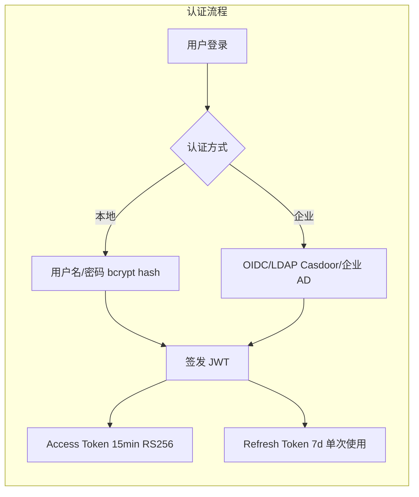

**JWT Payload**：

```json
{
  "sub": "user-uuid",
  "username": "alice",
  "org_nodes": ["org-4", "org-2", "org-1"],
  "roles": ["analyst", "compliance_reviewer"],
  "iat": 1693000000,
  "exp": 1693000900
}
```

### 10.2 传输与存储加密

| 层面 | 方案 |
|---|---|
| 传输加密 | 全站 TLS 1.3（Nginx 卸载 SSL） |
| API Key 存储 | AES-256-GCM 对称加密，密钥存环境变量/K8s Secret |
| 数据库连接 | 启用 PG SSL 模式 |
| Git 通信 | HTTPS 或 SSH（Gitea 内网） |
| MinIO 通信 | 启用 TLS |

### 10.3 提示词注入防护

| 层次 | 措施 |
|---|---|
| 输入层 | 用户输入长度限制 + 特殊字符消毒 |
| 上下文层 | 证据内容用 `<evidence>` 标签隔离标注 |
| 系统层 | 系统 prompt 加固：明确指令优先级，禁止执行证据内嵌指令 |
| 输出层 | 敏感内容过滤（可选 Guardrail 模型） |
| 边界层 | 权限过滤保证泄露上限为「用户本可见内容」 |

### 10.4 个人大脑物理隔离

| 维度 | 方案 |
|---|---|
| Git Repo 隔离 | 每用户独立 Gitea 仓库，系统服务账号读写，用户无直接 Git 凭证 |
| pgvector 隔离 | Brain Repo 的 chunks 表按 `brain_repo_id` 分区或查询时强制过滤 |
| 查询隔离 | Brain Query 仅在当前用户的 Brain Repo 范围内搜索 |
| API 隔离 | 所有大脑相关 API 从 JWT 中提取 user_id，不接受客户端传入 |

### 10.5 审计日志设计

| 审计事件 | 记录内容 | 留存期 |
|---|---|---|
| 登录/登出 | 用户、IP、方式、时间、成功/失败 | 大于等于1 年 |
| 对话查询 | 用户、问题摘要、命中主题页版本、KB 范围 | 大于等于1 年 |
| 知识变更 | 操作人、KB、文档、Git commit、变更类型 | 大于等于1 年 |
| 编译记录 | 触发原因、用户、主题、输入证据、Truth diff 摘要、token 用量 | 大于等于1 年 |
| 权限变更 | 操作人、变更类型、受影响用户/KB、变更前后策略 | 大于等于1 年 |
| 越权尝试 | 用户、请求路径、目标资源、拒绝原因 | 大于等于1 年 |
| 模型配置变更 | 操作人、变更项、变更前后值 | 大于等于1 年 |

---

## 11. 项目目录结构

### 11.1 推荐 Monorepo 结构（Turborepo/Nx）

```
llmwiki/
├── apps/
│   ├── web/                          # Next.js 前端应用
│   │   ├── src/
│   │   │   ├── app/                  # App Router 页面
│   │   │   │   ├── (auth)/           # 登录/注册
│   │   │   │   ├── (chat)/           # 对话界面
│   │   │   │   ├── (admin)/          # 管理后台
│   │   │   │   └── (brain)/          # 个人大脑浏览 (P2)
│   │   │   ├── components/           # React 组件
│   │   │   │   ├── chat/             # 对话相关（消息列表/输入框/引用面板）
│   │   │   │   ├── kb/               # 知识库相关（选择器/文件树/上传）
│   │   │   │   ├── admin/            # 管理后台组件
│   │   │   │   └── shared/           # 通用组件
│   │   │   ├── hooks/                # 自定义 Hooks（SSE/权限/会话）
│   │   │   ├── stores/               # Zustand 状态管理
│   │   │   └── lib/                  # 工具函数
│   │   ├── public/
│   │   └── package.json
│   │
│   ├── api/                          # NestJS 核心后端
│   │   ├── src/
│   │   │   ├── modules/
│   │   │   │   ├── auth/             # 认证模块（JWT/OIDC）
│   │   │   │   ├── chat/             # Chat Service 模块
│   │   │   │   ├── brain-query/      # Brain Query 模块
│   │   │   │   ├── brain-compiler/   # Brain Compiler 模块 ★
│   │   │   │   │   ├── triggers/     # 触发器处理
│   │   │   │   │   ├── scheduler/    # 调度器
│   │   │   │   │   ├── executor/     # 编译执行器
│   │   │   │   │   ├── cost/         # 成本控制
│   │   │   │   │   └── dream/        # Dream Cycle
│   │   │   │   ├── ingestion/        # 知识摄入模块
│   │   │   │   ├── permission/       # 权限模块（Casbin）
│   │   │   │   ├── model-gateway/    # 模型网关模块
│   │   │   │   ├── admin/            # 管理模块
│   │   │   │   ├── gbrain/           # gbrain 封装模块
│   │   │   │   └── audit/            # 审计日志模块
│   │   │   ├── common/
│   │   │   │   ├── guards/           # 认证/权限守卫
│   │   │   │   ├── interceptors/     # 日志/追踪拦截器
│   │   │   │   ├── filters/          # 异常过滤器
│   │   │   │   ├── pipes/            # 数据验证管道
│   │   │   │   └── decorators/       # 自定义装饰器
│   │   │   ├── config/               # 配置管理
│   │   │   └── main.ts
│   │   └── package.json
│   │
│   └── parser-worker/                # Python 解析微服务
│       ├── src/
│       │   ├── api/                  # FastAPI 路由
│       │   ├── parsers/
│       │   │   ├── docling_parser.py
│       │   │   ├── mineru_parser.py
│       │   │   └── ocr_parser.py
│       │   ├── router.py             # 按文件类型路由
│       │   └── config.py
│       ├── requirements.txt
│       └── Dockerfile
│
├── packages/
│   ├── shared-types/                 # TypeScript 共享类型/DTO
│   │   ├── src/
│   │   │   ├── dto/                  # 请求/响应 DTO
│   │   │   ├── events/               # 事件载荷类型
│   │   │   ├── enums/                # 枚举定义
│   │   │   └── index.ts
│   │   └── package.json
│   │
│   ├── database/                     # 数据库 Schema & Migrations
│   │   ├── prisma/
│   │   │   ├── schema.prisma         # Prisma Schema
│   │   │   └── migrations/
│   │   ├── seeds/                    # 种子数据
│   │   └── package.json
│   │
│   ├── gbrain-adapter/               # gbrain npm 包封装层
│   │   ├── src/
│   │   │   ├── brain-repo.ts         # Repo 生命周期管理
│   │   │   ├── ingest.ts             # ingest 适配
│   │   │   ├── search.ts             # search 适配
│   │   │   ├── maintain.ts           # maintain 适配
│   │   │   └── index.ts
│   │   └── package.json
│   │
│   └── ui/                           # shadcn/ui 组件库封装
│       ├── src/components/
│       └── package.json
│
├── infra/                            # 基础设施配置
│   ├── docker/
│   │   ├── docker-compose.yml        # 开发/小规模部署
│   │   ├── docker-compose.prod.yml   # 生产部署覆盖
│   │   └── dockerfiles/
│   │       ├── Dockerfile.api
│   │       ├── Dockerfile.web
│   │       └── Dockerfile.parser
│   ├── k8s/                          # Kubernetes 部署
│   │   └── helm/
│   │       └── llmwiki/
│   │           ├── Chart.yaml
│   │           ├── values.yaml
│   │           └── templates/
│   ├── nginx/
│   │   └── nginx.conf
│   └── monitoring/
│       ├── prometheus.yml
│       ├── grafana-dashboards/
│       └── alerting-rules.yml
│
├── design/                           # 设计文档
│   ├── architecture.md               # 本文档
│   └── llmwiki-prototype/            # 原型设计
│
├── tests/
│   ├── e2e/                          # 端到端测试
│   ├── permission-matrix/            # 越权回归测试集
│   └── golden-qa/                    # 100 条黄金问答集
│
├── turbo.json                        # Turborepo 配置
├── package.json                      # 根 package.json
├── tsconfig.base.json
└── README.md
```

### 11.2 各包/模块职责说明

| 包/模块 | 职责 | 技术栈 |
|---|---|---|
| `apps/web` | 用户界面：对话、知识库浏览、管理后台 | Next.js 14 + React 18 + Tailwind + shadcn/ui |
| `apps/api` | 核心后端：所有业务逻辑、编译引擎、权限、查询 | NestJS + TypeScript + BullMQ |
| `apps/parser-worker` | 文档解析微服务 | Python + FastAPI + MinerU/Docling/PaddleOCR |
| `packages/shared-types` | 前后端共享的 TypeScript 类型定义 | TypeScript |
| `packages/database` | 数据库 Schema 定义与迁移管理 | Prisma + PostgreSQL |
| `packages/gbrain-adapter` | gbrain npm 包的企业级封装层 | TypeScript |
| `packages/ui` | 可复用 UI 组件库 | React + shadcn/ui |
| `infra/` | 部署配置（Docker Compose / K8s / 监控） | YAML |
| `tests/` | 端到端测试、权限回归矩阵、质量评测 | Jest / Playwright |

---

> 本架构设计以「编译式个人大脑」为核心差异化，所有设计决策围绕这一理念展开。Brain Compiler 是系统灵魂，建议在 M0 阶段优先验证其编排可行性与编译成本可控性。
