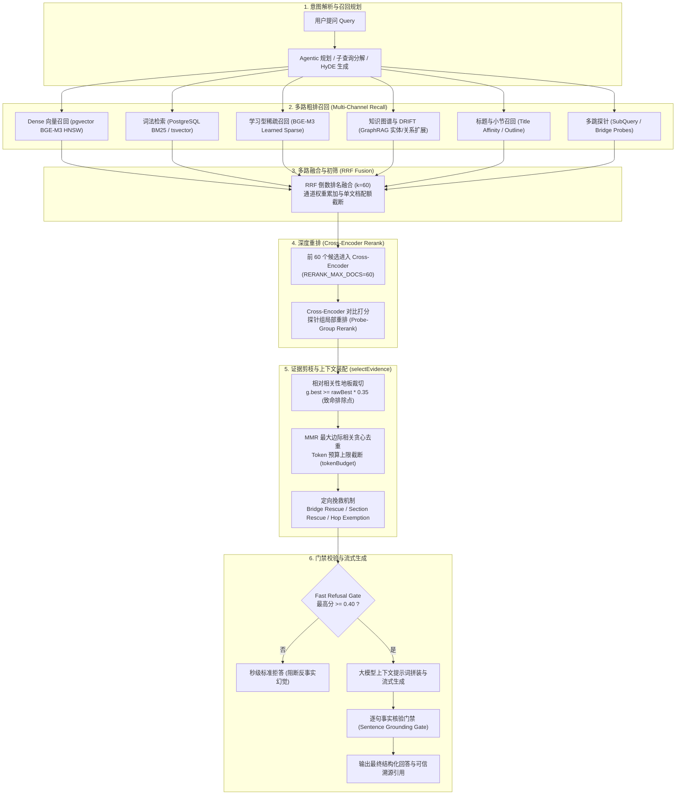
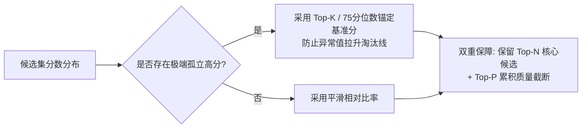
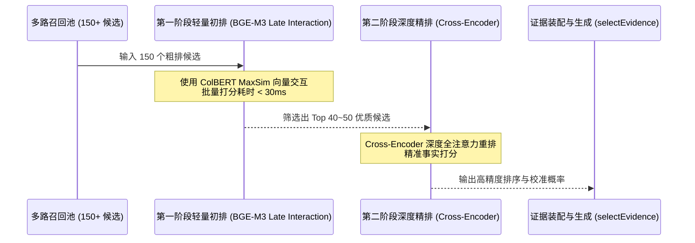

# 知识库检索低分排除与候选饱和优化方案

> **状态**：方案提议（Draft Proposal）  
> **模块**：`apps/api/src/retrieval` / `apps/api/src/chat`  
> **原则遵循**：完全遵循通用性设计（Corpus-Agnostic），严禁针对特定业务硬编码，兼顾高召回率与低幻觉门禁。

---

## 1. 背景与问题定义

在大型企业级知识库场景中，随着文档体量扩大以及问答场景复杂度提升（如跨段落多跳问答、简短事实陈述、长背景描述等），系统暴露出一个普遍的痛点现象：

> **核心问题表现**：  
> 当知识库中存在大量相似主题的文档或分块时，**真正包含答案的相关知识块在检索排序过程中被打出较低的分数**，随后在后续的“相对相关性地板（Relative Floor）”或“Token/组数截断”策略中**被判定为干扰项直接剔除（Filter out）**。  
> 最终导致：大模型由于上下文缺失无法作答、产生反事实幻觉，或直接触发秒级快速拒答门禁（Fast Refusal Gate）。

本文档针对这一现象，对当前代码库中的端到端检索与筛选流程进行完整溯源解剖，分析真实答案被误杀的深层根因，并给出从配置调优到架构演进的系统性优化方案。

---

## 2. 当前检索与过滤全流程解剖

目前系统的主链路涵盖提问解析、多路召回、联邦融合、交叉编码重排、证据筛选与门禁等完整阶段：



### 核心代码定位
- 规划与多路召回：[`RetrievalArmsService.searchChunksFallback`](file:///home/scottsun/gbrainkg/apps/api/src/chat/retrieval-arms.ts#L1278)
- 融合与重排服务：[`FusionRerankService.rerankPool`](file:///home/scottsun/gbrainkg/apps/api/src/chat/fusion-rerank.ts#L344)
- 证据筛选与裁切：[`CitationAssemblyService.selectEvidence`](file:///home/scottsun/gbrainkg/apps/api/src/chat/citation-assembly.ts#L339)
- 问答调度与门禁：[`ChatService.handleChatStream`](file:///home/scottsun/gbrainkg/apps/api/src/chat/chat.service.ts#L1023)

---

## 3. 为什么真实答案会被打低分并排除？（根因分析）

通过对全链路源码与评估数据的深入审查，真实答案被排除往往经历以下七级衰减：

### 根因 1：粗排阶段的“多路弱命中”虚高，稀释“单路强语义”
- **机制原理**：在 [`retrieval-arms.ts`](file:///home/scottsun/gbrainkg/apps/api/src/chat/retrieval-arms.ts#L1826-L1880) 中，系统采用 RRF（Reciprocal Rank Fusion）公式：
  $$\text{RRF Score} = \sum_{c \in \text{channels}} \frac{w_c}{k + \text{rank}_c}$$
- **致死场景**：
  - 某个**高频噪点段落**因文档标题部分匹配、含有 1~2 个通用高频词、且在向量上有弱相关，在标题路、BM25 路、向量路上均进入前 30 名；经 3 路得分叠加后，其 RRF 分数极高。
  - **真实答案段落**措辞严谨，没有通用冗余词，仅在向量或特定探针单路排在第 8 名；在缺乏其他通道多重命中的情况下，其最终综合得分反而显著落后于噪点段落。

### 根因 2：Cross-Encoder 重排容量硬截断（`RERANK_MAX_DOCS=60`）
- **机制原理**：Cross-Encoder 的全注意力交叉计算非常耗时，因此在 [`fusion-rerank.ts`](file:///home/scottsun/gbrainkg/apps/api/src/chat/fusion-rerank.ts#L441) 中设置了严格的输入上限：
  ```typescript
  const maxRerankDocs = Math.max(2, Number(process.env.RERANK_MAX_DOCS || 60));
  const rerankPool = citations.length > maxRerankDocs ? citations.slice(0, maxRerankDocs) : citations;
  ```
- **致死场景**：当候选库文档庞大时，RRF 汇总出的粗排池往往多达 100~200 条。一旦真实答案在 RRF 中被挤到了第 61 名，将**完全失去进入重排模型接受精细打分的机会**。

### 根因 3：Cross-Encoder 对短答案和隐式语义的单点偏见
- **机制原理**：Cross-Encoder 接收 `[Query, Document]` 对进行评分。
- **致死场景**：
  - 用户问题往往带有大量约束背景（例如：*“请问在2024年第四季度针对华东地区特种作业人员的补贴发放标准是多少？”*）。
  - 真正的核心规范可能只有简略的一句表述（例如：*“特种作业津贴按每人每月300元计发。”*）。
  - **假相关干扰段落**：刚好完整重复了背景文字（*“关于2024年第四季度华东地区有关工作安排……”*），Cross-Encoder 往往给该干扰段落打出 `0.85~0.92` 的超高分。
  - **真答案段落**：由于缺乏“2024年第四季度”、“华东地区”等修饰词，重排模型判定其表面语义相关度弱，仅打出 `0.20~0.28` 的超低分。

### 根因 4：致命排除点——相对相关性地板（Relative Relevance Floor 0.35 剪枝）
这是代码中最直接发生**“硬性删除真答案”**的地方。在 [`citation-assembly.ts`](file:///home/scottsun/gbrainkg/apps/api/src/chat/citation-assembly.ts#L447-L471) 中：

```typescript
const rawBest = hasCalibrated
  ? Math.max(...calibratedScores)
  : Math.max(...[...groups.values()].map((g) => g.best));
const relFloor = Math.max(0, Number(process.env.RETRIEVAL_RELEVANCE_FLOOR_RATIO || 0.35));

const entries = allEntries.filter(
  (g) =>
    g.best >= rawBest * relFloor ||
    g.members.some((m: any) => m?.floorExempt === true) ||
    (wantsSummarySection && g.isSummary),
);
```

- **杀伤机制**：
  如果前述的“表面词汇重合干扰项”拿到 `0.92` 的高分，相对地板阈值瞬间升至 $0.92 \times 0.35 = 0.322$。
  此时打分为 `0.25` 的真实答案段落，因为 $0.25 < 0.322$，**被认定为低信噪比垃圾噪点，直接从候选数组中永久丢弃！**

### 根因 5：MMR 边际收益惩罚与 Token 预算耗尽
- 即使真答案未被 0.35 阈值杀死，后续进入 MMR（最大边际相关）贪心选择过程。
- 前面的高分干扰项及其展开的上下文段落往往非常冗长，很快便占满了 [`tokenBudget`](file:///home/scottsun/gbrainkg/apps/api/src/chat/chat.service.ts#L3868)（或达到了 `RETRIEVAL_MAX_GROUPS` 组数上限），循环提前 `break`，排在后面的真答案被硬截断。

### 根因 6：Fast Refusal 门禁误判拒答
- 在 [`chat.service.ts`](file:///home/scottsun/gbrainkg/apps/api/src/chat/chat.service.ts#L4658-L4755) 中，系统设置了 `RETRIEVAL_FAST_REFUSAL_THRESHOLD = 0.4`。
- 如果真答案虽然侥幸进入后续流程，但如果本轮所有被选中的候选最大校准分均不足 0.4，系统直接判断为全网无有效事实，在生成之前直接切断回答并下发标准拒答文案。

---

## 4. 现有代码中的既有挽救机制及局限

项目中已有针对上述问题的防守性代码，但存在特定的覆盖盲区：

| 既有机制 | 实现位置 | 作用机理 | 现有局限 |
| :--- | :--- | :--- | :--- |
| **多跳与桥接豁免 (`floorExempt`)** | [`fusion-rerank.ts`](file:///home/scottsun/gbrainkg/apps/api/src/chat/fusion-rerank.ts#L492-L497) | 判定为子查询探针或多跳推理实体的候选，豁免 0.35 地板过滤 | 仅适用于多跳/子查询路由命中的情况，对**单跳但语义间接的常规问题**完全不生效 |
| **第二跳桥接挽救 (`planSecondHopRescue`)** | [`bridge-rescue.ts`](file:///home/scottsun/gbrainkg/apps/api/src/chat/bridge-rescue.ts) / [`chat.service.ts`](file:///home/scottsun/gbrainkg/apps/api/src/chat/chat.service.ts#L3886) | 从首跳文本识别实体，在被剪枝淘汰的池子中反向查回同名文档 | 强依赖第一跳候选文本中必须明确出现了该实体的标准名称 |
| **小节与汇总救援 (`applySectionAlign`)** | [`section-align.ts`](file:///home/scottsun/gbrainkg/apps/api/src/chat/section-align.ts) | 对点名“统计/汇总/章节”的问题置顶汇总分块 | 仅针对表格和宏观章节特定结构词，通用叙述文本不触发 |
| **探针分组独立重排 (`rerankByProbeGroups`)** | [`fusion-rerank.ts`](file:///home/scottsun/gbrainkg/apps/api/src/chat/fusion-rerank.ts#L282) | 谁由哪个子问题召回，就跟谁重排 | 前提是问题被成功分解成了互斥的子问题 |

---

## 5. 针对性优化方案与演进梯度

为根本性解决“候选多导致真答案被打低分排除”的问题，同时遵守 **“拒绝业务硬编码（Corpus-Agnostic）”** 守则，建议分四个梯度进行优化：

### 梯度一：即时可调整的配置与阈值优化（零代码风险）

针对测试环境与生产基线，可通过环境配置即刻放宽严苛门禁：

```bash
# 1. 降低相对相关性地板比例（从默认 0.35 适度下调至 0.20~0.25）
# 避免单个虚高噪点将门槛抬得过高，导致 0.2~0.3 的潜在答案被秒杀
RETRIEVAL_RELEVANCE_FLOOR_RATIO=0.22

# 2. 扩大 Cross-Encoder 重排池深度（从默认 60 扩容至 100~120）
# 给 RRF 粗排中段（第 61~120 名）的真答案留出重排翻盘机会
RERANK_MAX_DOCS=100

# 3. 增加答案候选池获取深度
RETRIEVAL_ANSWER_POOL_DOCS=30

# 4. 适度优化快速拒答门禁（复合场景放宽）
RETRIEVAL_FAST_REFUSAL_THRESHOLD=0.35
```

---

### 梯度二：重构相对地板为“自适应柔性地板（Dynamic Soft Floor）”

#### 现存缺陷
静态公式 `g.best >= rawBest * 0.35` 存在“一票独高、全盘皆输”的脆弱性。当某噪点由于字面重叠获得 `0.98` 时，地板立刻变成 `0.343`。

#### 改造设计
在 [`citation-assembly.ts`](file:///home/scottsun/gbrainkg/apps/api/src/chat/citation-assembly.ts) 中引入基于**分位数（Quantile）或自适应密度**的平滑剪枝：



1. **分位数锚定基准**：
   不以单条最大值 `max(scores)` 作为唯一参照物，而是取前 3 名或 85 分位数的均值作为有效上界：
   $$\text{BaselineScore} = \text{Percentile}_{85}(\text{CalibratedScores})$$
   $$\text{Floor} = \min(\text{BaselineScore} \times \text{FloorRatio}, \text{AbsoluteSafeFloor})$$
2. **保底候选名额（Guaranteed Minimum Candidates）**：
   无论相对地板如何裁切，始终确保至少保留前 $M$ 组候选（如 $M=6$），即使其相对得分较低，交由后续 MMR 和上下文模型综合仲裁，而不是直接硬丢弃。

---

### 梯度三：重排上下文增强（Contextualized Parent-Chunk Scoring）

#### 现存缺陷
Cross-Encoder 打低分的核心原因，往往是**“分块太碎片化，缺少问题的背景词”**（例如段落只有一句话事实，缺少时间、地点、主体定语）。

#### 改造设计
在向 Cross-Encoder 提交 `documents` 文本进行评估时（[`fusion-rerank.ts:443`](file:///home/scottsun/gbrainkg/apps/api/src/chat/fusion-rerank.ts#L443)）：
- **实施小到大（Small-to-Big）上下文扩充**：
  将送入重排模型的文本从单一 `chunk.content` 增强为：
  $$\text{RerankText} = \text{DocTitle} + \text{"\n"} + \text{ParentSectionHeading} + \text{"\n"} + \text{ChunkContent}$$
- **收益**：答案分块即使本身字数少，在带有章节标题（如 *“第四章 2024年度特种津贴”*）的情况下，Cross-Encoder 可以充分感知其与完整问题的深层语义匹配，打分直接从 `0.2` 跃升至 `0.7+`，自然脱离低分危险区。

---

### 梯度四：两阶段重排架构（Two-Stage Cascaded Reranking）

为了在有限算力下兼顾“大候选池（150+）”与“深度语义精确打分”，构建级联架构：



- **阶段 1（粗精排过渡）**：利用现有的 BGE-M3 Multi-Vector Late Interaction（[`hybrid-retrieval.service.ts`](file:///home/scottsun/gbrainkg/apps/api/src/retrieval/hybrid-retrieval.service.ts#L141)），在毫秒级内完成 150 条候选的快速语义对齐，将真正答案从 80~100 名提权至前 40 名。
- **阶段 2（深度交叉打分）**：由 Cross-Encoder 对 Top 40 候选精打细算，彻底解决 Cross-Encoder 见不到后段优质候选的算力与时间矛盾。

---

## 6. 实施路线图与测试验证准则

根据项目守则（[`AGENTS.md`](file:///home/scottsun/gbrainkg/AGENTS.md)），优化必须经过标准化验证流程，严禁直接发生产：

### Phase 1：基线测试与参数调优（1~2 天）
1. 提取历史因为“低分排除”导致答非所问或拒答的 badcase。
2. 在测试环境中调优 `RETRIEVAL_RELEVANCE_FLOOR_RATIO=0.22`、`RERANK_MAX_DOCS=100`。
3. 运行自动化评测套件：
   ```bash
   TEST_PORT=3202 pytest tests/evaluation/test_retrieval_quality.py -v --golden-file=tests/evaluation/golden_dataset.json
   ```
   对比 Hit@5、MRR 及 Context Recall 指标变化。

### Phase 2：自适应柔性地板与上下文增强（3~5 天）
1. 重构 [`CitationAssemblyService.selectEvidence`](file:///home/scottsun/gbrainkg/apps/api/src/chat/citation-assembly.ts#L339) 的裁切逻辑，实施自适应动态阈值与保底名额。
2. 升级重排文本装配逻辑，携带父章节与标题信息。
3. 运行多跳公共基准验证：
   - 2WikiMultiHopQA / MuSiQue / HotpotQA 子集。
   - 确保在不引发反事实幻觉（Faithfulness）的前提下显著提升复杂案例召回率。

### Phase 3：评审汇报与生产发布
1. 整理调优前后的详细评测报表与 Badcase 修复对比矩阵。
2. 获得用户明确书面授权后，统一通过标准发布流水线交付：
   ```bash
   bash scripts/deploy-prod.sh --target=all
   ```

---
*(本文档归档于项目文档库 `docs/retrieval-low-score-exclusion-optimization-proposal.md`)*
