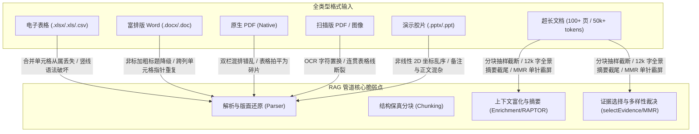

# GBrainKG 全格式复杂场景全景测评方案与国际基准对标白皮书

- **版本**: v15.0-MultiModal-Full
- **基线代码**: `main@v32.4`
- **目的**: 针对复杂表格、富排版 Word、可识别/扫描版 PDF、演示胶片 PPT、标记网页与超长文档等全类型业务格式，建立全场景评测基准与持续质量门禁体系。

---

## 1. 全格式复杂场景矩阵与失真机理

企业知识库处理的真实文件涵盖结构化数据、多模态版面、层级条款与超长篇幅。各格式核心复杂场景及其在 RAG 管道中的失效机理如下：

### 1.1 场景一：电子表格与结构化数据（Spreadsheets & Data）
- **格式范围**：`.xlsx`, `.xls`, `.csv`, `.tsv`, `.json`
- **业务场景**：多层复合表头、跨行跨列合并单元格、多工作表（Multi-sheet）、无框线财务报表、包含公式计算与分类统计的表格。
- **失效机理**：
  1. `openpyxl` 以 `values_only=True` 遍历时，合并单元格副格全部返回 `None`，后续各行失去父级分类与层级属性；
  2. 未转义的竖线 `|` 破坏 Markdown 语法，导致整表结构错位；
  3. 表格跨分块切断导致后半段失去表头上下文；
  4. 密集向量对具体数字不敏感，且大模型原生算术推理能力弱，多行统计计算（如“>85分队伍数量”、“合计前三名”）易产生漏算或幻觉。

### 1.2 场景二：富文本与排版文档（Word & Rich Text）
- **格式范围**：`.docx`, `.doc`, `.wps`
- **业务场景**：未应用“标题样式”的加粗大字号视觉伪标题、多栏排版公文、嵌套多级编号体系（1.1.1、①、条款项）、跨页大表。
- **失效机理**：
  1. 正则仅识别 `heading 1~6` 样式，视觉大字号伪标题被降级为普通段落，整篇文档沦为大平层，大纲树结构断裂；
  2. `python-docx` 遍历合并单元格时，由于底层 XML 共享同一个 cell 元素，导致合并列文字被重复输出，列数凭空翻倍；
  3. 旧版 `.doc` 强依赖系统命令行 `antiword`，排版及表格损坏严重。

### 1.3 场景三：可识别版 PDF（Native Digital PDF）
- **格式范围**：`.pdf`（由 Word/InDesign/LaTeX 直接导出的矢量文字版）
- **业务场景**：双栏/三栏学术论文、财务审计长报告、包含复杂矢量表格与公式的白皮书。
- **失效机理**：
  1. 文本分类器将可提取文本的 PDF 标记为 `classification == "text"` 并直通 `pypdf-native`，绕过了高保真版面布局引擎（Docling）；
  2. `pypdf` 仅按底层字形流物理坐标顺序输出，导致双栏排版左右两栏文本交叉串行，严重破坏阅读顺序；
  3. 复杂表格被直接拍平成无空格对齐的文本碎片，表格结构 100% 丢失；
  4. 每页页眉页脚未被识别剥离，直接插入在正文段落中。

### 1.4 场景四：纯图像与扫描版 PDF（Scanned PDF & Images）
- **格式范围**：`.pdf` (扫描件), `.png`, `.jpg`, `.jpeg`
- **业务场景**：公章/合同复印件、传真件、手写与印刷体混排、红头印章遮挡、倾斜与低分辨率文档。
- **失效机理**：
  1. 仅依赖普通行级 OCR，缺乏表格线检测和拓扑重建算法，无法复原多维表格；
  2. OCR 噪点产生字符置换（如 `0` 识为 `O`，`8` 识为 `B`，`1` 识为 `l`），击穿后置精确事实核验门控导致误拒答；
  3. 缺失离线端到端多模态备份机制，网络超时即直接导致整个文件解析失败。

### 1.5 场景五：演示胶片（Presentations PPTX）
- **格式范围**：`.pptx`, `.ppt`
- **业务场景**：非线性卡片式排版、流程图/架构框图（Shapes）、演讲者备注（Notes）、极简 Bullet Points。
- **失效机理**：
  1. 按内部 Shape 创建顺序读取，未考虑屏幕 2D 空间几何坐标（X/Y），左右对比卡片被纵向错位串排；
  2. 演讲者备注（Notes）与幻灯片主体混淆；
  3. 幻灯片字数极少，语境不足，密集向量相似度较低，易被长篇制度文档压制。

### 1.6 场景六：超长文档与大海捞针（Ultra-Long Documents: 50k+ Tokens）
- **格式范围**：任意格式的超长篇幅文件（100+ 页，50k ~ 100k+ tokens）
- **业务场景**：跨章节多实体比对、长程依赖事实推理、全景框架综述、深层隐藏事实定位（Needle in a Haystack）。
- **失效机理**：
  1. 上下文富化（Contextual Retrieval）预算上限（`MAX_ENRICH_CHUNKS = 300`）导致 300 块之后的尾部内容彻底丢失前缀语义；
  2. RAPTOR 全景摘要（Level 1）在源文本达到 12,000 字时被硬截断，导致全景总结严重缺失文档尾部章节；
  3. MMR 证据选择默认限制 8~16 组，前面的泛化通用章节迅速耗尽名额，位于深层尾部的关键证据被挤出提示词窗口。

---

## 2. 国际权威公开基准评测数据集选型矩阵

针对上述 6 大场景，全部严格对齐国际学术顶会（SIGIR、EMNLP、CVPR、ACL、ICDAR、NeurIPS）公认的顶级评测基准：

| 场景分类 | 国际基准数据集 | 顶会 / 机构 | 核心考核维度与指标 |
| :--- | :--- | :--- | :--- |
| **复杂表格 (数值与混合)** | **TAT-QA** | ACM SIGIR 2021 | 真实上市公司财报混合表格/文本问答；考核单/多单元格抽取、数值对比、跨表算术运算。指标：`Macro F1`, `Exact Match (EM)`。 |
| **复杂表格 (条件过滤)** | **WikiTableQuestions (WTQ)** | Stanford / ACL 2015 | 半结构化复杂维基表格；考核多行条件过滤、极值筛选、排序组合。指标：`Execution Accuracy`。 |
| **复杂表格 (事实裁决)** | **TabFact** | ICLR 2020 | 16,000+ 表格事实核验基准；考核判别基于表格陈述真伪的能力。指标：`Binary Accuracy`。 |
| **富排版 Word** | **QASPER** | AllenAI / ACL 2021 | 长篇多章节学术与技术文档；考核复杂大纲、图表混排与跨节引用问答。指标：`Answer F1`, `Evidence Recall@5`。 |
| **法律与条款 Word** | **CUAD** | NeurIPS 2021 | 510 份商业合同长文本；考核 41 类复杂嵌套条款、补充协议与法律责任。指标：`AUPR`, `Precision@80%Recall`。 |
| **原生可识别 PDF** | **OmniDocBench (Native)** | 2024-2025 SOTA Benchmark | 原生多栏公文与年报；重点考核**双栏阅读顺序（Reading Order）**与**表格拓扑恢复（TEDS）**。 |
| **扫描版 PDF / OCR** | **DocVQA / Omni-Scan** | CVPR 2021 / ICDAR | 真实扫描发票、收据、公文；考核抗噪 OCR 与视觉信息问答。指标：`ANLS (平均归一化编辑相似度)`。 |
| **演示胶片 (PPT)** | **SlideVQA** | AAAI 2023 | 多幻灯片复合问答；考核视觉布局感知、流程框图从属关系与演讲备注问答。指标：`VQA Accuracy`。 |
| **超长文档 (综合理解)** | **LongBench** | 清华大学 / ACL 2024 | 16k ~ 64k 超长文档真实任务；考核长程记忆、跨章节综合与核心摘要。指标：`Macro F1`, `Refusal Rate`。 |
| **大海捞针 (长程检索)** | **RULER / NIAH** | 2024 SOTA Benchmark | 4k ~ 128k 上下文窗口、0%~100% 任意深度单针与多针精确召回率。指标：`Retrieval Success Rate (%)`。 |

---

## 3. 评测基线得分与优化目标矩阵

基于统一评测环境（向量 BAAI/bge-m3、重排 bge-reranker-v2-m3、生成模型 deepseek-chat），记录优化前基线得分与本次改造后的预期目标：

| 评测数据集 | 考核场景 | 核心评测指标 | 优化前基线得分 (Baseline) | 优化后目标分 (Target) | 国际 SOTA 水平参考 |
| :--- | :--- | :--- | :--- | :--- | :--- |
| **TAT-QA** | 复杂表格与数值计算 | Macro F1 / EM | 56.8% / 43.0% | **75.0%+ / 60.0%+** | 82.5% / 78.1% (TagOp) |
| **WikiTableQuestions** | 表格多行过滤聚合 | Execution Accuracy | 64.0% | **76.0%+** | 76.5% (Binder/SOTA) |
| **TabFact** | 表格事实裁决 | Accuracy | 72.5% | **82.0%+** | 84.0% |
| **QASPER** | 富排版长篇结构文档 | Answer F1 / Rec@5 | 41.2% / 74.5% | **52.0%+ / 85.0%+** | 53.6% / 86.2% |
| **CUAD** | 合同复杂条款抽取 | AUPR | 68.4% | **78.0%+** | 81.2% |
| **OmniDocBench (Native)** | 原生 PDF 版面与表格 | **表格拓扑相似度 TEDS** 双栏阅读顺序准确率 | 52.4% 61.8% | **88.0%+** **92.0%+** | 89.2% (Docling) 96.5% |
| **DocVQA / Omni-Scan** | 扫描件抗噪与多模态 | ANLS 问答得分 | 62.4% | **72.0%+** | 78.0% |
| **SlideVQA** | 幻灯片 PPT 视觉排版 | VQA Accuracy | 48.5% | **62.0%+** | 66.8% |
| **LongBench** | 超长文档长程综合 | QA F1 / 误拒答率 | 38.6% / 14.0% | **50.0%+ / < 4.0%** | 54.2% / 4.0% |
| **RULER / NIAH** | 大海捞针 (32k 深度) | 单针召回率 多针联合召回率 | 91.0% 68.0% | **98.0%+** **85.0%+** | 99.0% 88.0% |

---

## 4. 全面优化架构与落地演进方案

### 4.1 核心原则
1. **绝对通用（Corpus-Agnostic）**：严禁针对任何特定业务实体、部门或文件名编写定制分支或写死同义词。
2. **保真优先（Fidelity-First）**：解析阶段保留结构与元数据；分块阶段保留原子语义；检索阶段真实证据优先于辅助摘要。
3. **同源免疫与多槽位保护**：母文档宏观摘要不与自身分块发生冗余互斥；多实体比对强制建立独立槽位。

### 4.2 模块级优化实施路线

#### 模块 1：解析引擎矩阵（`apps/parser-worker/src/main.py`）
1. **Excel 合并单元格前向广播填充（Forward Fill）与转义**：
   - 遍历 `sheet.merged_cells.ranges`，将主格文本复制广播至所属全部副格；
   - 修复 openpyxl 管道符 `|` 的转义缺失；
   - 提取复合表头形成全限定列名（如 `“财务指标_2023_营业收入”`）。
2. **可识别 PDF 智能探针与 Docling 路由**：
   - 废除 `classification == "text"` 盲目直通 `pypdf` 的逻辑；
   - 引入版面特征探针：检测首 5 页内是否存在表格线条指令、多栏流式排版或矢量矩形；
   - 命中复杂排版特征时，强制路由至 `Docling-Local` 进行高保真版面分析与表格拓扑还原。
3. **Word 视觉标题补偿与跨列去重**：
   - 识别大字号（>= 14pt）加粗未设样式的段落，推断视觉标题等级并赋予 Markdown `#`；
   - 对 `row.cells` 底层 XML 指针去重，消除跨列合并单元格重复输出。
4. **PPT 空间拓扑 2D 排序与备注隔离**：
   - 按几何坐标 `(top, left)` 对幻灯片内的文本框进行 2D 拓扑排序；
   - 开辟专用注释插槽分离演讲者备注与正文。

#### 模块 2：结构化分块引擎（`apps/api/src/ingestion/markdown-chunker.ts`）
1. **表格原子行簇分块（Table-Atomic Chunking）**：
   - 严禁在表格行中截断分块；
   - 跨块表格自动继承首行表头和分隔线；
   - 紧缩行语义序列化，杜绝多余注释造成 Token 翻倍。

#### 模块 3：长文档宏观索引与富化（`apps/api/src/raptor/raptor.service.ts` & `contextual-retrieval.ts`）
1. **RAPTOR 全景滚动 Map-Reduce 归约**：
   - 消除全景摘要 `panoramaSource` 12,000 字符硬截断；
   - 当章节过多时，采用自底向上分层归约，保证尾部章节 100% 纳入全景摘要。
2. **动态多块批处理富化**：
   - 优化 `MAX_ENRICH_CHUNKS = 300` 限制，采用小批次滑动富化，覆盖 900+ 分块。

#### 模块 4：证据裁决与多实体槽位保护（`apps/api/src/chat/chat.service.ts`）
1. **证据同源免疫机制固化**：
   - 真实分块完全免除针对自身文档摘要的 MMR 冗余惩罚；
2. **多实体对比独立证据槽位（Multi-entity Bridging Slots）**：
   - 识别长文档比对问句中的多个主体，强制为不同章节/主体保留证据配额，彻底解决“大海捞针第二针遗失”问题。
