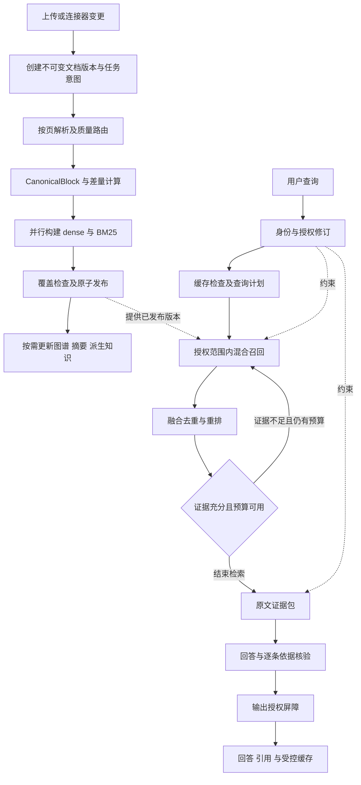

# GBrainKG 核心知识流程优化设计

面向 GPT-6.1-sol 的实施交接文档。范围：知识入库、知识查询、知识权限管理；同时约束精度、速度和成本。依据：2026 年 9 月 30 日工作区代码，Git HEAD `9ae72da`，以及文末一手技术资料。本次只产出设计，没有修改运行代码、执行数据库迁移、调用生产环境或开展性能测试。

**核心决策：保留 PostgreSQL、BGE-M3、BM25/pg_trgm、GraphRAG 和 Reranker 主架构；优先统一版本、授权和执行预算，再以消融实验选择增强能力。** 不增加独立向量数据库、图数据库或每实例 Python 服务。SOTA 在本文指有研究依据、可验证且处于精度与资源开销的优选边界；不表示项目已经达到公开榜单第一。

## 1 现状与必须解决的问题

下表为代码审阅结论。运行开关、迁移实际应用情况、模型网关能力、真实硬件和当前性能均未现场验证；风险不等于已证明发生故障或数据泄露。

| 流程 | 已有能力与证据 | 优化缺口与影响 | 优先级 |
| --- | --- | --- | --- |
| 入库编排 | [IngestionService](../apps/api/src/ingestion/ingestion.service.ts) 已有解析缓存、内容去重、质量检查、版本栅栏、事务 Outbox | 保存时按 documentId 删除全部 Chunk，再写新块；没有可并存的不可变索引版本。新版本构建期间难以继续提供上一版完整检索 | P0 |
| 索引建设 | [EnrichmentProcessor](../apps/api/src/ingestion/enrichment.processor.ts) 已将 dense 与 lexical 并行，摘要和图谱进入独立辅助队列；已有阶段记录与覆盖检查 | 阶段身份主要是 documentId/version/stage，未完整包含解析、分块、模型和配置指纹；辅助事件创建失败只记日志，需要可追补的持久化意图 | P1 |
| 向量复用 | [ChunkEmbeddingService.embedAndStore](../apps/api/src/embedding/chunk-embedding.service.ts) 已复用相同文本向量 | 数据库复用查询仅匹配 md5(content) 和非空 embedding，未限定 embedding 模型/修订/输入投影。换模型后可能复用旧空间向量，维度相同也不代表空间相同 | P0 |
| 混合召回 | [RetrievalArms](../apps/api/src/chat/retrieval-arms.ts) 已有向量、全库 BM25、图谱、稀疏通道、RRF 与扩检；[HybridRetrievalService](../apps/api/src/retrieval/hybrid-retrieval.service.ts) 有有界 MaxSim | 需要按请求统一控制探针、重复编码、重排和扩检；MaxSim 在 Node 中逐 token 计算，复杂度随候选与文本长度增长 | P1 |
| 查询编排 | [ChatService](../apps/api/src/chat/chat.service.ts) 约 5530 行，搜索与对话路径都有规划、召回、救援逻辑 | 局部保护难保证全链路预算和行为一致；优化一个接口可能让另一个接口退化 | P1 |
| 超时 | [RetrievalDeadline.guard](../apps/api/src/retrieval/retrieval-budget.ts) 已有 Promise.race 和 Bulkhead | guard 接收已启动 Promise，返回 fallback 不会自动取消工作；进程内限流不等于多实例共享资源限流 | P0 |
| 权限 | [PermissionService](../apps/api/src/permission/permission.service.ts)、[DocumentAclService](../apps/api/src/permission/document-acl.service.ts) 已有 RBAC、组织继承、知识库授权、文档 ACL 和批量判定 | 管理员语义不统一：应用 isSystemAdmin 认指定角色名；数据库可见性还认 `permissions=*`；KB 写策略还认 `builtin`。应用文档读取与数据库管理员豁免也不同 | P0 |
| 数据库隔离 | [RLS 包装器](../apps/api/src/db/rls-prisma.ts) 已为操作设置事务级上下文并验证运行角色；[9 月 28 日迁移](../packages/database/prisma/migrations/20260928140000_rls_visibility_tx_cache/migration.sql) 已缓存事务内可见 KB/管理员判断 | 保留现有缓存，重点解决规则一致性、授权变更后的缓存刷新和无身份上下文。不能把原始 SQL 外观当作绕过 RLS 的证据 | P0 |
| 请求身份 | [withServiceContext](../apps/api/src/db/tenant-context.service.ts) 有用户时保留用户身份 | 没有 userId 时辅助函数选择 service，而 RLS 包装器区分“有请求但无用户”和“无请求”。需要显式上下文，消除依赖隐式缺失来取得后台身份的分歧 | P0 |
| 撤权与缓存 | ACL 修改已在事务中记录 `doc_acl_change`；[Outbox](../apps/api/src/brain-compiler/brain-outbox.service.ts) 高优先派发；[Scope](../apps/api/src/brain-compiler/brain-scope.service.ts) 已有 aclEpoch/knowledgeEpoch | 需要把授权修订提交变成读屏障，不能仅等异步 Scope 重编译。当前是否存在可利用窗口需并发测试，不能根据事件异步直接认定泄露 | P0 |
| 回答缓存 | [SemanticCacheService](../apps/api/src/chat/semantic-cache.service.ts) 已有精确 L1、相似缓存、TTL；ChatService 缓存键含 source、epoch、模型和用户，并实时复核引用 | 默认相似度 0.96 不能保证问题语义等价；时间、否定、数字、主体差异可能错复用。还需完整证据依赖、提示词/策略版本和有效期约束 | P1 |
| 派生知识 | [CitationAssembly](../apps/api/src/chat/citation-assembly.ts) 已核验派生页来源、Scope epoch、源文档 ACL；库级 RAPTOR 有保守授权过滤 | 将分散保护统一成依赖清单，覆盖检索、规划、重排、生成、缓存各阶段；图谱导航本身也不能把无权内容送给模型 | P0 |
| 资源共享 | [Prisma 工厂](../apps/api/src/prisma.ts) 已单进程共享连接池，默认连接数下限 16 | 10 实例仅一个 API 进程/实例就可能配置至少 160 个连接，再加后台服务；必须按整机总量分配，不能独立提高各实例并发 | P1 |

数据库管理员语义证据还包括 [KB 写权限迁移](../packages/database/prisma/migrations/20260927100000_kb_write_rls_guard/migration.sql)。只在新迁移中修正，禁止修改已经执行的历史迁移来假装完成修复。

## 2 统一的数据与执行契约

### 2.1 目标流程



### 2.2 必须保持的约束

1. 一次查询使用明确的发布版本。版本未完成、已删除、无权访问的文本，不得进入重排服务、规划模型或回答模型；仅在最终删引用不够。
2. 所有事实引用指向不可变原文片段：`documentId + documentVersionId + blockId + span + contentHash`。模型生成的上下文前缀、摘要和图谱边只提供导航，事实仍回查原文。
3. 授权失败关闭访问；检索增强失败可以退回已授权通道。两类错误不得共用“忽略错误继续”的处理。
4. PostgreSQL 是内容版本、权限与事件意图的权威存储。Redis、向量、倒排、图谱、摘要、GBrain Source 都是可重建投影。
5. 所有计划使用同一个 `deadline、调用预算、token 预算、候选预算、取消信号`。各分支不能自行重置预算。
6. 继续保持 corpus-agnostic；不新增业务词表、题目专用正则、基准答案探针。结构规则可以依赖标题、表格、引用关系、语言和可验证元数据。

### 2.3 建议的数据增量

以下为设计契约，不是本次已创建的表。

| 对象 | 关键字段 | 用途 |
| --- | --- | --- |
| DocumentVersion | documentId、versionId、sourceHash、parserFingerprint、chunkerFingerprint、state、manifestHash | 持有原文及规范块；Document 增加 activeVersionId、buildingVersionId，替换内容不覆盖已发布版本 |
| IndexGeneration | versionId、channel、modelFingerprint、projectionFingerprint、expectedCount、readyCount、state | 区分内容版本与索引版本，支持同一内容更换模型、双索引和回滚 |
| BlockArtifact | versionId、blockId、rawHash、indexTextHash、page/section/table/span、parentBlockId | 继承 CanonicalBlock v1；块身份与内容相同但出现位置不同的情况分开处理 |
| ArtifactDependency | artifactId、sourceVersionId、sourceBlockId、sourceHash | 统一图谱、RAPTOR、派生页和缓存的依赖，支持撤权及内容失效 |
| AuthRevision | 实例修订；可选 user/KB 修订；policyVersion | 与权限修改同事务提交；现有 Scope epoch 继续用于派生物失效，不能代替权威授权修订 |
| QueryExecution | traceId、planVersion、authRevision、versionManifest、预算/实际消耗、stopReason | 对齐 `/chat/search`、对话、Agent、MCP 和 Open API 的检索行为 |

`modelFingerprint` 至少包含提供方、模型名、可获得的权重修订或部署版本、维度、归一化、tokenizer、输入模板；提供方不给不可变版本时使用管理员维护的 deployment revision，不能只存模型显示名称。

## 3 知识入库优化

### 3.1 分阶段构建与原子发布

建议状态：`RECEIVED → PARSED → VALIDATED → CORE_INDEXING → SEARCHABLE`，异常为 `REVIEW_REQUIRED / FAILED / SUPERSEDED`；GraphRAG、RAPTOR、GBrain 编译分别报告自身 readiness。

1. 接收请求先验证知识库写权限；存原始对象、创建版本与 Outbox。MinIO 不参与数据库事务，使用临时对象加提交标记，定期回收无 DB 引用的孤儿对象。
2. 新版本写独立 blocks 与索引，旧 activeVersion 持续服务。解析失败或新内容待审，不隐式下架已发布旧版；明确的撤回/删除操作立即停止服务旧版。
3. dense 和 BM25 的块清单必须匹配同一 manifest，coverage=100%，空文档走专门状态；不能以“有一个 lexical 条目”代替完整索引可用。
4. 在短事务中检查 expectedVersion、版本状态及核心索引 manifest，CAS 切换 activeVersionId，同时写发布事件和内容修订。并发任务只能发布仍有效的 buildingVersion。
5. GBrain Source 和图谱允许随后追上；查询检查其 version/generation，不使用旧正文。需要强依赖 GBrain 的功能独立标记暂不可用，不阻塞直接混合检索。
6. 旧版本先保留用于引用和回滚；按保留策略异步回收。历史内容访问仍执行当前 ACL。删除知识的查询可见性立即关闭，物理清理有可追踪 SLA。

这样将“能搜索原文”和“所有派生知识完成”解耦，缩短首次可检索时间；不把当前已存在的辅助队列拆分重新算作新增功能。

### 3.2 增量索引与幂等

| 变化 | 必须重算 | 应复用 |
| --- | --- | --- |
| 仅 ACL/成员关系变化 | 授权修订、相关缓存与派生物有效性 | 解析结果、原始块和普通文本向量 |
| 少量正文变化 | 受影响块、邻接上下文、受影响统计与图边 | 未变化且输入指纹一致的块产物 |
| 标题/章节变化 | 使用这些内容的 indexText、contextual prefix 及对应向量 | 未受影响的原文解析产物 |
| embedding 模型变化 | 新 generation 的向量及相关稀疏表示 | 原文、规范块、未改变的 BM25 |
| parser/chunker 变化 | 新版本的解析/分块及受影响下游 | 仅指纹完全兼容的产物 |

向量缓存键采用 `securityDomain + modelFingerprint + indexTextHash + contextWindowHash`。普通独立块编码可省 contextWindowHash；late chunking 必须包含实际共同编码窗口。不得仅凭原文哈希复用带上下文向量。

任务幂等键为 `instanceId/documentId/versionId/generation/stage/inputFingerprint`；成功记录携带输出 manifest。采用至少一次投递加幂等写入，不宣称队列 exactly-once。租约只解决并发，最终写入仍检查版本和 generation 栅栏。

核心发布事务同时持久化辅助构建意图；Outbox 重试耗尽进入可重放失败状态。定期对账“已发布版本所需产物”与 manifest，补齐丢失任务，而不是扫描全库重新解析。

### 3.3 解析与结构保真

沿用现有 Parser-Worker、Docling/AnyDoc 和质量判断，增加页级路由与页级产物缓存。Docling 的结构感知、token 感知分块可作为实现参考；具体阈值在本项目样本上校准。[Docling chunking](https://docling-project.github.io/docling/concepts/chunking/)

| 输入页/块特征 | 首选处理 | 升级条件 | 必须保留 |
| --- | --- | --- | --- |
| 原生文本及普通 Office | 原生提取、结构解析 | 乱码、阅读顺序异常、内容缺失 | 标题层级、列表、原始位置 |
| 扫描页/局部图片文字 | OCR，仅处理需要的区域 | 低置信度、关键数字识别冲突 | bbox、页码、OCR 置信度 |
| 复杂表格/图表/跨栏 | 版面及表格结构模型 | 结构评分不达标时使用 VLM | 表头层级、单位、脚注、合并单元格 |
| 仍不能可靠解析 | 原文保留并进入待审 | 人工补充或重新解析 | 失败原因，禁止伪造文本 |

初始试验分块范围：正文 300–600 tokens，父章节 1200–2000 tokens；仅在切断语义时使用约 10% 重叠。表格按行组切分，每组携带表头、单位和脚注，不把表头作为多份事实。这些是实验起点，不是各类材料统一最佳参数。

数值保真单独验收：负号、小数点、百分数、单位、跨页表头和脚注。长表聚合问题不能从 Top-K 抽样推断总量：先确定完整授权表格范围，再做类型化运算，附参与运算的行/单元格依据；不完整就明确缺失。

### 3.4 上下文增强与 BGE-M3 能力核验

保留已实现的 contextual retrieval 过滤、微批和缓存。默认使用确定性的标题/章节/表头前缀，仅对脱离上下文的代词、省略主语、短片段启用 LLM 前缀。前缀不得成为引用原文；收益应与额外入库 token 成本一起统计。[Contextual Retrieval](https://www.anthropic.com/engineering/contextual-retrieval)

BGE-M3 原生研究涵盖 dense、sparse、multi-vector，但项目网关支持程度必须单独验证。[BGE-M3 论文](https://arxiv.org/abs/2402.03216)

**不能把请求里有 `late_chunking=true` 等同于已实现 late chunking。** 当前接口发送块文本数组和该开关；真正的 late chunking 需要在共享长上下文中编码 token，再按块边界 pooling。新增 capability 响应及合同测试，返回实际使用的模型修订、上下文窗口与块 offset；仅独立编码每个字符串的网关标记为不支持。[Late Chunking 论文](https://arxiv.org/abs/2409.04701)

实验分别测“结构前缀”“LLM 前缀”“真实 late chunking”，先不默认叠加三者。同一长上下文任一片段修改可能使该窗口全部向量失效，必须计入增量更新成本。

### 3.5 图谱及摘要的成本控制

保留 GraphRAG 通道和原文 provenance；提取任务按内容变更、跨文档关联需求和使用热度触发，避免每次更新重建整个 KB。实体解析用规范 ID、别名证据和上下文消歧，不能只凭同名合并。边记录源块、版本、有效时间及抽取模型版本。

社区只重算受变更影响的子图；高连接度变更超出预算时转后台批处理。全局摘要只用于显式全局问题，普通单事实问题不支付全社区综合成本。DRIFT 使用有限社区导航；LazyGraphRAG 的按需计算思路可借鉴，但不承诺其论文/博客效果直接迁移，也不假设可直接安装同名开源能力。[DRIFT](https://microsoft.github.io/graphrag/query/drift_search/)、[LazyGraphRAG](https://www.microsoft.com/en-us/research/blog/lazygraphrag-setting-a-new-standard-for-quality-and-cost/)

## 4 知识查询优化

### 4.1 一个检索内核与三档计划

从 ChatService 渐进提取统一执行器，保留现有 API 协议。`/chat/search`、聊天、Agent、MCP 和 Open API 共用授权召回、融合、重排、证据选择；聊天另接生成阶段。先做行为对齐回归，再改变策略，避免一次重构同时修改多项排序逻辑。

先执行低成本并行首轮，综合问题复杂度和实际证据缺口决定升级。路由可用小分类器与校准分数，不在每个问题前增加一个大模型调用。Adaptive-RAG 提供按复杂度选择检索策略的研究依据；企业事实问答始终以授权证据为依据，不采用无检索自由作答分支。[Adaptive-RAG](https://arxiv.org/abs/2403.14403)

以下为初始可调预算，候选数指去重或通道上限，不是必须用满：

| 计划 | 触发 | 首轮 dense/BM25/图谱候选上限 | 最终重排池上限 | 扩检 | 证据上下文上限 |
| --- | --- | --- | --- | --- | --- |
| Fast | 单事实、明确对象，首轮证据覆盖足够 | 40/40/10 | 40 | 不启动新探针 | 4k tokens |
| Standard | 首轮覆盖不足、跨段或普通比较 | 60/60/20 | 80 | 最多 1 轮、2 个探针 | 8k tokens |
| Deep | 多跳、跨文档关系、显式全局问题 | 80/80/20 | 120 | 最多 2 轮、累计 4 个探针 | 12k tokens |

GraphRAG 是统一架构中的通道：Fast 最多做轻量原文溯源召回，无匹配直接跳过，不启动社区 LLM。所有通道共享 deadline；并行不等于免费。learned sparse 可先作为 Standard/Deep 实验臂，候选仍计入同一总预算。

### 4.2 召回与过滤

- **Dense**：保留 BGE-M3 和 pgvector。按授权候选规模和过滤选择性评估精确扫描与 HNSW；已有 iterative scan 设计继续保留并核验实际数据库配置。SQL 中先写 WHERE 不代表 ANN 物理执行一定先过滤。低可见比例时需要更多扫描或切换精确路径。[pgvector filtering](https://github.com/pgvector/pgvector#filtering)
- **BM25/pg_trgm**：保留当前倒排与统计实现，重点验证中文分词、标识符、数字单位、罕见词和同义表达。BM25 承担词项精确匹配，pg_trgm 处理拼写与局部匹配；候选窗口和 df 剪枝必须有召回消融，不能用更小窗口换取表面速度。
- **GraphRAG**：遍历有授权原文依据的边；最多两跳作为初始默认，允许 Deep 在总预算内调整。桥接实体必须来自已授权证据，抑制高连接度枢纽；无法证实的边不用于断言。
- **时间**：现有引用过滤默认检查“现在有效”。新增统一 `asOf` 参数支持历史时点问题，贯穿召回、重排、缓存和引用；问题未指定时使用请求开始时刻。历史效力不等于历史访问权限，始终用当前权限授权。

每个候选携带 `channel、rank、versionId、originalScore、scoreType、authorizedAtRevision`。RRF 用排名融合，避免直接相加不同标度分数；BM25、sparse 高相关时需校准权重，避免重复投票压倒其他通道。

### 4.3 重排与有条件升级

1. 合并重复块和重叠窗口，保留多通道来源；依据问题所需信息为子问题分组分配候选，继承现有 probe-group 重排和证据公平预算。
2. 默认用当前 Reranker 对最终候选批量重排；同一 query、块版本、reranker 指纹的 pair 评分请求内复用，新增候选只评分新增 pair。
3. Reranker 的相关性分数不是答案正确概率。用独立验证集校准“可回答、应扩检、应拒答”，同时检查子问题覆盖、版本冲突、实体和数字一致性。
4. 将 Qwen3-Reranker-0.6B/4B 作为候选与现有模型同台测试，选择 Pareto 最优点；不在应用小机器上直接部署多个大模型。固定 BGE-M3 主向量路线，reranker 升级不要求全库重嵌入。[Qwen3 官方仓库](https://github.com/QwenLM/Qwen3-Embedding)
5. multi-vector/MaxSim 为可选第二阶段：仅在独立增益明显的类别使用。优先共享推理端批量计算、紧凑存储，避免 Node 事件循环做大量嵌套循环。验证截断 token 的覆盖损失，不以支持该功能作为全量开启理由。

停止扩检的条件：全部必需子问题已有合格证据；新增证据边际收益过低；候选重复；剩余预算不足；取消；权限修订改变。停止原因进入 trace。不得以“生成了更长回答”衡量扩检成功。

### 4.4 证据包与生成

证据包携带原文 span、来源版本、授权依赖、子问题归属、时间效力和预算后的实际文本。父块扩展仅拉取同版本、已授权的邻接内容，并计入总 token；当前截断后 grounding 与提示词同源的能力继续保留。

回答前执行确定性校验：引用是否存在、数值/单位是否匹配、比较对象是否一致、时间范围是否适用。低风险且证据直接的问题一次生成；复杂或冲突回答可增加一次批量事实核验，只检验最终事实断言，不对每句单独调用模型。

每个关键事实关联支持 span。相关性不能替代蕴含关系；缺少一跳就说明缺少哪项依据，不能把缺失关系补成确定结论。事实与原文存在冲突时展示冲突及效力来源，不能只按上传时间或版本号大小裁决。

### 4.5 超时必须停止消耗资源

将 guard 改为接受惰性任务及 AbortSignal，预算耗尽不得启动任务。HTTP 请求传递取消；数据库短事务设置与剩余预算一致的 statement_timeout 和 lock_timeout；取消必须终止或确认终止 SQL 后才能归还并发令牌。

Python 解析线程的 wait_for 超时不保证停止底层工作，现有代码也有此说明。长解析转为共享 Parser 内受控子进程/可取消作业，超时回收进程及临时对象。无法立即终止的供应商推理仍计入实际消耗和在途配额，不能只因调用方不等了就释放令牌。

### 4.6 缓存分层

| 层次 | 缓存键必须包含 | 命中后的动作 |
| --- | --- | --- |
| Query embedding | 输入精确哈希、完整模型指纹、输入类型 | 可复用数学表示；私有查询数据仍按实例保护 |
| 检索结果 | 用户/授权等价域、authRevision、发布集合修订、query、asOf、planVersion | 校验候选版本和当前授权；不共享未经重新授权的正文 |
| Pair 重排 | queryHash、blockVersionHash、rerankerFingerprint | 仅复用 pair 分数，排名重新组合 |
| 精确回答 | 以上范围、生成模型、prompt/policy 版本、语言/风格、会话条件 | 核验完整证据依赖及有效期，再输出 |
| 语义回答 | 精确回答的范围键加语义候选 | 额外判断语义等价；默认仅开放经过验证的问法集合 |

实体、数字、时间、比较方向、否定任一不同，禁止仅靠向量相似度复用答案。无可靠依赖清单的历史缓存直接 miss；不是只数引用条数。只要任一依赖失效，整条缓存失效，不能保留原回答只删除失效引用。

缓存 TTL 不晚于授权最近到期时间和证据效力切换时间；相对时间问题加入解析后的时间范围。授权 revision 解决主动修改，过期时间单独解决“没有修改事件但权限自然到期”。

## 5 知识权限管理优化

### 5.1 统一决策语义

采用现有 RBAC 加资源关系和文档 ACL，不引入独立权限服务。将以下矩阵作为版本化 policy contract，API、RLS、后台和所有入口共用测试向量。生产迁移前先输出现有差异清单；不静默扩大权限。

| 操作/资源 | 目标规则 |
| --- | --- |
| 个人知识库 | owner 独享；系统管理员不自动读他人个人库 |
| 组织知识库读取 | 本人组织及祖先组织；库 owner/KbAdmin 只扩大指定库，不扩大相邻组织 |
| 组织管理 | 功能权限与管理组织范围同时满足；与读取继承分开 |
| 行业知识库读取 | 用户/角色/组织有效授权，或该库 owner/KbAdmin |
| 普通文档读取 | KB 可见且文档已发布，再按文档策略判定；时间效力另行过滤 |
| 受限文档 | `restricted` 模式必须命中 user/role/org ACL；该库 owner/KbAdmin 保留管理所需读取能力 |
| 文档组织 ACL | 保持当前直接组织匹配语义；不因 KB 使用祖先继承就自动扩大文档授权 |
| 系统管理 | 用不可变角色 code/明确能力识别；`builtin=true`、角色显示名和通配权限不再分别隐式定义不同的超级权限 |
| 系统管理员读受限正文 | 建议以显式内容授权为准；特殊代查通过独立、限时、完整审计的操作处理，不能借配置管理权自动取得所有正文 |
| 授权、写入、删除 | 每个动作独立授权；读权限不能推出写权限，库管理员不能任意改变 owner/type/org |

新增显式 `aclMode=inherit|restricted`：现有无 ACL 文档回填 inherit，有 ACL 回填 restricted。restricted 删掉最后一条 ACL 后仍为“无人获普通读取授权”，只有显式切回 inherit 才恢复继承，避免当前“空 ACL 继承”在撤销最后一项时意外扩权。API 保留兼容期，旧客户端全量替换空集合的语义必须明确迁移，不能无提示改变管理行为。

### 5.2 RLS 与显式执行身份

- 继续使用 NOBYPASSRLS 请求运行角色及启动预检。迁移角色、后台角色和请求角色分离；按 AGENTS.md 保留部署脚本的权限检查，不将迁移权限授给 API。
- 请求上下文至少包含 `instanceId、userId、policyVersion、authRevision`。后台任务显式包含 `servicePrincipal、purpose、resourceScope`；缺失用户绝不能自动升级为后台身份。
- RLS 策略保护 Document、Chunk、稀疏/倒排和派生内容；不可因应用层已过滤就关闭数据库保护。SQL 过滤发生在候选选择阶段，返回模型前再做批量验证。
- 事务只包授权与必要 SQL，不跨模型调用、解析或网络请求持锁。复用既有事务级可见性缓存；同事务内修改权限后清空相关 cache GUC 或刷新修订。读请求保持短事务，避免旧快照贯穿长生成。
- `app.service` 与缓存 GUC 是可信应用上下文，不是可以抵御任意 SQL 注入的安全边界。限制 SECURITY DEFINER 权限、固定安全 search_path、禁止运行角色创建可劫持对象；后台全权限入口不能暴露给普通请求。

PostgreSQL 的 superuser/BYPASSRLS 会绕过行级安全，表 owner 通常也有豁免；RLS 是否有效必须用真实运行角色测试，不能只看存在 policy。[PostgreSQL RLS](https://www.postgresql.org/docs/current/ddl-rowsecurity.html)

### 5.3 撤权一致性

借鉴 Zanzibar 的授权一致性思想，在当前 PostgreSQL 中实现修订屏障，不复制其分布式服务规模。[Zanzibar](https://research.google/pubs/zanzibar-googles-consistent-global-authorization-system/)

1. 第一阶段使用每实例一个 `authRevision`，实现容易审计。所有权限修改、成员变化、账户停用、组织结构变化、ACL 模式变化，在同一事务内修改权威数据、递增 revision、写 Outbox 和审计。授权到期另设时间屏障。
2. 新查询从主库取得 revision 和有效主体集合；按 revision 复用权限快照。Redis pub/sub 仅加速失效，通知丢失不能产生越权。
3. 在向模型发送证据前、输出事实正文前重新校验 revision 及依赖。发生变化则重新授权；任何失效依赖使已有生成结果整体作废，不能仅删引用后继续输出。
4. 授权数据库不可读时返回授权暂不可用；不能将其包装成“知识库没有答案”，更不能用旧权限缓存兜底。
5. 高频授权变更导致全实例失效过多时，再引入 user/KB revision 向量和依赖摘要；必须覆盖角色与组织带来的间接影响，不能为了缓存命中率遗漏撤权路径。

**并发语义必须明确：**撤权提交后开始的新请求不得使用旧权限；对已经开始的生成，默认在每个正文输出批次前校验并在发现变化后取消。仅“先查 revision 再发网络字节”不能承诺撤权提交瞬间终止全部在途字节。需要严格模式的资料，应缓冲正文，并将输出许可与撤权放入同一个有序控制流程，撤权成功回执等待旧许可终止/排空；超时返回待完成状态，不谎报已生效。已经发送给用户或合规模型供应商的数据无法撤回。

普通模式的在途取消延迟设可测目标，严格模式单独测输出与撤权顺序；两者不能混用一个“零泄露”指标。

### 5.4 派生知识与外部访问

派生知识必须有完整的 source dependency manifest。可见性原则为“用户能读全部实际输入来源”而非来源权限并集。多来源混合摘要若含受限内容，不能因为某一个引用可读就整体可读。

图谱社区摘要、实体描述、RAPTOR 节点、GBrain Scope 页、回答缓存均执行同一规则。无法获得完整依赖时，只返回经过授权的原文检索结果；不能把摘要传给规划模型后才删引用。按稳定授权等价域复用摘要，比每用户重复编译更省钱，但有文档 ACL 差异时不可仅以 KB 集合相同认定等价。

下载、预览、导出、历史会话、个人记忆及分享入口纳入同一访问矩阵。会话所有权不自动赋予当前已撤回来源的访问权；若产品另有历史留存规则，应显式独立授权。MinIO 私有对象默认通过授权代理读取，短期签名 URL 的 TTL 不能提供即时撤销保证，严格撤权场景不下发可独立访问的长效 URL。

连接器记录 source external ID、外部 revision、原始 ACL 与同步时间；外部“公开”不能自动变成本地“所有人可见”。授权映射未知时进入待配置状态；ACL 同步失败优先暂停新增开放，删除与撤权事件优先处理。

## 6 速度与成本预算

### 6.1 初始性能目标

以下全部是待验证目标，不是本次实测或容量承诺。实施前记录实际硬件、模型服务部署、输入长度和网络条件；先以单实例 10 万块、10 并发查询建立基线，再测试 100 万块及 10 实例总并发 20/50。不能用小语料、热缓存、无入库负载的数据替代多实例能力。

| 指标 | 初始目标 | 计量条件 |
| --- | --- | --- |
| 权限快照与批量复核 | P95 ≤ 100 ms | 独立测数据库时间、池等待和命中/未命中 |
| 精确回答缓存 | P95 ≤ 300 ms | 包含当前授权和依赖检查，不计网络传输大正文 |
| Fast 检索到证据包 | P95 ≤ 1.5 s | 无答案缓存，包含 query embedding 和重排 |
| Standard 检索到证据包 | P95 ≤ 3 s | 包含一次有限扩检 |
| Deep 检索到证据包 | P95 ≤ 6 s | 包含两轮预算内检索；超时以部分证据结束 |
| 首个有依据正文输出 | Fast P95 ≤ 3 s，Standard ≤ 5 s | 不把心跳、状态提示计为 TTFT；严格缓冲模式单独报告 |
| 常规正文完整回答 | P95 ≤ 10 s | 目标输出不超过 500 tokens，锁定生成模型；长回答另分桶 |
| 首次可搜索 | 10 页原生文档 P95 ≤ 30 s | 从接收完成到核心版本可用，包含排队；OCR 文档另分桶 |
| 增量更新成本 | 10% 块变化时，编码 token ≤ 全量重建的 30% | 上下文依赖稳定的文档；late chunking 长窗口单列 |
| 普通模式撤权取消 | P95 ≤ 250 ms，P99 ≤ 1 s | 从撤权提交到服务停止生成/发送后续批次，不能声称追回已发送字节 |

延迟应按关键路径计算，而非简单相加所有并行臂；预算包含排队。P95、P99、错误率和超时率一起报告，不能靠丢弃慢请求改善分位数。

### 6.2 成本核算

统一以每 1000 次查询、每 1000 页入库、每 GB 索引每月计费。使用实际供应商账单价和实例实耗，不在设计中虚构价格。

```text
单次查询成本 = query embedding
             + reranker 候选 token/推理时间
             + planner 与 verifier 调用
             + answer 输入输出 token
             + DB/缓存/网络的分摊

单次入库成本 = 原生解析页 + OCR页 + VLM页
             + 新增或失效块的编码
             + 上下文前缀生成 + 图谱/摘要增量
             + 存储/索引写入 + 失败重试

每个合格答案成本 = 包含失败、拒答、重试在内的全部查询成本
                 / 正确且有合格依据的回答数
```

混合负载示例仅用于预算：若 Fast/Standard/Deep 为 70%/25%/5%，则加权成本是 `0.70×CF + 0.25×CS + 0.05×CD`。与缓存命中率分开建模，不能把假定命中率当成实测降本。

压缩成本的先后顺序：消除重复调用与旧模型误复用 → 差量索引 → 缩减不必要扩检/上下文 → 分级模型 → 经消融证明后启用 sparse/MaxSim。模型降级以质量门禁为前提。

**存储量示例：**100 万块、1024 维 float32 的纯 dense payload 约 4.10 GB；不含 HNSW、表行、WAL、副本和备份。若每块保存 128 个 1024 维 token 向量，纯 float32 payload 已约 524 GB，JSON 存储还会增加开销。实际按返回维度计算，不能全量默认启用 multi-vector。可实验 halfvec 建索引加原精度重排，但需单独测 ANN 召回。[pgvector half precision](https://github.com/pgvector/pgvector#half-precision-vectors)

### 6.3 多实例资源预算

- 保持每实例独立 `llmwiki_instN` 与 `REDIS_DB=N-1`；MinIO 对象前缀、临时目录、任务键、缓存键和模型限流身份携带 instanceId。
- DB 连接总预算：`Σ(API池 + Worker池 + GBrain池) + 运维预留 ≤ 可用连接数`。先测活跃连接、排队和 DB CPU，再定每实例上限；默认 16 的下限不能原样乘以实例数量。
- 查询、核心入库、辅助图谱分别设置资源配额，交互查询优先；既限制每实例，也限制共享 Parser/模型网关总并发。Parser 内按 instanceId 公平调度，避免大文件实例占满全局槽位。
- 保留实例 Redis DB 隔离，不为全局限流把所有 BullMQ 队列并回同一个 DB。全局并发在共享服务入口执行，配额由配置下发。
- 达到容量时有限排队并返回 retry-after；辅助构建延后，权限检查不降级。监控 DB wait、事件循环延迟、Parser RSS、队列最老任务年龄及取消后的在途工作。

## 7 验证与上线门禁

### 7.1 基线和实验纪律

项目已有 [国际基准套件](../tests/evaluation/intl-benchmark/README.md)、ANN recall、BEIR、压测和权限回归，应复用。README 的历史数字不作为当前基线；`profile_300` 是固定题目的小语料测量，不能据此宣称全量公开基准 SOTA。Answer Containment 与启发式 judge 不能替代标准 EM/F1、事实正确性和人工复核。

锁定：代码 SHA、迁移版本、运行配置指纹、语料/问题 SHA-256、模型修订、随机种子、硬件、并发及缓存状态。开发集用于调参，隔离测试集不参与阈值选择；来源文档也要划分，避免同文档改写泄漏。

建议离线评测至少 1000 个分层问题：单事实、语义改写、跨语言、表格数字、多跳、历史效力、冲突、无答案、权限受限、文档注入。权限组合测试独立生成，不以这 1000 题替代完整权限矩阵。

### 7.2 质量门槛

| 维度 | 定义与初始验收门槛 |
| --- | --- |
| ANN Recall@20 | 同一授权与时间过滤下，以精确向量搜索为参照；总体 ≥ 0.98，1% 可见比例桶 ≥ 0.95；不是语义检索 Recall |
| 语义召回 | Recall@20、nDCG@10、完整证据覆盖率分别测；总体及重点桶较基线不得降低超过 1 个百分点 |
| 多跳 | 正式上线增强方案相对基线完整证据覆盖率目标 +5 个百分点；不能只命中任意一篇支撑文档就算完整 |
| 答案正确性 | 标准 EM/F1 加人工标注关键事实正确率；目标 ≥95%，历史/冲突/数值独立分桶 |
| 引用 | 引用支持精度 ≥98%；关键事实引用覆盖率 ≥95%；版本和原文 span 绑定正确率 100% |
| 无答案 | 无依据断言率 ≤1%；可回答问题误拒答率 ≤5%；二者同时约束 |
| 权限 | 测试中正文、标题、片段、摘要、图谱、缓存、计数及下载均不得返回未授权内容；任何失败阻断上线 |
| 增量一致性 | 重复、乱序、超时、进程中止后发布 manifest 一致；旧任务不能覆盖新版本；无双版本混合证据 |
| 性能与成本 | 满足对应负载档的 SLO；保持质量时，常规请求 P95 及加权单次成本目标各降低 ≥25% |

这些阈值用于启动验收设计；若当前基线已优于绝对门槛，仍受相对防退化约束。报告配对 bootstrap 95% 置信区间；样本不足以区分 1 个百分点变化时扩大测试，不把“不显著”写成“完全等效”。零次越权失败只说明该测试集通过，不宣称统计上证明绝对安全。

### 7.3 必做消融

| 实验 | 主要判断 |
| --- | --- |
| dense+BM25 vs 加图谱 | 多跳完整证据收益能否覆盖延迟和图谱构建成本 |
| 现有重排 vs 候选新重排模型 | 中文、跨语言、表格桶的增益及每候选 token 成本 |
| baseline vs sparse vs MaxSim | 三者分别测，避免重复通道叠加得到无解释的改善 |
| 结构前缀 vs LLM 前缀 vs late chunking | 精度、入库成本、更新失效范围 |
| 固定检索 vs 三档计划 | 难题误分 Fast 的损失、常规问题速度和调用次数 |
| 关闭答案缓存 vs 精确缓存 vs 受限语义缓存 | 错复用率、命中率、撤权/过期正确性 |
| 无入库 vs 混合入库负载 | 查询 P99、DB 池等待、辅助队列公平性 |

发布增强能力的判据：质量显著提升且成本/延迟仍在预算内，或质量满足非劣条件且资源开销明显降低。没有通过的增强保持关闭，不能因采用“先进技术”自动进入默认链路。

### 7.4 权限与故障专项

必须覆盖：组织迁移/停用、角色撤销、授权自然到期、最后一条 ACL 删除、个人库隔离、管理员角色语义、受限表格父块扩展、图谱社区混合来源、RAPTOR、派生页、已有会话、缓存命中时撤权、流式输出中撤权、预览/下载、MCP/Open API、队列乱序、实例 Redis 配错、对象存储跨前缀访问。

故障注入：权限 DB 失败必须拒绝；Redis 通知丢失仍生效；reranker 超时只能在已授权证据内降级；Parser 超时不无限占资源；外部源下架或删除后旧 Source 内容不能绕过主库；供应商返回错误维度/错误 token offset 时拒绝该索引产物。

## 8 交给 GPT-6.1-sol 的实施顺序

按依赖拆分提交，每项包含实现、针对性测试、基线差值和回滚开关。下面是后续开发任务，本次未执行。

| 顺序 | 任务与主要落点 | 完成条件 |
| --- | --- | --- |
| 0 | 基线冻结；`tests/evaluation`、observability、配置清单 | 三条流程的 trace、质量、P50/P95/P99、调用/token、入库耗时和真实角色均可复现 |
| 1 | 权限 contract、管理员语义、显式上下文、aclMode；`permission/*`、`db/*`、新迁移 | API/RLS 差分测试一致；删除最后一项不扩权；匿名不能成为 service；输出历史语义变更清单 |
| 2 | 同步 authRevision、依赖清单、缓存/模型前/输出屏障；Scope、Outbox、citation/cache | 撤权、自然到期、失效依赖与所有入口专项通过；普通/严格模式语义明确 |
| 3 | 向量模型指纹复用；`embedding/*`、索引元数据 | 同文本不同模型不误命中；检测到旧空间污染时新 generation 回填，旧索引可回退 |
| 4 | 不可变版本与核心索引原子发布；schema、ingestion、enrichment、compiler | 新版构建时旧版可查询；崩溃/重试/乱序不混版；核心发布不等待可选图谱 |
| 5 | 统一 QueryExecution、取消链、共享预算、连接池与服务配额 | 搜索和聊天检索一致；deadline 后不启动新任务；取消后实际资源释放可观测 |
| 6 | 三档计划、重排复用、证据校准、asOf、表格完整计算 | 消融通过；难题不被错误降级；数字/时效/多跳桶达到门槛 |
| 7 | 页级解析路由、差量块和图谱、产物对账 | 增量成本指标达标；解析精度无退化；共享 Parser 不出现实例饥饿 |
| 8 | sparse、late chunking、MaxSim、新 reranker 灰度实验 | capability 合同与独立质量/成本实验通过，才逐项开启 |

关键依赖：1→2；3→4 的新索引建设；1、2、4、5→6；4→7；0 的评测契约约束全部任务。可以分阶段实施，不要求一次全量重写。

### 8.1 数据迁移和回滚

采用 expand → backfill → compare → switch → contract：先新增兼容表/字段，新旧数据双写；按实例/KB 受限速回填；比较版本清单、块数、模型指纹、授权结果和查询效果；通过后切读新路径。旧字段删除放在后续独立发布。

权限切换先 shadow 比较 allow/deny；旧路径 allow、新路径 deny 的差异要定位是否原有扩权，不能简单取并集保证“兼容”。授权失败不得自动退回旧宽松规则。内容索引可切回旧 generation，但仍使用当前 ACL、当前撤回状态和删除 tombstone。

任何开启回滚都不能复活已删除或已撤权知识。通过 `planVersion/indexGeneration` 回退检索策略和索引；数据库破坏性回滚不作为常规回退手段。

### 8.2 开发验收与生产边界

后续实现完成后，在测试环境运行 `pnpm test`、受影响 parser/adapter 测试、真实 RLS 集成测试、检索质量门禁、ANN recall 与混合负载压测。命令涉及在线 API 时先确认测试 endpoint 和实例标识；不沿用脚本默认地址盲跑。

按项目 [AGENTS.md](../AGENTS.md) 汇报改动、测试、资源影响及迁移/回滚结果；只有得到明确“发生产”书面指令后才允许部署。届时仍统一使用既有 `scripts/deploy-prod.sh --target=instN/all`，扩容用 provision 脚本，不重复部署重型中间件。

## 9 设计依据与适用范围

资料核对日期为 2026 年 9 月 30 日。上文的组件能力来自以下一手资料，架构组合、预算、阈值和实施顺序是针对本项目的设计选择；外部论文的效果数字未当成本项目收益。

| 资料 | 用于支持的选择 | 不据此推断 |
| --- | --- | --- |
| [BGE-M3](https://arxiv.org/abs/2402.03216) | 多语言 dense/sparse/multi-vector 统一表示 | 所有兼容 embedding 网关都支持这些输出 |
| [Late Chunking](https://arxiv.org/abs/2409.04701) | 共享上下文编码后分块 pooling | 请求附一个布尔值就实现算法 |
| [Contextual Retrieval](https://www.anthropic.com/engineering/contextual-retrieval) | 上下文前缀改善孤立块可检索性 | 全量 LLM 增强在本语料必然划算 |
| [Adaptive-RAG](https://arxiv.org/abs/2403.14403) | 按复杂度分配检索计算 | 路由器无需校准或可以无证据回答 |
| [DRIFT](https://microsoft.github.io/graphrag/query/drift_search/) 与 [LazyGraphRAG](https://www.microsoft.com/en-us/research/blog/lazygraphrag-setting-a-new-standard-for-quality-and-cost/) | 图谱局部/全局协同、按需支付计算 | 本项目已有完整等价实现或同样性能 |
| [Qwen3 Embedding 与 Reranker](https://github.com/QwenLM/Qwen3-Embedding) | 可纳入评测的不同规格重排模型 | 历史榜单名次等于当前最佳或项目最优 |
| [pgvector](https://github.com/pgvector/pgvector) | ANN 过滤、iterative scan、半精度候选方案 | PostgreSQL WHERE 保证 ANN 召回无损 |
| [PostgreSQL RLS](https://www.postgresql.org/docs/current/ddl-rowsecurity.html) | 角色绕过边界及数据库行级防护 | RLS 能替代应用权限和输出控制 |
| [Zanzibar](https://research.google/pubs/zanzibar-googles-consistent-global-authorization-system/) | 授权修订与一致性设计 | 必须新增分布式权限集群 |
| [Docling](https://docling-project.github.io/docling/concepts/chunking/) | 结构与 token 感知的分块 | 某个固定块长适合所有文档 |
