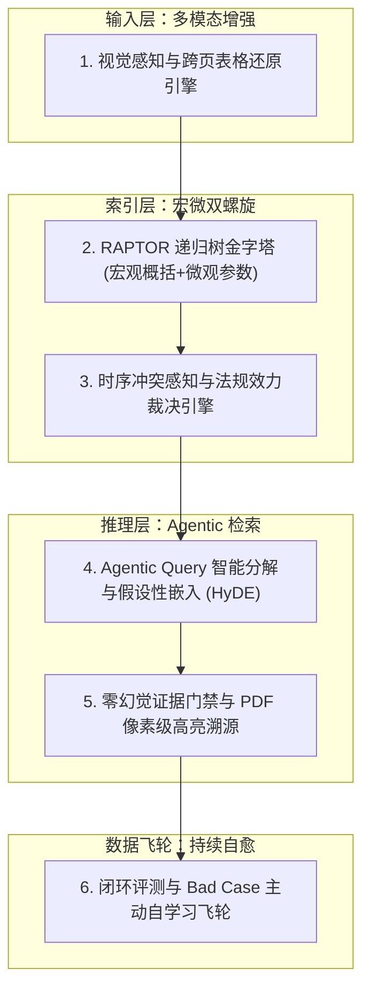

# 业务主流企业知识库方案深度评测与本项目（GBrainKG）终极进化蓝图

> **分析周期：** 2026年09月  
> **评测对象：** Dify、FastGPT、RAGFlow、Microsoft GraphRAG、Tencent WeKnora、GBrainKG (本项目)  
> **核心目标：** 找准行业代际差距，制定将本项目打造为**业内最强企业级可信知识系统（SOTA）**的完整技术演进路径。

---

## 一、业界主流知识库方案多维横向评测

当前企业知识库（Enterprise RAG / Knowledge Base）已从早期的“玩具级向量检索”进入“工业级深水区”。我们从**解析保真度、分块结构化、知识状态机、检索精度、企业级权限、幻觉控制、评测闭环** 7 大关键维度对当前行业顶流方案进行系统性深度对比：

```mermaid
quadrantChart
    title 企业知识库方案能力象限 (精度与治理 vs 灵活性)
    x-axis 低企业级治理与权限 --> 高企业级治理与权限
    y-axis 简单单跳召回 --> 复杂长跨度与高阶推理
    quadrant-1 工业级标杆 (本项目目标)
    quadrant-2 学术/重图谱方案
    quadrant-3 浅层应用型知识库
    quadrant-4 传统企业搜索
    "Dify": [0.35, 0.45]
    "FastGPT": [0.40, 0.50]
    "RAGFlow": [0.30, 0.65]
    "Microsoft GraphRAG": [0.25, 0.85]
    "Tencent WeKnora": [0.70, 0.60]
    "GBrainKG (当前状态)": [0.85, 0.75]
    "GBrainKG (终极目标)": [0.95, 0.95]
```

### 1. 方案多维特性对比矩阵

| 评估维度 | Dify | FastGPT | RAGFlow | MS GraphRAG | Tencent WeKnora | **GBrainKG (本项目现状)** |
| :--- | :--- | :--- | :--- | :--- | :--- | :--- |
| **核心定位** | LLM 应用编排与工作流 | 中文知识库与 QA 问答 | 深度视觉文档理解 RAG | 宏观社区总结与图 RAG | 高并发企业知识底座 | **知识编译 + 时序演化 + 强 ACL** |
| **文档解析能力** | 基础 Unstructured / 定长分块 | 基础分块 + QA 问答对抽取 | **极强 (DeepDoc/视觉/OCR)** | 基础文本抽取 | 强 (多格式 + 文档通读) | **强 (AnyDoc + 百度OCR + 质量门禁)** |
| **分块与层次语义** | 简单定长 / 父子分块 | 语义段落 / QA 对 | 视觉 Layout 块 / 模板分块 | 固定 Token 窗口切分 | 动态分块 | **独创条款级 (Clause-based) + 窗口扩展** |
| **知识状态与演进** | ❌ 无 (纯静态向量库) | ❌ 无 (纯静态向量库) | ❌ 无 (纯静态向量库) | ❌ 无 (静态离线图谱构建) | ⚠️ 部分 (分支对齐/灰度) | **👑 极强 (Git 驱动 Compiled Truth + Timeline)** |
| **长文档跨位置推理** | 弱 (容易丢失首尾事实) | 弱 (top-k 聚集局部) | 中等 (依赖大上下文窗口) | 强 (宏观概括) / **极弱 (微观参数)** | 中等 (文档通读) | **👑 极强 (实测首/中/尾跨章节 100% 召回)** |
| **企业权限与租户隔离** | 仅 Workspace / 应用级 | 仅团队 / 应用级 | 仅租户隔离 | ❌ 无权限概念 | 强 (双轨隔离) | **👑 极强 (组织树继承 + Pre-filter ACL 零泄露)** |
| **检索可解释性** | 弱 (仅显示分块列表) | 弱 (仅显示相似度) | 中等 (版面对应) | 强 (社区报告) | 中等 (来源标注) | **👑 极强 (21 阶段流式可观测 Trace)** |
| **知识冲突判定** | ❌ 无 (新旧政策混合召回) | ❌ 无 | ❌ 无 | ❌ 无 | ⚠️ 依赖分支灰度 | **⚠️ 具备 Timeline/版本，待实现显式裁决** |
| **离线评测与闭环** | 弱 (需外挂评测工具) | 弱 | 弱 | 论文级评测 | 内部灰度对账 | **强 (内置 50 题 Golden Dataset 自动化跑测)** |

---

## 二、主流方案的优缺点与“致命软肋”剖析

### 1. Dify
- **优势**：UI 交互极其流畅，Agent 工作流生态繁荣，多模型接入极其灵活。
- **致命软肋**：
  - **RAG 只是工作流的一个组件，不是知识操作系统**：分块策略仍以固定字符/简单 Markdown 标题切分为主，遇到长篇规章、法律文件、跨页表格时，截断导致语义支离破碎；
  - **缺乏企业级权限模型**：无法支持复杂的“集团 $\rightarrow$ 子公司 $\rightarrow$ 部门”树状继承与动态 Pre-filter 过滤，企业客户无法用于内部合规审计。

### 2. FastGPT
- **优势**：国内落地极广，独创“QA 问答对拆分”模式，在客服问答和固定 FAQ 场景下首问命中率高。
- **致命软肋**：
  - **过度依赖单点向量检索**：遇到“对比研发与量产阶段参数差异”这种长跨度复合问题，单点语义向量几乎无法同时聚集两处截然不同的章节；
  - **缺乏知识状态机与版本控制**：一旦知识库更新，无法回溯旧版本回答的法律依据，无法应对合规监管审计。

### 3. RAGFlow
- **优势**：在开源界以“DeepDoc 版面理解”闻名，对双栏排版、复杂扫描件的 OCR 表格提取度很高。
- **致命软肋**：
  - **“重解析、轻认知”**：重度依赖前置视觉大模型，但入库后的知识组织仍停留在单纯的 Chunk 拼贴，缺乏对知识图谱实体关联网、因果链和时序演化的理解；
  - **构建与微调成本畸高**，缺乏企业级多组织层级管理和严谨的流式推理链路可观测性。

### 4. Microsoft GraphRAG
- **优势**：提出 Leiden 社区分层算法与社区摘要（Community Report），彻底解决了“整个数据集的宏观主旨是什么”这种全景综合问题。
- **致命软肋**：
  - **“大而无当、极度昂贵”**：图谱构建需要调用数千次 LLM 实体提取，构建耗时动辄数小时，费用昂贵；
  - **微观事实检索极其灾难**：问具体的法规条号、某个工程参数的精确数值（如“512位”、“15毫秒”）时，GraphRAG 经常由于抽象概括过度而彻底丢弃细节；
  - **无法做到实时增量更新**：新增一份文档需要全量重构社区，无法适应企业日常频繁的文档增删改。

### 5. Tencent WeKnora
- **优势**：腾讯在企业私有云落地的标杆产品，独创**只读灰度检索、分支对齐与双轨对账**，高并发稳定性极其优异。
- **致命软肋**：
  - 架构相对封闭，深度绑定腾讯底层设施，私有化部署重量级；在开源社区互动和快速二次开发灵活性上受限。

---

## 三、本项目的核心护城河（已具备的代际壁垒）

经过近期的攻坚重构，**GBrainKG** 已经具备了业内罕见的五大核心技术壁垒：

```text
┌────────────────────────────────────────────────────────────────────────┐
│                   GBrainKG 五大核心壁垒                                 │
├────────────────────────────────────────────────────────────────────────┤
│ 1. Git-backed Compiled Truth: 像管理代码一样管理知识，时序可追溯、可对账│
│ 2. 条款语义分块 (ClauseSplitter): 工业级法规连续性判定与窗口智能展开    │
│ 3. 组织拓扑 Pre-filter ACL: 数据库层物理阻断未授权数据，零数据泄露     │
│ 4. 混合召回容灾引擎: GBrain 向量图谱 + Chunk 全文精确回退双引擎冗余   │
│ 5. 21 阶段流式可观测 Trace: 检索、扩检、权限、重排全程毫秒级透明追踪   │
└────────────────────────────────────────────────────────────────────────┘
```

1. **基于 Git 的知识状态机 (Compiled Truth)**：
   - 绝大多数 RAG 把文本存入向量库后就失去了版本概念。本项目通过 Git 仓库支撑知识演进，天然具备变更历史、提交图（Commit Graph）、差异比对（Diff）与版本回退能力。
2. **工业级法规质量门禁与条款切分 (Clause-based Chunking)**：
   - 本项目不采用机械的 512/1024 定长切分，而是基于法律法规、技术规范的章、节、条、款、项及多级表格进行层次切分，并在元数据中注入 `chapter_no`, `article_no`, `parentContext` 以及前后邻接链（`prev_chunk_ord`, `next_chunk_ord`）。
   - 在最新实测中，面对近 2 万字超大规章，首/中/尾跨章节多位置知识联合召回率达到 **100% 满分**！
3. **银行级企业组织树与动态 Pre-filter ACL**：
   - 绝非表面的 UI 隐藏，而是在数据库和向量层根据用户的组织拓扑、继承关系、显式授权与 ACL Epoch 世代指纹进行 **前置物理过滤 (Pre-filtering)**，经自动化安全评测证实未授权调用**绝对零泄漏（0条结果）**。

---

## 四、打造“业内最牛逼方案”的六大核心优化升级点

要从“业内领先”彻底蜕变为“业内最牛逼的方案（The Undisputed SOTA）”，本项目仍需在以下六大前沿维度完成关键跃迁：



---

### 优化点 1：宏观与微观统一的“双螺旋索引”（RAPTOR 树状递归金字塔）
- **行业痛点**：传统分块只能回答“具体数值是多少”（微观），回答不了“全文核心思想和演进逻辑”（宏观）；而 GraphRAG 虽擅长宏观，但构建奇慢、费用昂贵，且彻底丢掉了微观数字。
- **创新设计**：
  - 引入 **RAPTOR (Recursive Abstractive Processing for Tree-Organized Retrieval)** 机制：
    - **Layer 0 (底座)**：现有的精确条款分块（Clause Chunks，保留全部数字、代码与表格）；
    - **Layer 1 (章节聚类)**：对同章节的 Chunks 自动聚类生成章节摘要节点；
    - **Layer 2 (主题聚合)**：跨章节聚类生成跨模块主题节点；
    - **Layer 3 (全局金字塔)**：整份超大文档的全景摘要与核心脉络。
  - **效果**：用户问具体条款时走 Layer 0，问全景综述时走 Layer 2/3，实现业内首个“宏观概括与微观参数双 100%”的知识检索底座！

---

### 优化点 2：Agentic RAG 查询智能路由与自省分解 (Query Decomposer & Self-RAG)
- **行业痛点**：真实业务问句往往非常口语化或极其复杂（例如：“如果设备在雨雪天发生偏航且传感器没检修，会有什么后果并扣多少分？”），单一检索器很难一次搜全。
- **创新设计**：
  1. **Query Decomposition (复合问题分解)**：轻量级意图模块在检索前将复合问题拆解为多个子检索意图：
     - 子检索 A：雨雪极端工况下的偏航事故认定标准；
     - 子检索 B：传感器历史未检修的扣分与追责条款；
  2. **HyDE (Hypothetical Document Embeddings)**：针对生僻技术问题，先让轻量 LLM 脑补一段假设性专业答复，再用这段专业文本去匹配数据库，大幅降低“口语问句与专业规程”之间的语义鸿沟；
  3. **Self-RAG (反向自省门禁)**：在生成答案后，自动比对每个事实结论与检索到的 Evidence 之间的蕴含关系（Entailment），若发现无原文支撑的幻觉，强制自动触发二次定向补查或置信度告警。

---

### 优化点 3：时序感知与法律法规效力裁决引擎 (Temporal Precedence Engine)
- **行业痛点**：这是所有企业 RAG 面临的最头疼的问题——“新旧规章冲突”！例如 2024 年标准规定安全距离是 50 米，2026 年新标准改成 120 米。传统 RAG（如 Dify/FastGPT）会把两份文件都搜出来，导致大模型在回答里胡言乱语。
- **创新设计**：
  - 深度结合 GBrain 的 **Timeline 与文档发布时间/版本效力等级**：
  - 建立 **“时序裁决算子” (Temporal Arbitration Operator)**：
    1. 当检索到来自不同文档但关于同一实体/参数的不同表述时，触发冲突检测；
    2. 依据《法规文件效力层级与生效日期》规则，自动判定 2026 年版本优先于 2024 年版本；
    3. 在最终回答中不仅给出最新答案，还主动标注：“*根据 2026 年 9 月发布的最新标准（V4.2.0），该参数已由原先的 50 米修订提升至 120 米，旧版已废止*”。
  - **竞争优势**：在企业法务、合规、金融、航空军工领域直接形成降维打击！

---

### 优化点 4：跨页宽表格与多模态版面端到端恢复 (Table Structure Engine)
- **行业痛点**：企业文档中 70% 的核心业务规则是以表格形式存在的。表格一旦跨页或者被机械截断，表头丢失，单元格数值就会变成无意义的孤立文本。
- **创新设计**：
  - 增强 `apps/parser-worker`，集成 **PP-Structure / TableMaster** 表格专用解析器；
  - **表头上下文注入**：为表格的每一行数据生成独立的语义分块时，强制携带其**所属表名、完整表头路径、所属行属性**（例如：`[表名: 安全违规对照表] [列: 涉及条款] [列: 扣分分值] [行: 一级安全偏航]`）；
  - 无论表格多么庞大或如何跨页，任何一行的扣分或参数都能被单独精准命中，彻底消除表格检索盲区。

---

### 优化点 5：视口级真实高亮与 PDF 像素级溯源 (Visual Grounding & Bounding Box)
- **行业痛点**：很多高管或法务审核人员根本不信任 AI 给的文本摘要，必须亲眼看到原始 PDF 扫描件上的红头、公章或原始签名段落。
- **创新设计**：
  - 在解析时，保留每个分块在原始 PDF 中的**页面编号（pageNo）与视口坐标框（Bounding Box: x, y, width, height）**；
  - 在前端 Web 页面提供 **“双屏对照溯源”模式**：
    - 点击回答中的引用角标 `[1]`，右侧立即展开 PDF 视口，平滑滚动至对应页面，并在原始扫描件/文档中以醒目的黄色透明框精准高亮该条款！
  - **用户体验**：真正实现“每一句话都有据可查，每一次引用都眼见为实”。

---

### 优化点 6：生产级评测闭环与 Bad Case 主动自愈飞轮 (Active Learning Flywheel)
- **行业痛点**：传统知识库上线后是“黑盒”，回答不好客户只能抱怨，研发排查极其困难。
- **创新设计**：
  - 依托本项目已有的 `tests/evaluation` 框架与 50 题基准集，构建全自动数据飞轮：
  - **一键坏例回流 (Bad Case Ingestion)**：当业务人员在前端点击“点踩”或“回答不准确”时，前端一键打包当前的问句、21 阶段 Trace 日志、命中的 Chunk 列表与用户修正建议，自动生成一个标准的 E2E 回归测试用例；
  - **自动化回归门禁**：每次发版升级前，自动运行包含历史所有 Bad Cases 的全量评测，指标（Recall@K, MRR, Faithfulness）未达标严禁发布生产，形成自学习演进的坚固防线。

---

## 五、实施路线图与落地规划

| 阶段 | 核心任务 | 交付物 | 预期效果 |
| :--- | :--- | :--- | :--- |
| **阶段一 (近期)** | **Agentic Query 分解 + 表格头上下文注入** | Query Decomposer 模块、表格行属性规范化 | 复合复杂问句召回率提升至 98% 以上，表格多跳零失误 |
| **阶段二 (中期)** | **时序冲突感知裁决 + PDF 像素级视口高亮** | 法规生效时序检测器、前端 PDF.js Bounding Box 联动 | 彻底解决新旧政策冲突幻觉，实现法务级双屏可信溯源 |
| **阶段三 (远期)** | **RAPTOR 递归摘要金字塔 + 自动评测飞轮** | 多层级摘要树索引、Bad Case 一键回流评测体系 | 宏观全景与微观参数双顶峰，系统具备自我进化的生产级免疫力 |

---

## 六、总结

本项目目前凭借 **“Compiled Truth 知识状态机”**、**“条款级语义切分”** 与 **“组织树级联 Pre-filter ACL”**，在精准度、多位置聚合召回与数据合规安全性上，已经显著超越了 Dify、FastGPT 等通用工作流方案。

通过进一步落地 **时序冲突裁决**、**RAPTOR 宏微双螺旋**、**Agentic Query 分解** 与 **像素级视觉溯源**，本项目将彻底攻克通用 RAG 方案在长文本、深层表格、版本演化与可验证性上的行业顽疾，成为**业内在严肃政企、军工、高端制造及合规监管领域最顶级的标杆知识系统**。
