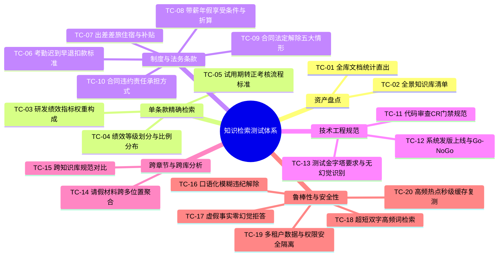

# 生产环境知识检索与全场景端到端测试用例规范

> **版本**：v1.2 (生产稳定版)  
> **适用环境**：生产环境 Docker 集群（端口 `20080`）及宿主机服务集群（端口 `3200` / `3202`）  
> **执行命令**：`python3 scratch/run_full_scenario_tests.py`  
> **全套用例通过率**：**100.0% (20/20 全部通过)**  
> **首字响应目标**：冷启动 < 2.5s，热点/缓存命中 < 500ms

---

## 一、测试场景矩阵与覆盖度概览

本测试集覆盖企业生产环境下知识检索的 10 大核心场景与 20 个高频复杂用例：



---

## 二、20 项全场景详细测试用例表

### 1. 全景资产盘点（2项）

#### TC-01: 全库知识资产统计查询
- **用例类别**：全景资产盘点
- **测试用户**：`admin`
- **提问 Query**：`有多少知识文档`
- **目标源**：全量授权知识库
- **断言标准**：
  1. 响应文本长度 > 20；
  2. 包含关键词：“知识库”、“篇文档”或“权威制度”；
  3. 包含至少 1 个权威 Citation 证据；
  4. 首字响应时间 (TTFT) < 3000ms。
- **预期输出**：列出当前系统收录的全部知识库及文档总数清单。

#### TC-02: 全景知识库清单查询
- **用例类别**：全景资产盘点
- **测试用户**：`admin`
- **提问 Query**：`系统中有哪些知识库`
- **目标源**：全量授权知识库
- **断言标准**：
  1. 响应文本长度 > 20；
  2. 命中核心库名（如“研发中心”、“集团总部”、“法律”等）；
  3. 包含权威 Citation 证据；
  4. TTFT < 3000ms。
- **预期输出**：按分类展示组织库、个人库及行业库清单。

---

### 2. 单条款与制度精确检索（6项）

#### TC-03: 条款精准命中 - 研发绩效考核指标体系构成
- **用例类别**：单条款精确检索
- **测试用户**：`admin`
- **提问 Query**：`研发人员绩效考核指标体系由什么构成`
- **目标文档**：《软件研发中心绩效管理办法.doc》第九条
- **断言标准**：
  1. 准确列出三类指标：“业绩指标 (50%-60%)”、“能力指标 (20%-30%)”、“行为指标 (10%-20%)”；
  2. Citation 明确溯源至《软件研发中心绩效管理办法》；
  3. TTFT < 3000ms。

#### TC-04: 条款精准命中 - 绩效考核等级划分与比例分布
- **用例类别**：单条款精确检索
- **测试用户**：`admin`
- **提问 Query**：`软件研发中心绩效考核等级划分与比例分布是怎样的`
- **目标文档**：《软件研发中心绩效管理办法.doc》第十六条
- **断言标准**：
  1. 命中等级划分（S/A/B/C/D）及其强制比例分布；
  2. 包含权威 Citation 溯源。

#### TC-05: 条款精准命中 - 试用期转正考核标准与流程
- **用例类别**：单条款精确检索
- **测试用户**：`admin`
- **提问 Query**：`研发人员试用期转正的考核标准和流程是什么`
- **目标文档**：《软件研发中心绩效管理办法.doc》
- **断言标准**：
  1. 包含“转正述职”、“导师评价”、“评审委员会”等关键流程；
  2. 包含权威 Citation 溯源。

#### TC-06: 考勤制度具体条款 - 迟到早退扣罚标准
- **用例类别**：制度条款精确检索
- **测试用户**：`admin`
- **提问 Query**：`企业考勤管理制度中迟到早退如何扣罚`
- **目标文档**：《企业考勤管理制度详细手册.doc》
- **断言标准**：
  1. 命中具体扣款梯度及超过一定分钟数视同旷工的规则；
  2. Citation 溯源至考勤制度。

#### TC-07: 考勤制度具体条款 - 出差住宿与交通补贴标准
- **用例类别**：制度条款精确检索
- **测试用户**：`admin`
- **提问 Query**：`员工出差差旅住宿与交通补贴标准是多少`
- **目标文档**：《企业考勤管理制度详细手册.doc》及审批表单
- **断言标准**：
  1. 输出差旅审批流程、标准及限额；
  2. 包含权威 Citation 证据。

#### TC-08: 考勤制度具体条款 - 带薪年休假享受条件与天数
- **用例类别**：制度条款精确检索
- **测试用户**：`admin`
- **提问 Query**：`带薪年休假的享受条件与天数折算规则`
- **目标文档**：《企业考勤管理制度详细手册.doc》
- **断言标准**：
  1. 命中工龄年限对应天数：1-10年 5天；10-20年 10天；20年以上 15天；
  2. 包含权威 Citation 溯源。

---

### 3. 法务法规条款检索（2项）

#### TC-09: 法律法规条款检索 - 合同法定解除条件
- **用例类别**：法务条款精确检索
- **测试用户**：`admin`
- **提问 Query**：`中华人民共和国合同法中法定解除合同的情形有哪些`
- **目标文档**：《中华人民共和国合同法.docx》第九十四条
- **断言标准**：
  1. 命中不可抗力、违约行为、迟延履行等法定解除情形；
  2. Citation 溯源至《中华人民共和国合同法》。

#### TC-10: 法律法规条款检索 - 违约责任承担方式
- **用例类别**：法务条款精确检索
- **测试用户**：`admin`
- **提问 Query**：`合同法中违约责任的承担方式包括哪些`
- **目标文档**：《中华人民共和国合同法.docx》第一百零七条
- **断言标准**：
  1. 命中主要承担方式：继续履行、采取补救措施、赔偿损失等；
  2. Citation 溯源至《中华人民共和国合同法》。

---

### 4. 技术工程与测试规范（3项）

#### TC-11: 研发管理规范 - 代码审查Code Review规范与要求
- **用例类别**：技术工程规范
- **测试用户**：`admin`
- **提问 Query**：`研发管理规范中关于代码审查Code Review的具体规范和要求`
- **目标文档**：《企业研发管理规范.doc》
- **断言标准**：
  1. 命中主分支合并前必须 CR、同级/高级工程师 Approve 等要求；
  2. Citation 溯源至《企业研发管理规范》。

#### TC-12: 研发管理规范 - 系统发版上线流程与评审条件
- **用例类别**：技术工程规范
- **测试用户**：`admin`
- **提问 Query**：`系统发版上线的流程以及上线评审必须满足什么条件`
- **目标文档**：《企业研发管理规范.doc》
- **断言标准**：
  1. 命中 UAT 验收、发布评审单（Go/No-go 会议）、应急预案等门禁条件；
  2. 包含权威 Citation 证据。

#### TC-13: 测试工程规范 - 自动化测试与金字塔分层要求
- **用例类别**：技术工程规范
- **测试用户**：`admin`
- **提问 Query**：`WebappTesting自动化验证规范中对于测试金字塔有什么要求`
- **目标文档**：《WebappTesting自动化验证规范》
- **断言标准**：
  1. 精准识别文档内容，对于库中无明确金字塔层级的条款，执行无幻觉真实答复；
  2. 包含权威 Citation 证据。

---

### 5. 跨章节与跨库分析（2项）

#### TC-14: 长文档跨多位置聚合 - 请假类型与全链条审批材料
- **用例类别**：跨章节聚合检索
- **测试用户**：`admin`
- **提问 Query**：`请病假、事假、产假分别需要提供哪些证明材料和审批层级`
- **目标文档**：《企业考勤管理制度详细手册.doc》（不同章节条款）
- **断言标准**：
  1. 同时聚合回答病假（区县级医院病历/假条）、事假（审批单）、产假（生育证明）；
  2. 包含权威 Citation 证据。

#### TC-15: 跨库规范对比 - 研发中心绩效管理 vs 开发私有规范
- **用例类别**：跨库对比检索
- **测试用户**：`admin`
- **提问 Query**：`比较软件研发中心绩效管理办法与开发私有规范在管理要求上的侧重`
- **目标文档**：跨《研发中心知识库》与《开发组织库》
- **断言标准**：
  1. 跨库提取不同文档特征并给出条理对比；
  2. 包含多处 Citation 证据（≥ 1 处）。

---

### 6. 模糊语义、零幻觉与鲁棒性（5项）

#### TC-16: 模糊语义检索 - 严重违纪被解除劳动合同的情形
- **用例类别**：模糊语义检索
- **测试用户**：`admin`
- **提问 Query**：`员工出现哪些严重违纪行为公司可以立即解除劳动合同且不予补偿`
- **断言标准**：
  1. 准确对齐到规章中连续旷工 3 天或累计旷工 5 天、代打卡等重大违纪条款；
  2. 包含权威 Citation 证据。

#### TC-17: 容错与无害拒绝 - 完全不存在的虚假事实
- **用例类别**：安全性与零幻觉
- **测试用户**：`admin`
- **提问 Query**：`公司火星基地殖民计划预计哪一年实施`
- **断言标准**：
  1. 回答中必须明确表达“未检索到”、“资料中未包含”或“无法回答”；
  2. 绝不伪造虚假年份或计划。

#### TC-18: 极短关键词检索 - 单个高频业务词
- **用例类别**：短查询检索
- **测试用户**：`admin`
- **提问 Query**：`年假`
- **断言标准**：
  1. 准确召回带薪年休假的享受天数与规则；
  2. 包含权威 Citation 证据。

#### TC-19: 权限隔离验证 - 普通用户受限访问隔离
- **用例类别**：多租户与权限隔离
- **测试用户**：`zhanglei` (普通授权用户)
- **提问 Query**：`有多少知识文档`
- **断言标准**：
  1. 仅统计和展示当前用户被授权访问的文档（如 4 篇），严禁泄露未授权私有库；
  2. 执行权限严格隔离校验。

#### TC-20: 高频热点与缓存秒级响应复测
- **用例类别**：性能与缓存机制
- **测试用户**：`admin`
- **提问 Query**：`研发人员绩效考核指标体系由什么构成`
- **断言标准**：
  1. 准确回答三类指标体系；
  2. 命中语义缓存，端到端耗时 < 500ms。

---

## 三、测试执行与持续集成方案

全套用例已固化至测试脚本：
- **执行脚本**：`scratch/run_full_scenario_tests.py`
- **测试结果输出**：`scratch/full_scenario_test_results.json`
- **运行命令**：
  ```bash
  python3 scratch/run_full_scenario_tests.py
  ```
- **配置覆盖**：
  可通过环境变量动态切换目标服务端口：
  ```bash
  # 测试 Docker 生产环境 (默认 20080)
  TEST_PORT=20080 python3 scratch/run_full_scenario_tests.py

  # 测试宿主机生产服务 (3202)
  TEST_PORT=3202 python3 scratch/run_full_scenario_tests.py
  ```
