# LLMWiki 企业级智能知识库平台 · 官方使用与操作手册 (White House Showcase Edition)

> **版本**：v2.4.0-Enterprise  
> **适用受众**：企业决策层、系统管理员、知识库主管、合规审查员、日常业务用户  
> **文档定位**：全功能实操指南、界面控件图解、白宫演示演练 SOP (Standard Operating Procedure)

---

## 目录 (Table of Contents)

1. [第一章：系统访问与多角色鉴权体系](#第一章系统访问与多角色鉴权体系)
2. [第二章：知识库三级隔离与生命周期管理](#第二章知识库三级隔离与生命周期管理)
3. [第三章：多格式文档入库、版面解析与父子分块](#第三章多格式文档入库版面解析与父子分块)
4. [第四章：智能对话问答与 Compiled Truth 可信证据链](#第四章智能对话问答与-compiled-truth-可信证据链)
5. [第五章：知识图谱力导向网络与实体拓扑探索](#第五章知识图谱力导向网络与实体拓扑探索)
6. [第六章：管理控制台、组织架构树与模型网关配置](#第六章管理控制台组织架构树与模型网关配置)
7. [第七章：全局快捷键与效率操作速查](#第七章全局快捷键与效率操作速查)
8. [第八章：白宫高规格演示操作脚本 (Demo Runbook)](#第八章白宫高规格演示操作脚本-demo-runbook)

---

## 第一章：系统访问与多角色鉴权体系

### 1.1 环境访问地址与端口规划
- **Web 前端控制台**：`http://localhost:3200`
- **核心业务 API 网关**：`http://localhost:3202`
- **Docling 智能解析引擎**：`http://localhost:8100`

### 1.2 预置演示账号与权限矩阵

| 账号身份 | 用户名 | 默认密码 | 组织归属 | 核心权限与角色定位 |
|---|---|---|---|---|
| **超级管理员** | `CY` | `admin123` | 集团总部 / 合规部 | 全局全量权限、系统管理控制台、模型网关注册、全组织知识库管控 |
| **组织管理员** | `LK` | `admin123` | 市场部 | 市场部组织库管理员、人员授权、部门文档上传/删除 |
| **研发主管** | `LH` | `admin123` | 研发中心 | 研发中心组织库管理员、代码及技术标准库维护 |
| **普通研究员** | `ZM` | `admin123` | 研发中心 | 个人知识库创作、授权组织库只读检索、AI 智能对话 |

### 1.3 登录界面与操作步骤

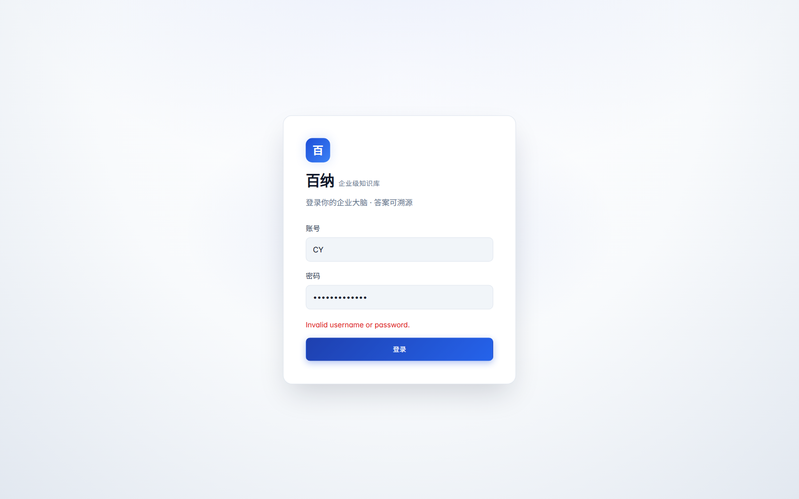

#### 界面元素说明 (UI Breakdown)：
1. **① 用户名/邮箱输入框**：支持输入登录用户名（如 `CY`）或标准工作邮箱（如 `chenyu@example.com`）。
2. **② 登录密码输入框**：密文遮罩输入，支持回车键快捷提交。
3. **③ 快速身份切换卡片**：在测试与演示环境中，点击右下角快捷预置账号可实现一键填充。
4. **④ 登录按钮**：触发基于加盐 scrypt 哈希校验并下发高安全性 JWT Token。

#### 操作步骤：
- **步骤 1**：在浏览器地址栏打开 `http://localhost:3200`。
- **步骤 2**：在用户名输入框输入 `CY`，密码输入框输入 `admin123`。
- **步骤 3**：点击 **「登录」** 按钮或直接按下 `Enter` 键。
- **步骤 4**：系统完成 JWT 鉴权并在本地存储 Session，自动跳转进入主工作区。

---

## 第二章：知识库三级隔离与生命周期管理

平台构建了业界领先的 **三级多租户知识库隔离架构**，确保数据在物理与逻辑层面的绝对安全性：

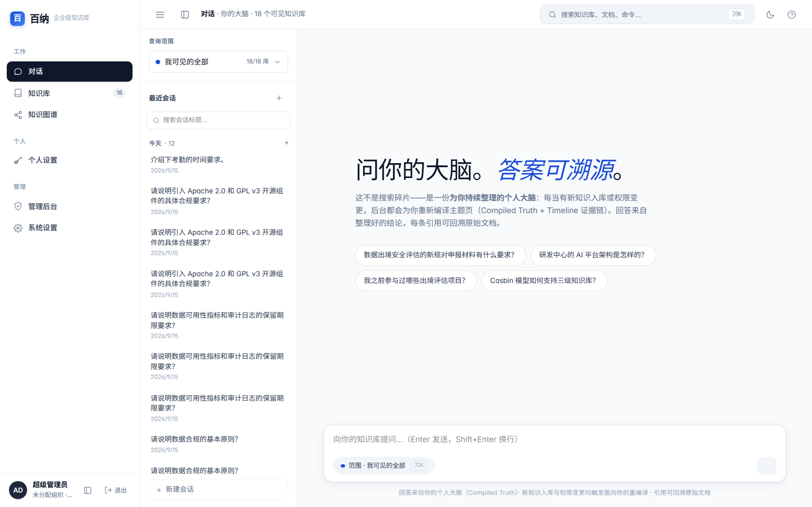

### 2.1 三级知识库核心定义
1. **个人知识库 (Personal KB)**：
   - **可见性**：严格仅创建者本人可见，不支持跨账号共享与派生授权。
   - **应用场景**：个人调研笔记、敏感草稿、待整理原始素材。
2. **组织知识库 (Organization KB)**：
   - **可见性**：依据企业行政组织树（部门/中心/小组）自动继承，部门成员开箱即用。
   - **应用场景**：部门制度规范、业务 SOP、技术文档、项目协作档案。
3. **行业标准库 (Industry KB)**：
   - **可见性**：企业级公共权威库，由超级管理员统一创建，通过 ACL 授权给指定人员、角色或部门节点。
   - **应用场景**：国家法律法规、行业合规标准、集团红头文件。

---

### 2.2 新建个人知识库实操

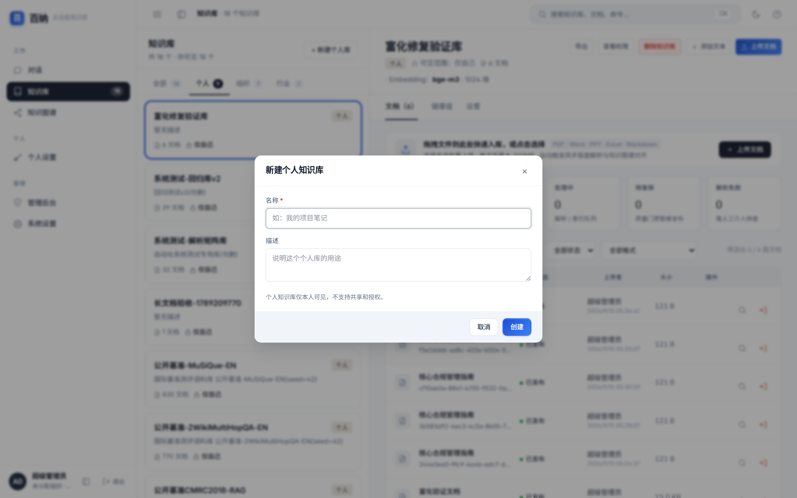

#### 操作步骤：
1. 点击左侧主导航栏的 **「知识库」** 图标（或按下快捷键 `⌘2`）。
2. 在左侧面板上方点击 **「+ 新建个人库」** 按钮，弹出新建弹窗。
3. **输入名称**：输入知识库标题（如 `企业合规研究专题库`）。
   > **边界约束**：名称不能为空，名称为空时「创建」按钮将保持置灰禁用状态。
4. **输入描述**：填写知识库的业务定位与说明（如 `用于跟踪数据出境与隐私合规相关文献`）。
5. 点击 **「创建」** 按钮，系统完成数据库写入并在左侧列表实时高亮新卡片。

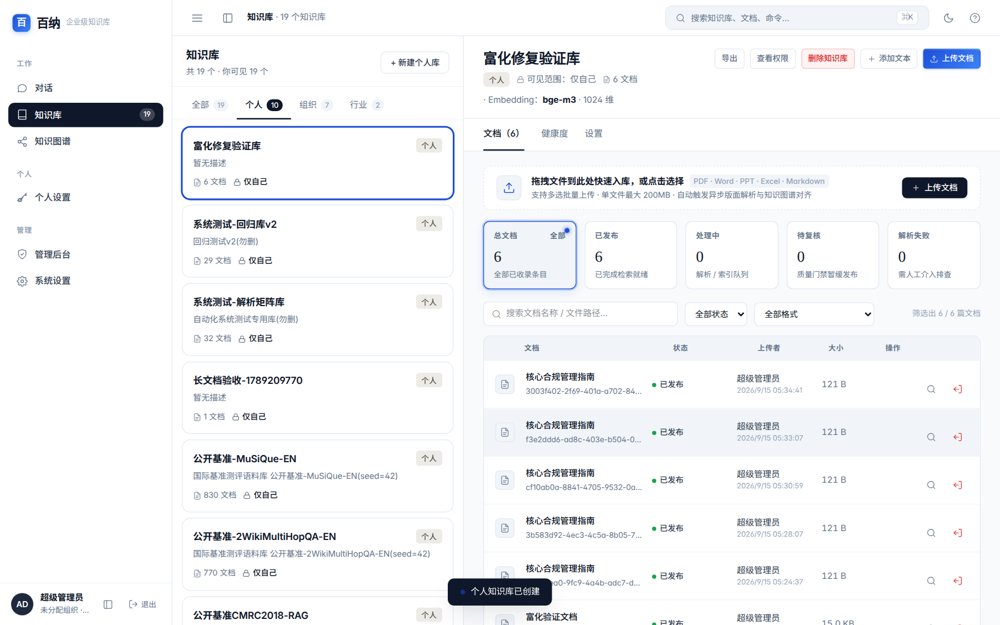

---

### 2.3 知识库多维过滤与切换
在知识库列表顶部，提供了即时分类筛选 Tab：
- **全部**：聚合展示当前用户可见的所有三级知识库。
- **个人**：仅过滤出属于当前用户的私有知识库。
- **组织**：过滤展示所在部门及下级部门的组织知识库。
- **行业**：展示已获得授权的行业标准与公共政策库。

---

## 第三章：多格式文档入库、版面解析与父子分块

LLMWiki 集成了先进的 **Docling 高保真版面解析引擎** 与 **Parent-Child（父子层级）分块架构**，确保表格、标题层级与长上下文不发生语义丢失。

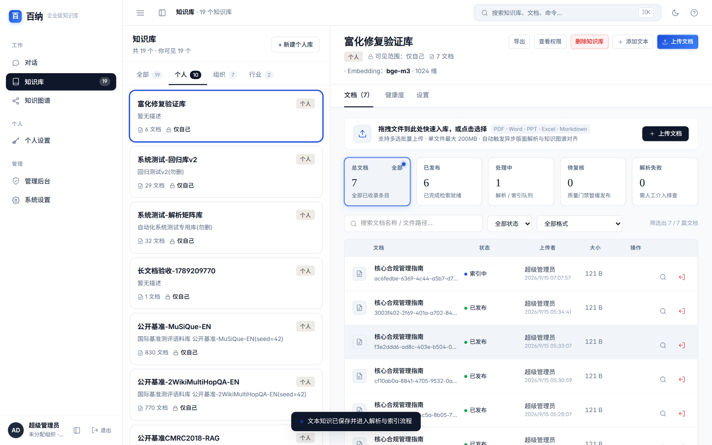

### 3.1 异步非阻塞上传与批量并发处理 (Non-blocking Upload)

系统采用**完全异步非阻塞的文档接收与后台处理架构**。在知识库中上传文档后，前端无需停滞等待解析完成，上传按钮与拖拽区域保持完全可用，支持立即连续上传下一个文档或批量多选上传：

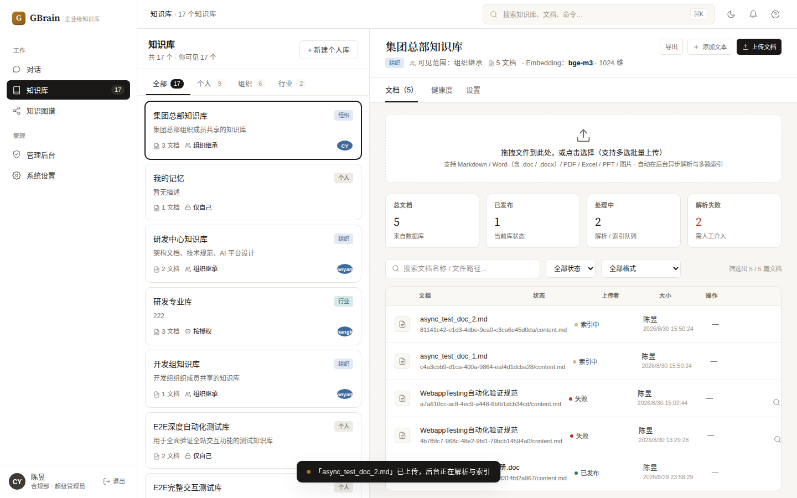

#### 核心交互与进展跟踪机制：
1. **多选与拖拽支持**：支持点击「上传文档」按钮在文件选择器中按住 `Ctrl/⌘` 多选，或直接将多个文件拖入拖拽区域。
2. **零等待非阻塞响应**：选定文件后，系统毫秒级将文件送入后台接入流水线并给出气泡提示，**上传按钮与拖拽区绝不锁定**，随时可继续添加。
3. **动态状态实时轮询**：
   - 刚上传的文档在表格中即时呈现为 **`🟡 解析中`** 或 **`🟡 索引中`** 状态。
   - 前端后台采用低负载自动轮询机制，文档处理完毕后状态自动无缝跃迁至 **`🟢 已发布`**，无需用户手动按 F5 刷新页面。

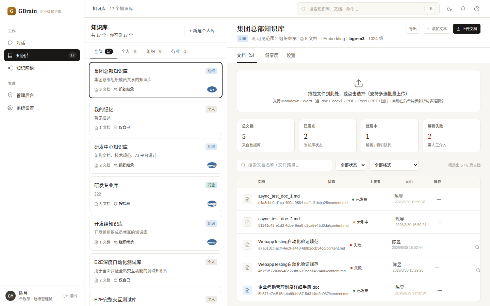

---

### 3.2 支持的文件格式与自动版面还原
- **Markdown / 纯文本**：`.md`, `.txt`（即时解析分块）
- **富文本办公文档**：Word (`.docx`, `.doc`), Excel (`.xlsx`), PPT (`.pptx`)
- **固定版式文件**：PDF (`.pdf`, 支持单双栏、扫描件 OCR 与跨页表格)
- **结构化数据**：`.csv`, `.html`

---

### 3.3 手动录入结构化 Markdown 文本

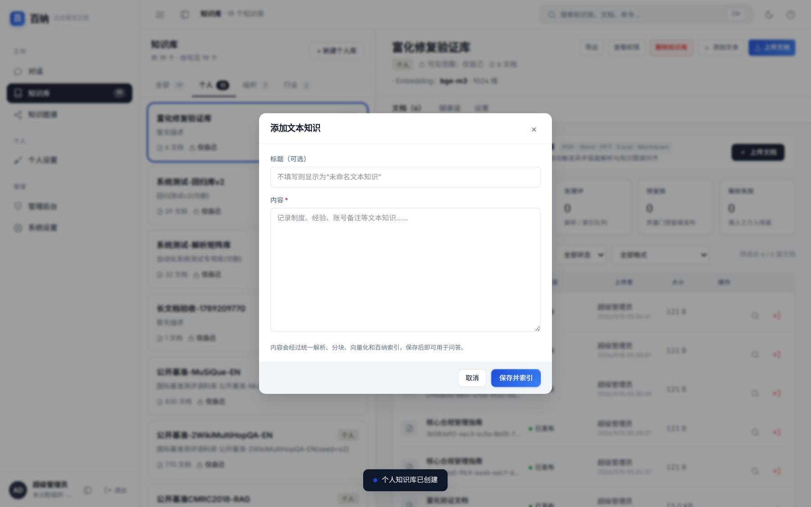

#### 操作步骤：
1. 在选中的知识库主界面，点击右上角操作栏的 **「+ 添加文本」** 按钮。
2. **输入标题**：输入文档名称（如 `企业数据出境安全评估操作指南`）。
3. **录入正文**：在文本框中输入标准 Markdown 内容（支持多级标题、有序/无序列表、代码块与表格）。
4. 点击 **「保存并索引」** 按钮。
5. 系统自动启动高可用多级后台处理流水线：
   - **PDF 文档**：第一级采用 `pypdf` 高速结构化解析（50ms 提取原生排版与分页），并自动过滤字体编码中的 `\u0000` 空字符；对扫描件无缝降级至 `Docling Layout OCR` 模型。
   - **Word 文档**：第一级采用 `python-docx` 提取标题层级与表格，并对老旧 `.doc` 启用 `antiword` 引擎转换。
   - **Excel 表格**：第一级采用 `openpyxl` 转换为标准 Markdown 表格。
   - **分块与向量化**：标准 Markdown -> 父子分块 (1800/200) -> bge-m3 向量化 -> Compiled Truth 知识库实时编译与在线检索。

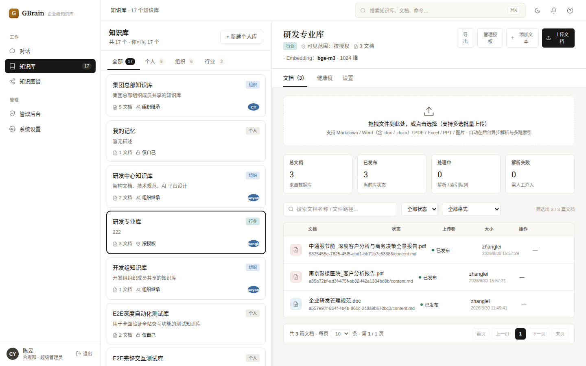

---

### 3.4 通用文档前端预览与知识切片洞察 (Universal Document Viewer)

系统搭载了业界主流的前端高保真渲染套件（集成 `docx-preview` 原生 Word 渲染器、`marked` Markdown 排版引擎、`xlsx` SheetJS 多工作表表格解析器与浏览器原生 PDF 引擎），彻底告别外部复杂文档服务器依赖，支持毫秒级无缝预览：

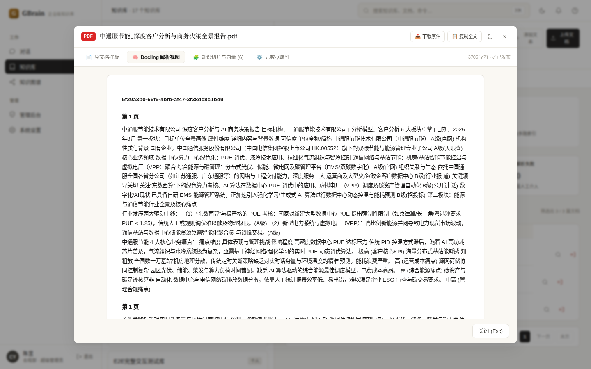

#### 四维多模态预览选项卡：
1. **📄 原文档排版 (Raw Render)**：
   - **Word (`.docx`, `.doc`)**：纯前端 DOM 排版还原（支持段落、字体、内嵌表格与页边距）。
   - **PDF (`.pdf`)**：浏览器原生矢量渲染，自带缩放、页面定位与搜索。
   - **Excel (`.xlsx`, `.csv`)**：交互式多 Sheet 切换器，提供带斑马纹的响应式表格数据透视。
   - **Markdown / 纯文本**：GitHub 风格美化排版与代码高亮。
2. **🧠 Docling 解析视图 (Parsed View)**：
   - 展现经深度版面分析后提取的规范化 Markdown 结构树，方便对照清洗质量。
   
   

3. **🧩 知识切片与向量 (Chunks Inspector)**：
   - 直观展示文档被拆分成的细粒度检索 Chunk（包含 `#0`, `#1`, `#2` 序号、Token 计数、字符区间），支持一键复制单分块。
   
   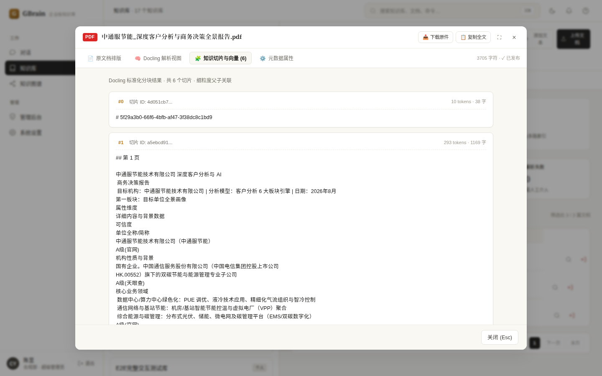

4. **⚙️ 元数据属性 (Metadata)**：
   - 审查文档的唯一 UUID、所属库 ID、存储后端归档状态、发布生命周期与时间戳。

#### 操作快捷键与工具栏：
- **📥 下载原件**：一键导出本地备份。
- **📋 复制全文**：复制经过规范化提取的 Markdown 全文字符。
- **⛶ 全屏沉浸式阅读**：一键切换至 98% 视窗全屏模式。
- **Esc 键 / ×**：随时无阻退出。

### 3.5 库内知识多维搜索、状态过滤与海量分页

为应对企业级海量知识文档资产（成千上万篇规章、技术规范与数据表），知识库文档管理区提供了强大的实时检索、多条件过滤与高效分页组件：

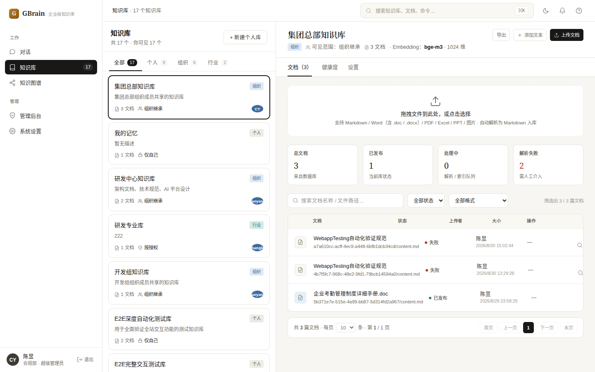

#### 核心功能与操作指南：
1. **🔍 实时文档检索**：在搜索栏中输入文档名称、关键字或存储相对路径，表格将毫秒级联动过滤。
2. **多状态精确筛选**：
   - `全部状态`：查看当前库内所有文档。
   - `已发布`：已完成 Docling 解析与向量索引，可在智能问答中被检索。
   - `索引中 / 解析中`：正在流水线中处理的文档。
   - `解析失败`：支持点击行末的「重试 🔄」按钮一键重新发起解析。
3. **格式分类筛选**：支持快速按 `Word (.docx/.doc)`、`PDF (.pdf)`、`Excel (.xlsx/.csv)`、`Markdown / 纯文本` 进行格式聚类查看。
4. **分页与每页容量配置**：
   - 支持自由切换每页容量（`10` / `20` / `50` 条）。
   - 提供 `首页`、`上一页`、`页码快速跳转`、`下一页`、`末页` 完整导航控件。

---

## 第四章：智能对话问答与 Compiled Truth 可信证据链

不同于传统的黑盒 RAG 简单向量拼接，LLMWiki 采用 **编译式知识检索 (Compiled-then-Query)** 架构，为金融与政府级应用提供不可伪造的真实性保障。

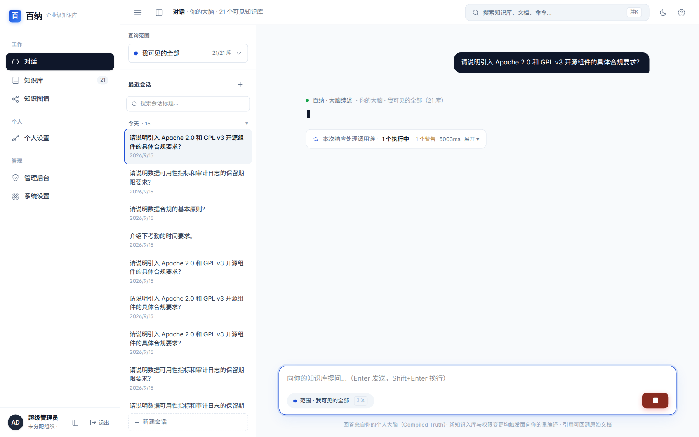

### 4.1 检索范围灵活控制 (Scope Picker)

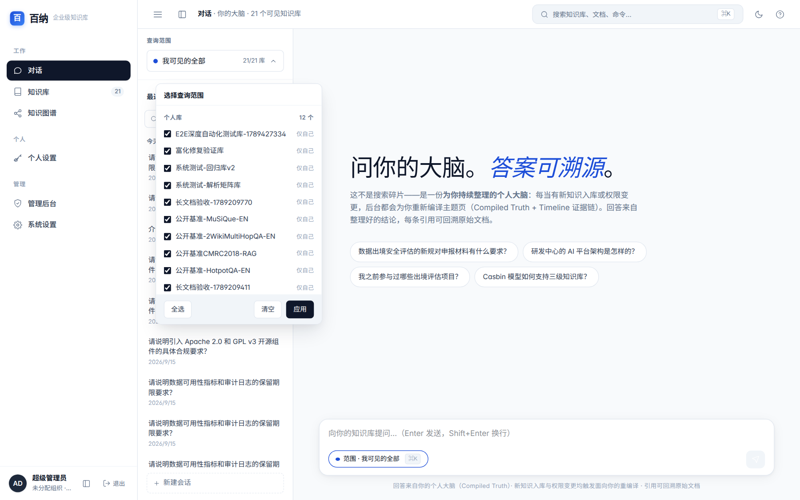

#### 操作步骤：
1. 进入 **「对话」** 模块（或按快捷键 `⌘1`）。
2. 在输入框底部的胶囊工具栏中，点击 **「范围 · 我可见的全部 ⌘K」**。
3. 在弹出的多选浮层中：
   - 勾选 **「全选」**：跨所有可见库进行全局智能检索。
   - 或单独勾选指定库（如仅勾选 `合规部知识库` 和 `行业标准库`）。
4. 选项即时生效，输入框下方的状态指示灯将更新为已选库数量。

---

### 4.2 发起流式提问与交互体验
1. 在输入框中输入业务问题（例如：`请说明数据出境安全评估的申报条件与核心材料清单？`）。
2. 按下 `Enter` 发送（如需换行请按 `Shift + Enter`）。
3. **SSE 流式生成**：大语言模型以打字机动效逐字输出结构化解答。
4. **数字溯源引用角标**：在正文中出现的每一处结论均自动标注来源角标（如 `[1]`、`[2]`）。
5. **精准证据链展开**：
   - 点击消息底部的 **「大脑整理与查询」** 折叠面板。
   - 即可清晰查看：**权限视图边界判定 -> 主题页检索 -> Compiled Truth 结论生成 -> 原始文档切片对齐** 的完整四级过程。

---

### 4.3 答案质量反馈机制
在每条 AI 回答卡片的底部右侧：
- 点击 **「👍 有用」**：标记该条回答为高质量标准答案，并记录至审计反馈库。
- 点击 **「📋 复制」**：一键将 Markdown 格式完整答案复制到系统剪贴板。
- 点击 **「🔄 重写」**：携带上下文重新触发推理生成。

---

## 第五章：知识图谱力导向网络与实体拓扑探索

知识图谱模块将企业所有离散文档提炼为互联的概念网络，直观呈现实体间的关联拓扑。

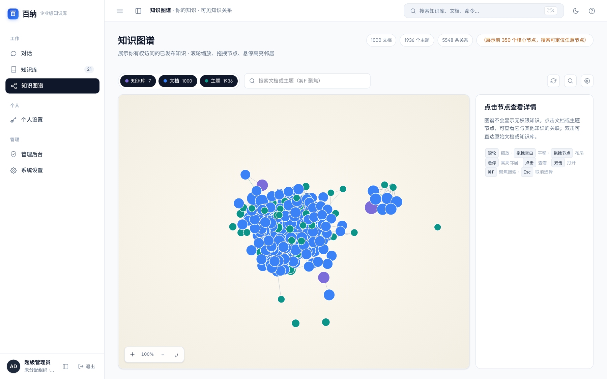

### 5.1 图谱画布交互控制

| 操作手势 / 按键 | 对应图谱行为 | 体验说明 |
|---|---|---|
| **鼠标滚轮滑动** | 画布中心缩放 | 放大可观察细粒度实体名称，缩小可纵览全局宏观聚类 |
| **鼠标左键拖拽空白** | 画布自由平移 | 平滑拖拽移动视图中心 |
| **鼠标左键拖拽节点** | 自定义物理布局 | 节点附带弹簧力学惯性，松开后自动维持平衡 |
| **鼠标悬停在节点上** | 高亮邻居子网络 | 目标节点及其一阶关联边高亮，其余无关节点半透明弱化 |
| **单击实体节点** | 打开右侧属性面板 | 查看节点的唯一标识、类型、度数及关联文档切片 |
| **双击实体节点** | 直达源文档/库 | 快速跳转至包含该实体的原始文档阅读视图 |

### 5.2 实体快速搜索定位
1. 在图谱上方的搜索框（按 `⌘F` 可快速聚焦输入框）输入实体关键词（如 `合规` 或 `Casbin`）。
2. 按下 `Enter`，物理网络将自动将视口平滑居中到匹配的节点，并以脉冲光圈效果高亮呈现。

---

## 第六章：管理控制台、组织架构树与模型网关配置

超级管理员专属的系统级中枢，涵盖人员、组织树、角色权限、AI 模型网关以及全流程合规审计。

### 6.1 人员管理：组织树联动筛选、多维检索与严格权限收敛

人员管理模块支持**左侧层级组织架构树 + 右侧多维人员表格**的联动交互布局，同时在底层实施严格的组织管理员数据与操作安全边界：

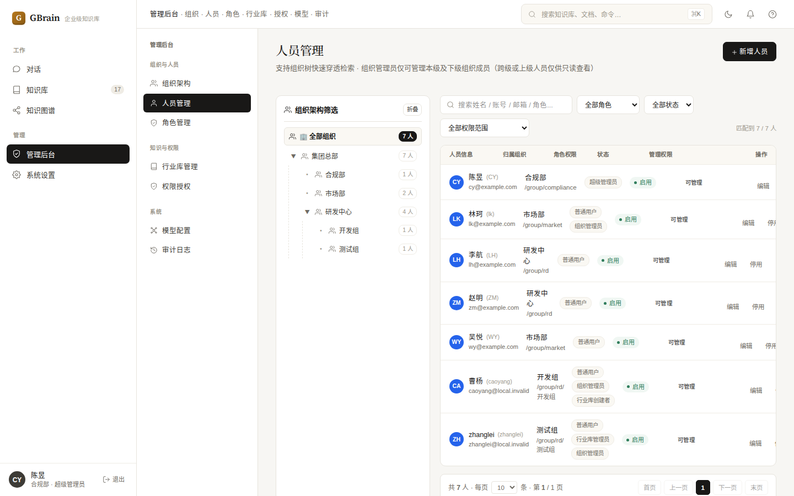

#### 1. 组织架构树穿透筛选 (Hierarchical Descendant Filtering)
- **全部组织根项**：展示系统内全部用户总数；点击可一键重置组织筛选条件。
- **层级穿透检索**：点击左侧组织树的任意节点（如 `研发中心`），系统自动计算该节点**及其所有下属子部门（如 `开发组`、`测试组`）**的并集，即时筛选出属于本层及以下的所有人员，并在右侧上方呈现黄色提示条：`📁 当前组织筛选：/group/rd 及所有下属部门（共匹配 X 人）`。
- **一键展开/折叠**：支持右上角一键展开或收起整棵组织架构树。

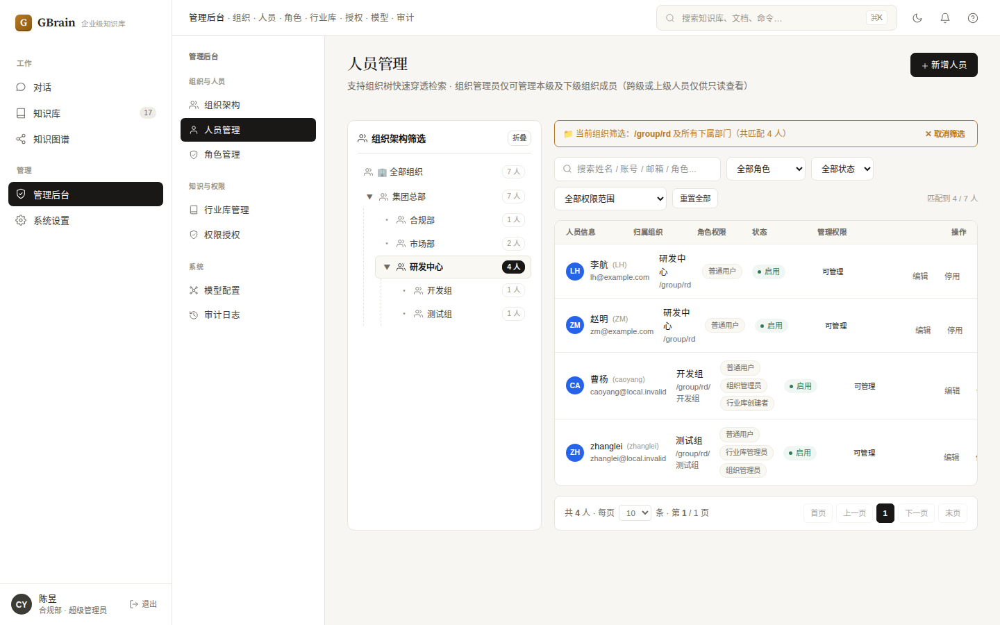

#### 2. 组织管理员权限边界严格收敛 (Org Admin Boundary)
根据企业安全合规基线规范：
- **可看与可管分离**：组织管理员可以查阅系统组织目录中的所有人员（确保跨部门协作与通讯录完整性），但**只能管理属于自己这一层组织及以下组织的成员**。
- **UI 操作防护**：
  - 对属于管辖范围的人员：状态标记为 `可管理`（绿色徽章），提供正常「编辑」与「停用」操作按钮。
  - 对超出管辖范围的人员（如上级集团总部、同级其他部门、系统管理员）：状态明确标记为 `只读查看`（灰白徽章），「编辑」与「停用」按钮被严格禁用（带不可点击禁止图标与悬停提示），杜绝越权误操作。
- **后端双重拦截**：API 层在 `canManageUser` 和用户更新/停用接口中进行强鉴权拦截，即便通过脚本发起请求亦会被拒。

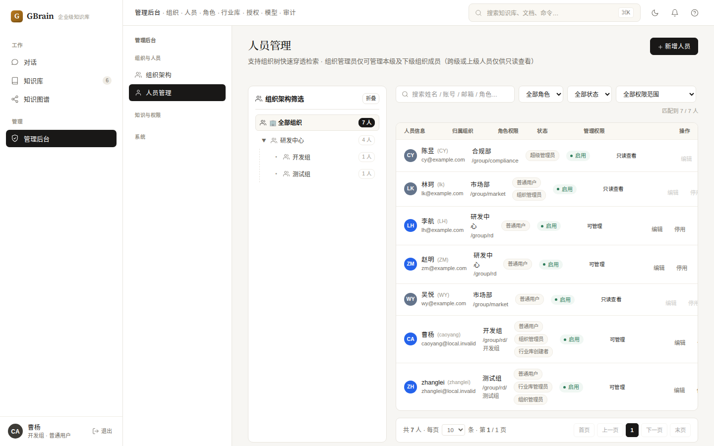

#### 3. 多维搜索与分页控制
- **综合搜索栏**：实时匹配姓名、用户名（账号）、邮箱、所属组织全路径或角色。
- **角色/状态/权限范围下拉**：支持按 `全部角色`、`启用/停用`、`可管理/只读查看` 复合过滤。
- **分页导航**：支持 `10` / `20` / `50` 条每页容量选择与页码快速跳转。

---

### 6.2 组织架构树形拓扑管理

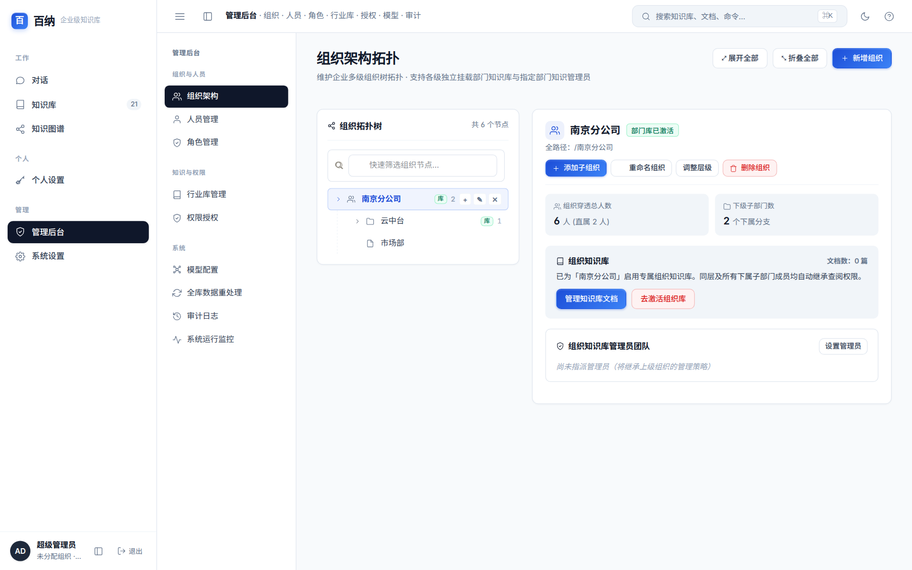

- **无限层级支持**：支持以集团总部为根节点，自由扩展分子公司、中心、事业部与敏捷小组。
- **一键开通部门库**：点击组织节点旁的「开启组织知识库」，即可自动为该部门生成独立的组织库，该部门下所有员工自动获得读写权限。
- **部门管理员指派**：支持指定部门负责人为知识库管理员，实现去中心化的知识治理。

---

### 6.3 AI 模型网关与连通性自检

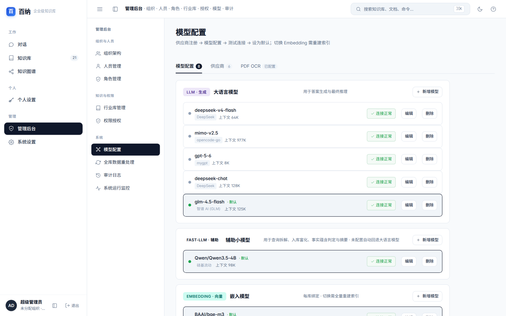

#### 平台三层模型架构：
1. **大语言模型 (LLM · 生成)**：
   - 默认模型：`deepseek-chat`（支持 64K 超长上下文）。
   - 职责：负责最终可信回答生成、多轮对话意图改写与推理。
2. **嵌入模型 (Embedding · 向量)**：
   - 默认模型：`BAAI/bge-m3`（1024 维度）。
   - 职责：负责多语言语义表征与稠密向量检索。
3. **重排模型 (Reranker · 重排)**：
   - 默认模型：`BAAI/bge-reranker-v2-m3`。
   - 职责：对向量初筛与 BM25 关键词双路召回的候选集进行交叉打分精排。

#### 一键连通性自检：
点击模型卡片右侧的 **「测试」** 按钮，系统将向供应商发起轻量级 Ping 探测，并在 1 秒内以绿色指示灯反馈：`✓ 连接正常` 及端到端往返延迟（RTT）。

---

## 第七章：全局快捷键与效率操作速查

平台全面支持桌面级快捷键体系，显著提升高频专业用户的操作吞吐量：

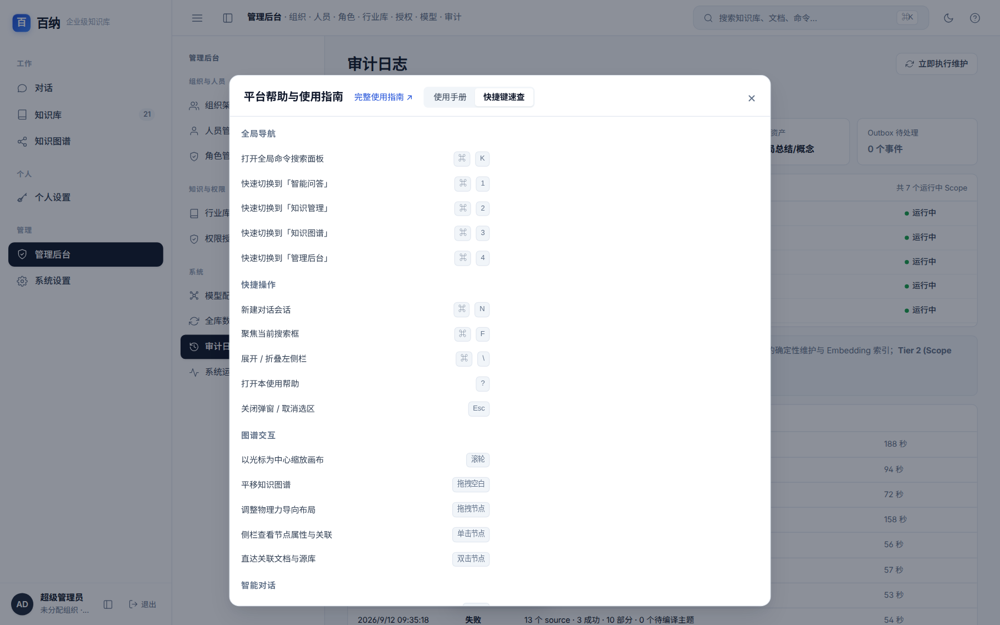

### 7.1 全局核心快捷键

| 快捷键 (macOS / Windows) | 对应功能行为 |
|---|---|
| <kbd>⌘</kbd> + <kbd>K</kbd> / <kbd>Ctrl</kbd> + <kbd>K</kbd> | 打开全局命令搜索面板（CmdK Palette） |
| <kbd>⌘</kbd> + <kbd>1</kbd> / <kbd>Ctrl</kbd> + <kbd>1</kbd> | 快速切换至 **「智能问答」** 界面 |
| <kbd>⌘</kbd> + <kbd>2</kbd> / <kbd>Ctrl</kbd> + <kbd>2</kbd> | 快速切换至 **「知识库管理」** 界面 |
| <kbd>⌘</kbd> + <kbd>3</kbd> / <kbd>Ctrl</kbd> + <kbd>3</kbd> | 快速切换至 **「知识图谱」** 界面 |
| <kbd>⌘</kbd> + <kbd>4</kbd> / <kbd>Ctrl</kbd> + <kbd>4</kbd> | 快速切换至 **「管理控制台」** 界面 |
| <kbd>⌘</kbd> + <kbd>N</kbd> / <kbd>Ctrl</kbd> + <kbd>N</kbd> | 在对话界面立即新建一个会话窗口 |
| <kbd>⌘</kbd> + <kbd>F</kbd> / <kbd>Ctrl</kbd> + <kbd>F</kbd> | 聚焦当前界面的搜索输入框 |
| <kbd>?</kbd> / <kbd>Shift</kbd> + <kbd>/</kbd> | 随时打开系统帮助手册与快捷键速查面板 |
| <kbd>Esc</kbd> | 关闭当前弹出的所有模态对话框与浮层 |
| <kbd>Enter</kbd> | 发送问答消息 / 确认提交表单 |
| <kbd>Shift</kbd> + <kbd>Enter</kbd> | 在问答输入框中进行文本换行 |

---

## 第八章：白宫高规格演示操作脚本 (Demo Runbook)

> **演示目标**：在 8 分钟内向核心决策人员完整呈现 LLMWiki 的数据主权隔离、高精度文档解析、Compiled Truth 可溯源问答及企业级拓扑管控能力。

```
演示标准流程 (8分钟)
 00:00 - 01:00  [1. 架构理念与鉴权隔离]  登录超级管理员 CY，展示 3 级知识库隔离架构
 01:00 - 03:00  [2. 复杂文档极速入库]  新建专题库，录入包含表格与多级标题的合规 Markdown，秒级索引
 03:00 - 05:00  [3. 编译式问答与证据链] 提问复杂合规条款，演示流式输出、[1] 证据角标与溯源抽屉
 05:00 - 06:30  [4. 知识图谱物理网络]  切换知识图谱，演示 155 个主题节点的力导向力学模拟与实体聚焦
 06:30 - 08:00  [5. 管理后台与模型网关] 演示组织架构树与多供应商模型网关的一键连接诊断
```

### 步骤 1：开场与三级权限架构阐释 (1分钟)
1. 打开浏览器全屏展示 `http://localhost:3200`。
2. 使用 `CY` / `admin123` 登录。
3. 点击左侧 **「知识库」**（快捷键 `⌘2`），点击顶部的 **「全部 / 个人 / 组织 / 行业」** 选项卡。
4. **演示要点讲解**：“LLMWiki 在底层构建了军工级的 RBAC + 组织树预过滤机制，不同于简单的共享文件夹，个人库绝对私密、组织库依部门自动继承、行业库通过严格 ACL 授权管控。”

### 步骤 2：文档入库与解析全流程 (2分钟)
1. 点击 **「+ 新建个人库」**，输入 `白宫专项汇报演示库` 并创建。
2. 点击 **「+ 添加文本」**，粘贴一段包含法规条款的 Markdown 文本，点击 **「保存并索引」**。
3. 在文档列表中点击行末的 **「🔍 预览」** 图标，向观众展示解析后的结构化数据。
4. **演示要点讲解**：“系统内置 Docling 统一版面解析，支持扫描件 OCR、跨页复杂表格与公式无损还原，并采用 1800 字符父子分块，杜绝断章取义。”

### 步骤 3：智能问答与 Compiled Truth 证据溯源 (2分钟)
1. 按下快捷键 `⌘1` 快速切入对话界面。
2. 在输入框输入：`请说明企业数据治理的核心合规指标与审计日志保留期限？`
3. 按下 `Enter` 发送，展示极速流式打字效果。
4. 点击回答底部的 **「大脑整理与查询」**，展开展示四级处理流。
5. 点击正文中的引用角标 **`[1]`**，弹出右侧证据切片抽屉，直接定位到源文档的具体条款。
6. **演示要点讲解**：“金融与政务场景对大模型幻觉零容忍。LLMWiki 的 Compiled Truth 机制保证每一个字的结论都有源可查、有据可依。”

### 步骤 4：知识图谱力导向实体探索 (1.5分钟)
1. 按下快捷键 `⌘3` 切换到 **「知识图谱」**。
2. 用鼠标拖拽节点展示物理引擎弹簧惯性；滑动滚轮展示缩放。
3. 在图谱搜索框输入 `合规`，按下回车展示目标节点的聚焦高亮。
4. **演示要点讲解**：“通过图谱引擎，原本沉睡在 PDF 中的孤立知识被自动关联为企业知识大脑。”

### 步骤 5：系统管理中枢与模型网关 (1.5分钟)
1. 按下快捷键 `⌘4` 进入 **「管理后台」**。
2. 展示 **「组织架构」** 树状图与各部门的组织库激活状态。
3. 切换至 **「模型配置」**，点击 `deepseek-chat` 和 `bge-m3` 卡片上的 **「测试」** 按钮，点亮绿色 `✓ 连接正常` 指示灯。
4. **演示总结**：“平台具备完备的自主可控能力，支持在公有云与私有信创算力之间实现秒级无缝模型路由。”

---

*文档编写单位：LLMWiki 企业架构与产品体验保障组*  
*核准发布日期：2026-08-30*
