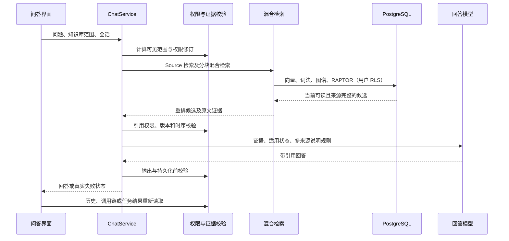

# 知识问答架构审查与修正（2026-10-05）

## 目标与验收

问答应准确引用原文、覆盖与问题相关的有效来源、说明来源差异，并在生成、存储和重新读取时遵守文档权限。系统应呈现处理阶段和真实失败原因，避免将检索超时解释为权限撤销。验收使用针对性回归和用户的原问题，不运行全量测试，不涉及生产发布。

验收条件如下：

1. 超级管理员询问“员工考勤规定上下班的时间要求什么”时，返回可访问原文支持的规定和引用。
2. 权限撤销、文档版本变化或来源失效后，历史消息、调用链和完成结果轮询均不得返回原回答或来源内容。
3. 相同事实可以合并引用；不同来源的不同规定须分别说明来源、适用范围和明确可证的生效状态。文件名、上传时间、存储版本计数均不能单独证明制度替代关系。
4. 没有来源支持的结论须说明信息不足。派生摘要不能覆盖与其不同的原文事实。
5. 超时和服务失败须显示对应状态；各检索臂遵守既有请求预算，完成后恢复会话可以继续看到任务状态。

## 当前路径及已有机制

- `apps/api/src/chat/chat.service.ts` 的 `processChat` 计算权限范围、规划 Source、检查来源新鲜度，随后并发启动数据库分块召回和 GBrain 检索。`query_rewrite` 阶段复用 `AgenticRagService.planQuery`；普通问题默认不支付扩展规划模型调用。
- `apps/api/src/chat/retrieval-arms.ts` 的 `searchChunksFallback` 融合向量、BM25、BGE-M3 稀疏及图谱信号，执行重排、相邻段落和章节扩展，并追加 RAPTOR 摘要。已有共享 `QueryExecution`、检索期限和并发闸门，应复用这些约束，而不是另建检索服务。
- `packages/gbrain-adapter/src/index.ts` 的 `queryMany` 按 Source 有界并发，使用跨 Source RRF 合并。50 个 Source 会形成多批查询；前端选择范围不能成为后台权限的替代物。
- `apps/api/src/db/rls-prisma.ts` 为数据库操作设置事务内用户、时序及超时上下文。`withServiceContext` 在请求中保留用户身份，只有后台任务使用服务身份。
- `apps/api/src/permission/evidence-dependencies.ts` 用服务器捕获的依赖清单检查文档 ACL、活动版本、物理版本、内容哈希及有效时间。`ConversationController` 已在重新读取消息和调用链时使用该检查。
- `ChatService` 已具有同族版本比对、对应段落补入、证据组装、引用检查和多来源提示。此次修正复用这些流程，不增加专门的业务同义词或考勤规则。

## 已确认问题与修正

### 失败原因被误写为来源失效

此前失败回答没有证据清单，读取历史时进入来源失效路径，用户看到“该回答的来源已失效或您已无权访问。”。该文本本身不能证明管理员无权访问。修正使用服务器生成的 `non_evidence` 失败或拒答标记，保存对应状态；旧失败记录只返回通用超时或失败提示，并清除可能含来源内容的调用链。

### 派生数据权限查询重复扫描无关依赖

测试数据库有 11,399 个 RAPTOR 节点、2,058,113 条依赖。此前逐节点检查源文档权限，独立基准达到 137 秒。集合读取保护把共享 ACL 判定改为每条 SQL 一次，并保留清单完整性、所有输入的可读性、发布状态、活动版本、哈希和有效时间。

初版集合函数仍为每次图谱读取计算所有种类的派生数据。独立实际向量 SQL 的 HNSW 查询为 3.615 秒，集合函数执行一次为 3.595 秒，不能据此认定该向量 SQL运行了 51 秒。实时观察显示大量并发 Chunk、Document、GraphEntity SQL，部分持续约 17 秒；RAPTOR SQL在检索开始约 18 秒后启动，持续约 4 秒。

`20261005120000_artifact_set_read_guard` 增加按目标表调用的集合函数。候选 ID 来自真实目标表，不能信任历史 `artifactKind` 标签；GraphEntity、GraphRelation、GraphCommunity 的读取不再为无关 RAPTOR 依赖建立集合。无参数函数继续用于清单读取保护，旧逐节点函数保留为回归参考。迁移具有回滚 SQL。

### 版本序号被误用为效力依据

`resolveTemporalPrecedence` 曾仅因数字版本较大就宣称最新现行、旧版废止；同族比对也曾按数字版本去重，并给较小版本标记已替代。这会隐藏不同文档的有效规定。修正如下：

- 提示只说明检测到多个版本，不自动宣布废止。
- 版本提示按知识库隔离；同族成员按文档 ID 保留，不能因版本数字相同而合并掉另一文档。
- 引用按文档 ID 匹配元数据。只有明确的失效状态或来自现行文档的显式替代链才能标记已替代。
- 多来源提示要求并列引用相关规定及差异。派生编译资料的提示不再要求无条件优先于原文。

文档标题相似仍只用于发现待比较资料，不作为替代关系的证明。存储版本与展示版本继续分离，保留不可变证据的校验。

### 完成任务轮询缺少读取时校验

`ChatRunService.get` 原先检查任务及会话归属后直接返回已存储回答、引用和调用链，与历史读取的权限规则不一致。修正从对应消息读取服务器持久化的依赖清单，使用同一个 `validateEvidenceDependencies`。校验失败时同时移除回答证据、引用和调用链；依赖清单不返回客户端。

### 普通属性问题触发无必要的多跳判定

同一问题的成功调用链显示 `complexity=simple`、改写问题不变、子问题为空，却执行了 15.007 秒的充分性模型判定。原触发条件只要识别出关系词就开启多跳循环，普通“某对象的某属性是什么”也进入这一流程。

`relation-extractor.ts` 的 `shouldProbeEvidenceHops` 现在根据真实多跳或比较规划、明确子问题、已验证的桥接实体启动补检。仅有属性名不再触发模型判定；实际多跳、比较问题和有证据的桥接救援保留。该判定没有业务词表，不替代最终来源校验或引用核查。

## 性能边界与后续判定

按表集合保护修正前，同一个问题的一次监测已返回成功及 `企业考勤管理制度详细手册.doc` 引用，但总耗时 115.29 秒；检索 50.237 秒，置信度重排 708 毫秒，首次充分性判定 15.007 秒。成功只证明可以找到可读证据，尚不证明性能达到目标。

按表集合保护及多跳触发修正后，一次原问题调用成功，用时 108.01 秒：Source 规划 2.858 秒、来源新鲜度检查 3.465 秒、混合检索 42.947 秒、置信度重排 1.336 秒、生成 36.296 秒、事实落地核查 12.033 秒。无必要的充分性判定已消失，但性能仍未达到目标。

进一步检查发现，已存在的 20 秒 GBrain 硬超时控制器没有连接主检索的独立竞速控制器，导致主跨 Source 检索不受该限制。修正复用 `combineAbortSignals`，同时观察客户端取消、既有引擎硬期限和竞速取消；竞速取消不会影响后续检索控制器。数据库召回仍查询完整授权范围，最后的权限及事实核查保留。该修正的最终耗时需要单问题复测，不能按配置值推断。

首先应用并验证按表集合保护，然后复测一次原问题。依据各阶段实际耗时再调整既有预算：规划、嵌入、向量、词法、图谱、重排、补检、生成和输出复核。避免在未测量前通过关闭图谱、服务身份绕过 RLS 或丢弃有效来源缩短时间。检索候选、原文证据、生成和重新读取必须共用权限约束。

前端恢复应根据持久化任务 ID 和会话归属显示真实阶段，任务轮询终止时解除等待。多个会话必须各自绑定任务，不能用全局单一“正在生成”状态覆盖其他会话。

## 验证记录

针对性验证由 `gpt-6-luna` 执行。代码开发使用 `gpt-6.1-sol`。137 秒及 115.29 秒观测来自修正前；108.01 秒观测来自按表权限集合及补检触发修正之后。硬超时连接修正、权限撤销、版本比对、任务轮询及最终原问题结果由主任务补录。

产品设计参考：Anthropic 的 [Citations API 说明](https://claude.com/blog/introducing-citations-api)强调将回答连接到源文档；[Rich Knowledge Sources Bring Complex Knowledge Conflicts](https://arxiv.org/abs/2210.13701)讨论检索证据冲突，并提出在冲突候选并存时避免单一答案的校准研究。这里采用可校验的原文归属与权限检查，不以产品宣传或模型置信度替代系统验收。

## 最终定向验证（2026-10-05）

本地测试库 `llmwiki` 已应用并在 Prisma 迁移历史中登记 `20261005120000_artifact_set_read_guard`。隔离库完成回滚、重新应用、真实 RLS 权限矩阵及派生数据等价性回归；该本地验证阶段没有操作生产数据库或服务。

后端定向验证通过：5 个套件、68 项测试；来源捕获、最终权限门及跨 KB 版本优先级的 3 项关键回归；7 项取消与期限回归。前端 TypeScript、定向 ESLint、Next 构建和运行注册表的 11 项回归通过。

最新本地超级管理员原问题已成功完成，回答包含 4 条引用与服务器保存的来源依赖清单，延迟为 98,922 毫秒（约 99 秒）。记录中的主要阶段约为检索 44 秒、生成 39 秒、事实核查 12 秒；阶段记录可能重叠，不作串行求和。引擎的 20 秒中止警告实际触发，但包含数据库兜底等待的检索阶段仍为 44 秒，因此不能宣称整个检索已限于 20 秒或性能最优。数据库兜底及模型调用仍是后续需要测量的瓶颈。

原失败历史对话现在返回“知识检索超时，请重试。”，不再误报管理员权限失效；正常带引用的历史回答仍可读取。完成任务的读取权限复验与不同文档版本保留已有定向回归。

按照用户的最新要求，此次没有继续三套各 100 题的全量重测；旧检索数据仍明确标记 RAPTOR/重排未生效，以上单题结果不用于宣称整体精度提升。浏览器并发与延迟加载验收记录见 `docs/validation/sota-20261005/concurrent-chat-ux-fix.md`。

前端最终浏览器验收已通过：并发轮询、停止单个运行而不影响其他运行、迟到响应归属、刷新恢复、50 条历史分页、去重及活动占位保留、trace 延迟加载。使用受控 API 响应且没有调用模型供应商。测试服务现已加载正确的 `.next-live` 构建，实际服务 JS 指纹与构建一致。详细结果见上述交互修正文档。

## 后续发布

2026-10-05 用户明确授权后，代码提交 `9876e78` 已发布生产（实例 1）和演示（实例 2）。发布使用已有验证产物，未重复全量测试；迁移、隔离、快照与健康检查已执行。详见[发布记录](../validation/sota-20261005/release-2026-10-05.md)。
