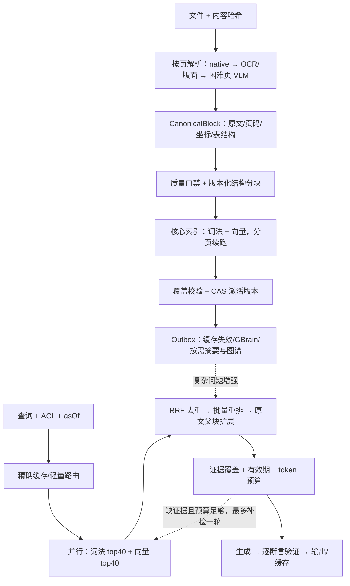

# 核心入库 / 查询评估与实现方案

评估日期：2026-09-12。基线：`main@976753a` + 当前未提交工作区；包括未跟踪的 Python 评测与 SQL。方法：代码审计、定向单测、官方资料/论文对照。未进行生产压测、计费统计或同语料竞品实验。

## 1. 结论

**不能认定达到国际 SOTA。具备较完整的高级 RAG 功能，但证据可信度、索引完整性、评测有效性存在实质缺口，速度和成本缺少可靠基线。**

| 维度 | 判断 | 关键依据 |
|---|---|---|
| 入库准确度 | 基础较好，完整性不足 | 结构分块、质量门禁、OCR/Docling/VLM 路由已存在；向量/摘要存在首段截取和就绪误判 |
| 查询准确度 | 能力丰富，实际水平未证实 | 混合、多跳、重排、MMR 已存在；引用存在不等于事实成立，时效裁决不完整 |
| 速度 | 存在明确可削减开销 | 简单问句扩词、独立缓存 embedding、跨库 CLI 扇出、多轮检索/重排 |
| 成本 | 有局部预算，缺端到端计量 | 富化限制块数、上下文 token 预算已存在；重复 embedding、逐块 LLM、双索引仍有开销 |
| 工程可验证性 | 不足 | 当前定向测试 4 套通过、4 套编译失败；质量门禁指标不能支持历史“100% 忠实度”结论 |

旧报告中的“领先”“零幻觉”“补齐两项即可全面 SOTA”不应继续作为结论。SOTA 必须限定任务、数据、模型、资源及指标，并经同条件比较；功能数量不能替代证据。

## 2. 现有链路与具体问题

入库：上传 → BullMQ → 文本/AnyDoc 快路或 parser-worker → 内容质量评估 → 结构分块 → 同步上下文富化 → 替换 Chunk → GBrain Source 编译/发布 → enrichment 队列执行向量、RAPTOR、可选图谱。

查询：授权范围 → 语义缓存 → 改写/扩词/分解 → GBrain 与本地向量/关键词并行 → 子问题探针/弱证据扩检 → 合并重排 → 充分性检查及多跳 → MMR/token 裁剪 → 版本裁决 → 流式生成 → 引用/语义检查 → 缓存。

以下是代码事实；影响为据此推断，不代表已经观测到生产事故。

| 优先级 | 已核实问题 | 影响 | 代码定位 |
|---|---|---|---|
| P0 | `embedDocumentChunks(maxChunks=400)` 仅取一批；embedding 失败返回 null、写入失败被捕获；enrichment 不校验覆盖率就设 ready | 超长文档后部可能缺向量，失败可能被伪装为完成 | `embedding/chunk-embedding.service.ts:30`；`ingestion/enrichment.processor.ts:43` |
| P0 | 入库仅开头检查 expectedVersion；保存时按 documentId 删除全部块；富化任务无 version；Source 发布仅检查 indexing 状态 | 新旧任务交错可能覆盖内容、误发布或写错 ready | `ingestion/ingestion.service.ts:137,319`；`ingestion/enrichment.processor.ts:10`；`brain-compiler/brain-compiler.processor.ts:69` |
| P0 | 带有效编号即计为 grounded；仅部分无角标语句进入蕴含检查；生成 delta 在检查前发出；低覆盖回答仍可入缓存 | 编造内容附上真实角标可绕过检查；事后 warning 无法撤回已显示答案 | `chat/chat.service.ts:2865,3842,3870,3943` |
| P0 | TS faithfulness 主要检查是否有引用；contextPrecision 只检查第一篇标题；LLM judge 只收到标题和关键词，没有证据正文 | 高分不能说明事实准确、证据精确或多跳完整 | `tests/evaluation/quality-gate.ts:168,260,276` |
| P1 | Python 评测用最终引用代替检索排名，snippet 命中代替忠实度；API 异常 skip；门禁不排除 dry-run/过期或残缺结果 | 可漏计失败，不能充当独立质量门禁 | `tests/evaluation/test_retrieval_quality.py`；`quality_gate.py` |
| P1 | 本地关键词是逐词 contains，最多 15 词、每词默认 25 块且按 docId/ord 截断；不是 BM25 | 大库中早排序文档占据候选，稀有证据漏召；数据库往返增多 | `chat/chat.service.ts:1021` |
| P1 | 简单非条款问题仍扩词；缓存查找自行调用 embedding，存储又可能调用；跨 Source 默认每批 8 个 CLI 查询 | 普通问题固定延迟偏大，跨库/多子问题调用数量膨胀 | `chat/agentic-rag.service.ts:373`；`chat/semantic-cache.service.ts:34`；`gbrain-adapter/src/index.ts:1277` |
| P1 | 上下文富化在质量阻断/持久化前执行；每块重复发送前 60,000 字；默认超过 300 块整篇跳过；前缀直接写入 content | 不合格文档也花模型费用；300/301 块行为突变；检索辅助文字混入原文证据 | `ingestion/ingestion.service.ts:245`；`ingestion/contextual-retrieval.ts:24,57,137` |
| P1 | RAPTOR 默认仅前 300 块、前 12 组；章节摘要顺序调用；文档摘要材料再次截断 | “全景”可能只覆盖文档前部；摘要成本和耗时未与增益对应 | `raptor/raptor.service.ts:79` |
| P1 | 时序按同标题聚组，单版本直接跳过；未按查询 asOf 排除未来生效文档，读取 supersedesDocumentId 却未用来分组 | 改名版本、历史查询、未来版、单一废止版可能判断错误；旧版降权不等于效力裁决 | `chat/chat.service.ts:2602` |
| P2 | Late Chunking 只有函数定义，无调用；GraphRAG 社区为 BFS 连通分量和模板摘要 | 不能把这些等同于已完成的 late chunking / 分层社区全局推理 | `ingestion/late-chunking.ts:26`；`graph-rag/graph-rag.service.ts:562` |

定位根目录：`apps/api/src/`；adapter 位于 `packages/`；评测位于仓库根目录。

补充：当前已存在 ACL 前置范围与后续权限复核，不应声称“没有权限治理”；但部分 contains 查询没有 published 条件，仍依赖后续过滤。应统一所有候选入口的授权、发布版本、有效期过滤。

SQL 冲突：Prisma 的 `20260910130000_drop_unused_tsv` 已移除 simple tsv；未跟踪的 `deploy/migrations/001_search_optimization.sql` 又恢复。simple 不解决中文分词，代码也没使用该 tsv。合并迁移入口；trigram 可加速 contains，但不能替代 BM25 排序。

## 3. 国际实践对照：采用哪些，暂缓哪些

| 方法 | 对照事实 | 本项目决策 |
|---|---|---|
| 上下文 + 稀疏/稠密检索 + 重排 | Anthropic 的 49%/67% 是其数据上检索失败率相对下降，不是普遍准确率提升 | 保留组合，先做消融；上下文仅用于检索表示，原文单独保存。[官方实验](https://www.anthropic.com/engineering/contextual-retrieval) |
| 结构分块 / Late Chunking | 2026 对照研究发现最优策略依任务变化，上下文化并非所有场景都提升 | 结构分块作为基线；late chunking 独立实验，不默认增加第二套上下文化。[论文](https://arxiv.org/abs/2602.16974) |
| GraphRAG | 官方区分 local/global/DRIFT/basic，适用于不同查询 | 只给全局综述/关系推理使用摘要与图谱；事实题不强制经过图谱。[官方文档](https://microsoft.github.io/graphrag/query/overview/) |
| 带过滤 ANN | pgvector 明确近似扫描后过滤可能不足 k，提供 iterative scans | 压测授权选择率与召回；窄范围可精确检索，大范围调 iterative scan/分区。[官方说明](https://github.com/pgvector/pgvector#iterative-index-scans) |
| 多模态检索 | 2026 ColChunk 研究探索压缩视觉多向量的精度/存储权衡，尚不等于项目收益 | 先测图表是否主要失败源，再为相关页面试验视觉索引。[论文，预印本](https://arxiv.org/abs/2604.10167) |
| 独立评测 | OmniDocBench 覆盖解析；BRIGHT 检验推理型检索 | 分层测解析、检索、生成；公开集作泛化补充，业务留出集决定上线。[OmniDocBench](https://github.com/opendatalab/OmniDocBench)、[BRIGHT](https://arxiv.org/abs/2407.12883) |

这些是设计依据，不构成对所有国际方案的排名。当前没有同条件数据支持“超越 Dify/RAGFlow/WeKnora”。

## 4. 目标架构

原则：**PostgreSQL 保存版本与原始证据；核心检索路径可独立完成问答；GBrain/摘要/图谱作为可选增强；所有路径共用授权、预算和证据协议。**



### 4.1 入库：可直接拆任务

1. **质量门禁前移**：解析完成先判定 passed/needs_review，再启动付费富化。native/AnyDoc 快路质量不足时，仅困难页走 OCR/版面；无法恢复则送审。保留原始文件与解析块坐标，不靠字符串位置推导 PDF 坐标。
2. **不变版本**：新版本写新 Chunk 集合，旧激活版本继续可查；新版本核心索引完整后事务切换 activeVersionId 并写 Outbox。解析、富化、编译任务都携带 versionId、pipelineVersion；提交时 CAS 检查目标版本仍有效。旧任务完成只更新自己的版本，不激活新版本。
3. **完整向量化**：按游标每批 64 块续跑；批量 embedding + 批量 upsert。返回 requested/embedded/failed/missing；required 块缺失不得 coreReady。失败写明原因并重试；文档删除/版本取消则终止任务。400 是每轮预算，不是全文上限。
4. **原文/检索表示分离**：`rawText` 保留原始解析文本；`searchText = title + headingPath + tableHeaders + 可选contextPrefix + rawText`。生成与验证只引用 rawText/源页面；前缀不能被当作原文事实。
5. **块策略起点**：正文目标 350–600 tokens；父块 1,200–2,000；整条款优先，过长条款按款项切；表格逐行组保留列名、单位、脚注、合并单元格关系。tokenizer 与模型一致。所有数值通过留出集调优。
6. **选择性富化**：结构上下文免费补齐；只有指代/语义不自足块使用 LLM，按章节提供上下文，设置每文档 token/金额预算。缓存键含内容哈希、上下文哈希、模型与模板版本；文档尾部不以固定首 N 块代替覆盖。
7. **异步增强独立状态**：摘要逐章节覆盖全文，持有 childChunkIds 和 coverage；图谱/摘要失败不阻断基础检索。分别记录 coreReady、summaryReady、graphReady，禁止一个 ready 混合表示。局部修改仅重建受影响块及祖先摘要。

### 4.2 数据与接口契约

| 对象 | 必要字段/约束 |
|---|---|
| Document | id、kbId、familyId、activeVersionId；familyId 标识同一制度/文档谱系，不能用标题代替 |
| DocumentVersion | id、documentId、version、contentHash、pipelineVersion、effectiveFrom/To、lifecycle、supersedesVersionId、coreStatus；唯一(documentId,version) |
| CanonicalBlock | versionId、blockId、kind、rawText、pageNo、bbox、headingPath、table结构、解析置信度；bbox 带页尺寸/坐标系 |
| Chunk | versionId、chunkId、ord、rawText、searchText、parentId、sourceBlockIds、contentHash、tokenCount；唯一(versionId,ord) |
| IndexManifest | versionId、indexKind、modelId/revision、dimensions、templateVersion、expectedCount、indexedCount、failedCount、checksum、状态；同维模型也不能混查 |
| Job / Outbox | eventId、versionId、pipelineVersion、stage、cursor、attempt、幂等键；业务事务内持久化事件，消费者可重复执行 |
| Candidate | chunkId、versionId、kbId、channel、rank、score、parentId、sourceBlockIds；无正文或版本绑定不进入证据池 |
| Evidence | evidenceId、rawText、sourceBlockIds、versionId、page/bbox、有效期、contentHash；摘要附叶子证据指针 |
| QueryContext | queryId、aclSnapshot、selectedKbIds、asOf、indexGeneration、deadline、tokenBudget、callBudget、AbortSignal |
| AnswerClaim | text、evidenceIds、verdict(supported/contradicted/unknown)、reason；引用编号由服务端分配 |

检索接口：`retrieve(query, QueryContext, topK) -> Candidate[]`。每个 provider 必须落实相同授权/版本过滤；父块展开与图谱跳转也必须复核。IndexManifest 固定 embedding 模型版本，模型升级写新索引并切换，不与旧向量混用。

### 4.3 查询：固定预算，按需升级

| 路由 | 行为 | 初始预算，不是实测承诺 |
|---|---|---|
| 编号/条款/清单 | 精确字段/授权 SQL；必要时向量补充 | 0 次规划 LLM；可直接返回原文或最多 1 次生成 |
| 普通事实 | 原问直接词法+向量并行 → 一次重排 → 父块扩展 | 0 次扩词/HyDE；1 次 embedding、1 次生成；上下文≤4k tokens |
| 复合/多跳 | 一次规划，≤3 子问题批量 embedding、并发召回；缺失子问题最多补检一轮 | 首轮及补检每轮最多一次重排；总 LLM≤4，含生成/必要验证；上下文≤8k |
| 全局综述 | 授权章节摘要召回 → 下钻原文；跨文档主题才调用 GBrain/图谱 | 独立慢路 SLA；明确覆盖文档范围，不能把 top-k 当全库统计 |
| 图表/扫描困难题 | 页面视觉候选 + 原文/图像证据验证 | 按需 VLM；单独记录页数、token、时延 |

具体规则：

- 新增 `QueryOrchestrator`、`RetrievalBudget`，将近 4,000 行 ChatService 的路由、召回、选择、验证拆出。所有 HTTP/DB/CLI 调用继承剩余 deadline；超时取消底层任务，DB 使用 statement timeout；全请求及租户并发均限流。
- 词法 top40 + 向量 top40 → 按 `(versionId,chunkId)` 去重 → RRF(k=60) → 批量重排最多 60 块 → 选 6–10 组原文。候选/阈值均为起点，禁止直接相加关键词启发分与 cosine。保留现有 MMR/子问题覆盖机制并纳入消融。
- 本地 contains 短期只保留编号/精确短语通道，加 published 与版本过滤、trigram 索引。目标词法 provider 使用 **OpenSearch BM25 + 中文分词/编号独立 keyword 字段**；支持所有子查询共享过滤。[BM25](https://docs.opensearch.org/latest/search-plugins/keyword-search/)、[混合过滤](https://docs.opensearch.org/latest/query-dsl/compound/hybrid/)。新增一个搜索服务有固定资源成本，必须通过 P1 消融门禁后启用；低流量部署可留在过渡模式，不宣称已实现 BM25。
- 向量继续使用现有 PostgreSQL/pgvector；按授权选择率实测 ANN 召回，支持 iterative scan 和小范围精确搜索。第一阶段不迁移全部向量数据库。
- 普通查询不同时触发 GBrain 各库完整 query/rerank。GBrain 保留编译/溯源及复杂路候选能力；如 provider 无法关闭内部生成/重排，其费用与延迟计入慢路预算。
- 共享一次 query embedding 给召回及可选语义缓存；请求内 singleflight，跨请求键包含 provider/model revision/dimensions/task/textHash。先查无 embedding 的精确缓存。
- 默认只复用已验证的精确答案缓存。语义缓存仅对低风险单轮 FAQ 启用，额外核对实体、数字、单位、否定词、时间；0.96 相似度不能证明等价。键包含 ACL、所选库、知识版本、asOf、模型/提示版本；有历史会话时禁用或纳入已解析会话意图。
- 有效期在召回前处理：`effectiveFrom ≤ asOf < effectiveTo`，空界按明确约定处理；沿 family/supersedes 查版本。历史查询选历史有效版；元数据不足标注未知，不按上传日期断言旧版废止。其他适用范围冲突明确呈现。
- 验证所有事实断言与实际引用原文；数字、单位、比较方向、否定优先做确定性检查，其他用经业务集校准的 NLI/LLM。有角标不自动通过。strict 模式逐句/整答缓冲至验证通过再输出；无法验证则删改、有限补检或拒答，缓存只收 supported 内容。首条 trace 不计 TTFT。

## 5. 成本与速度验收

当前无完整账单和压测数据，不能承诺降本百分比。历史文档的 P50≈10s/P95≈30–40s 是历史描述，本次未复测，不能作为当前基线。

成本按实际调用记录：

```text
C入库 = OCR/VLM页费用 + 富化/摘要/图谱模型费用 + embedding费用 + 索引CPU/存储摊销
C查询 = Σ各调用(输入token×输入单价 + 输出token×输出单价)
      + embedding/rerank费用 + 搜索/数据库/缓存资源摊销
单位有效回答成本 = 总查询成本 / 正确且证据支持的已回答问题数
```

缓存命中 token、未命中 token、重试、取消后计费都单列。对每文档记录质量合格至可检索耗时；对每查询记录排队、改写、embedding、各路召回、重排、生成、验证和端到端耗时。

| 验收项 | 初始目标；固定硬件/模型/网络后校准 |
|---|---|
| 核心入库完整性 | eligible chunks 向量/词法覆盖 100%；缺失则非 coreReady；长文首中尾均覆盖 |
| 入库吞吐/成本 | 报告原生/扫描/表格各类 docs/h、pages/min、千页成本、p95 可检索延迟；同质量下不劣于基线 |
| 普通问答速度 | 10万块、并发10、固定≤300输出tokens：检索+重排 p95≤1.5s；已验证首段 p95≤4s；整答 p95≤10s |
| 复杂问答速度 | 同资源：整答 p95≤20s；所有依赖纳入总预算，超限明确降级 |
| 查询质量 | 留出集完整证据 Recall@20≥90%；supported claim precision≥98%；可回答题正确作答率≥90%；无答案正确拒答≥95% |
| 回归 | 相同数据/模型下，准确率下降不得超过1个百分点，并报告 bootstrap 95% CI；不能靠提高拒答率换忠实度 |
| 安全/一致性 | 越权候选不进生成；版本切换/撤权/缓存回放专项用例全部通过；零观测泄露不等于数学保证 |
| 开销 | 普通题规划调用=0、embedding≤1；对比基线单位有效回答成本。新增服务固定成本计入，低负载不能只算 token |

规模曲线至少测 1万/10万/100万块、并发1/10/50、ACL可见比例1%/10%/100%；分别报告冷缓存、暖缓存、模型缓存、失败率和 p50/p95/p99。百万块测试前先设资源上限，不能用无上限堆硬件满足延迟。

## 6. 实现顺序与发布门禁

| 阶段 | 改动范围 | 完成标准 |
|---|---|---|
| P0-A 可验证基线 | `tests/evaluation/*`、adapter 类型、Prisma生成流程 | 干净依赖环境可编译；测试失败/skip/缺结果不能绿灯；所有评测绑定 commit、语料/模型/索引版本及 runId |
| P0-B 入库正确性 | `ingestion.service/processor`、`enrichment.processor`、`chunk-embedding.service`、compiler、Prisma migrations | 401/2600块完整入库；部分 embedding 失败不 ready；v1 慢任务晚于 v2 完成不覆盖/激活；重试幂等 |
| P0-C 证据与缓存 | `chat.service`拆出`evidence-verifier`、`semantic-cache` | 错数字+真角标、反向结论、未支持陈述均不作为已验证事实输出/缓存；撤权后复核 |
| P1-A 查询瘦身 | `query-orchestrator`、`retrieval-budget`、embedding共用、GBrain路由 | 普通题移除规划和重复 embedding；超时无遗留执行；记录总调用与真实 TTFT |
| P1-B 混合检索 | `retrieval/lexical.provider`、`vector.provider`、RRF、Outbox同步 | BM25+向量对比当前 contains+向量；完整证据召回不下降且成本/延迟有可解释收益才切默认 |
| P1-C 入库/时效 | CanonicalBlock、raw/search拆分、family/asOf、摘要覆盖 | 图表/跨页表、改名版本、未来版、历史日期、新旧混存专项通过 |
| P2 按坏例投资 | Late Chunking、视觉多向量、社区算法 | 单项消融显示收益且资源预算可接受再上线；不以增加功能作为验收 |

最低评测集：400 道业务题，按文档家族分离开发/留出，留出至少200题；包含条款/数字、同义问、多跳、长文尾部、表格、时效、无答案；另建≥100个权限/版本故障场景。公开数据抽样另计，不能用改写开发题替代真正留出。

分别导出原始候选、重排候选、选中证据、最终回答；检索按 chunk/span 金标计算 Recall/MRR/nDCG，多跳另报全部必要证据命中率；生成按断言蕴含、正确性及拒答评估。LLM judge 必须看到原文，由人工抽样校准；同题反复重试不能只保留最好结果。

迁移采用 expand → 回填新版本/双写 Outbox → 小比例 shadow → 同条件对比 → 按库灰度切换。shadow 禁止重复生成计费；词法服务必须索引确认后才激活版本。旧索引保留一个发布周期用于回滚；删除/撤权靠数据库权威过滤立即生效，异步清理所有派生索引。

## 7. 本次验证记录

执行：`pnpm --filter api exec jest --runInBand --silent --testPathPattern='(ingestion-version|ingestion-quality|contextual-retrieval|chat.service|agentic-rag.service|embedding.service|raptor.service|semantic-cache-scope).*spec.ts'`

结果：8 套中 4 套通过、4 套未能编译；已执行的 48 个用例通过。失败包括 `BrainQueryResult` 缺少 `fallbackMerged/evidenceSelection` 类型声明，以及本地 Prisma Client 缺少 schema 已有的 `effectiveFrom/indexReadiness`。后者表明生成产物与 schema 不一致；不等于数据库必然缺字段。当前未形成可复现的全绿基线。

本次只输出评估方案，未修改业务代码、迁移数据库或运行付费端到端评测。建议首先实施 P0-A/B/C，再验证 P1 的速度与成本收益。
