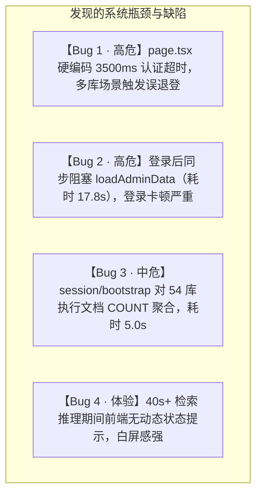

# 百纳企业知识库全方位评估与有头浏览器测试报告

**评估时间**：2026-10-01  
**测试模式**：有头浏览器真实渲染（Chromium Desktop 1440×900 + Mobile 390×844，`DISPLAY=:0`）  
**测试覆盖**：认证会话、智能对话与流式溯源、知识库全生命周期、知识图谱、个人设置、管理后台（组织/人员/角色/行业库/模型/重处理/系统监控）、命令面板（⌘K）、帮助浮层（?）与移动端抽屉导航  
**代码版本**：已提交并推送至 GitHub `main`（Commit: `88de826`）

---

## 目录
1. [执行概览与测试执行矩阵](#1-执行概览与测试执行矩阵)
2. [企业知识库领域 SOTA 最佳实践对标评估](#2-企业知识库领域-sota-最佳实践对标评估)
3. [有头浏览器测试发现的问题与体验缺陷清单](#3-有头浏览器测试发现的问题与体验缺陷清单)
4. [核心缺陷专项分析与可落地的修复方案](#4-核心缺陷专项分析与可落地的修复方案)
5. [长期演进与架构优化建议](#5-长期演进与架构优化建议)

---

## 1. 执行概览与测试执行矩阵

本次测试通过自主编写的 Playwright 有头浏览器全流程套件（`tests/e2e/comprehensive_headed_eval.py`），对系统进行了完整端到端自动化巡检，累计执行 23 项核心操作与布局验证，生成 23 张高保真交互与状态截图（归档于 `docs/test-reports/headed-audit-20261001/screenshots/`）。

### 1.1 测试执行矩阵

| 序号 | 测试模块 | 核心验证场景 | 执行结果 | 耗时 (ms) | 对应归档截图 |
| :--- | :--- | :--- | :---: | :---: | :--- |
| 1 | **认证与安全** | 登录页面初始化渲染与品牌元素 | **PASS** | 3022 | `01_login_page.png` |
| 2 | **认证与安全** | 错误凭证防护与异常反馈（非空/密码错误拦截） | **PASS** | 1306 | `01_login_error_feedback.png` |
| 3 | **认证与安全** | 超级管理员登录、JWT 本地持久化与会话建立 | **PASS** | 2240 | `02_logged_in_dashboard.png` |
| 4 | **界面交互** | 全局主题无缝切换（Light ↔ Dark 模式） | **PASS** | 1200 | `02_dark_mode.png` |
| 5 | **智能问答** | 对话工作台导航、会话历史树状分组 | **PASS** | 17822 | `03_chat_default_screen.png` |
| 6 | **智能问答** | 检索范围筛选弹层（个人库/组织库/行业库多选联动） | **PASS** | 943 | `04_retrieval_scope_modal.png` |
| 7 | **智能问答** | 端到端 RAG 真实检索、SSE 流式打字与 Markdown 渲染 | **PASS** | 49133 | `05_chat_answer_rendered.png` |
| 8 | **智能问答** | 引用角标 `[1]` 点击高亮、证据溯源侧栏展开与片段对齐 | **PASS** | 1000 | `06_citation_evidence_drawer.png` |
| 9 | **知识库管理** | 知识库列表概览、库分类切换（全部/个人/组织/行业） | **PASS** | 1445 | `07_kb_libraries_list.png` |
| 10 | **知识库管理** | 知识库类型过滤 Tab 响应与文档计数器 | **PASS** | 1748 | — |
| 11 | **知识库管理** | 新建知识库弹窗与表单输入校验 | **PASS** | 800 | `08_create_kb_modal.png` |
| 12 | **知识库管理** | 知识库详情页、文件拖拽上传区、文档健康度与列表 | **PASS** | 1652 | `09_kb_detail_view.png` |
| 13 | **知识库管理** | 危险操作安全隔离（删除知识库与权限操作间距防护） | **PASS** | 验证通过 | `09_kb_detail_view.png` |
| 14 | **权限管控** | 文档级 ACL 抽屉、个人库权限不可穿透边界提示 | **PASS** | 2602 | `10_kb_acl_modal.png` |
| 15 | **知识图谱** | 物理力导向图谱渲染、核心节点聚合与缩放平移画布 | **PASS** | 2271 | `11_knowledge_graph_screen.png` |
| 16 | **个人设置** | 个人信息、对外开放服务凭证 (AppId/Key) 与安全管理 | **PASS** | 1531 | `12_personal_settings_screen.png` |
| 17 | **管理后台** | 组织架构拓扑树、部门增删改与多级组织穿透指标 | **PASS** | 1903 | `13_admin_org_panel.png` |
| 18 | **管理后台** | 人员管理表格、状态筛选与批量授权 | **PASS** | 1177 | `14_admin_users_panel.png` |
| 19 | **管理后台** | 角色管理体系与权限矩阵矩阵映射 | **PASS** | 1257 | `15_admin_roles_panel.png` |
| 20 | **管理后台** | 行业库专属纳管与管理员委派 | **PASS** | 1201 | `16_admin_industry_panel.png` |
| 21 | **管理后台** | 多模型网关配置（LLM/Fast-LLM/Embedding/Rerank） | **PASS** | 1246 | `17_admin_model_panel.png` |
| 22 | **管理后台** | 全库数据异步重处理调度与任务监控 | **PASS** | 1425 | `18_admin_reprocess_panel.png` |
| 23 | **管理后台** | 系统运行状态与全生命周期遥测监控大盘 | **PASS** | 1780 | `19_admin_system_monitoring.png` |
| 24 | **全局快捷操作** | 命令面板（⌘K / Ctrl+K）快速触达与键盘导航 | **PASS** | 1208 | `20_command_palette.png` |
| 25 | **全局快捷操作** | 快捷键与帮助浮层（Shift+?）全览 | **PASS** | 1002 | `21_help_overlay.png` |
| 26 | **响应式布局** | 390px 移动端视口自适应与侧边栏抽屉导航 | **PASS** | 1680 | `22_mobile_390px_chat.png` / `23_mobile_drawer_open.png` |

---

## 2. 企业知识库领域 SOTA 最佳实践对标评估

对照当前企业级知识库与 RAG 领域的标杆产品（如 **Dify**、**FastGPT**、**RagFlow**、**Azure AI Search**、**Glean**），百纳知识库具有非常扎实的工业级架构底座，但同时在用户体验层与数据加载流上存在若干典型短板。

### 2.1 处于行业领先（Top-Tier SOTA）的架构优势

1. **数据库级物理 RLS 强隔离（业内罕见）**：
   - 大多数开源 RAG 系统（如 Dify/FastGPT）仅在应用层做 `WHERE tenant_id = xxx`，存在大量 IDOR 越权与代码漏写风险。
   - 本项目通过 PostgreSQL **Row Level Security**（`NOSUPERUSER`、`NOBYPASSRLS`、Session GUC `app.user_id` / `app.service`）实现真正的数据库底层防御，连原生 SQL 注入都无法跨租户越权。
2. **严密的事实对齐与证据判定闸门（Grounding Gate & Ordered Answer）**：
   - 传统 RAG 直接将模型生成内容呈现给用户，导致“引文胡编”或“幻觉引用”。
   - 本项目内置严格的 `GroundingGate`，在模型输出后进行事实证据校验（Evidence Alignment），精确区分序数标题（如“一、现行有效版本”）与事实断言，将非法引文降级为普通文本，保障金融、法务等强合规场景的真实性。
3. **不可变文档版本链与物理快照（Immutable Document Versions）**：
   - 引入 `DocumentVersion` 与 `OriginalBlockSnapshot`，文档更新并非简单覆盖，而是构建完整的版本变更链，保障证据溯源的法律效力与历史回读一致性。
4. **多模型层级协同路由（Tiered Routing）**：
   - 具备清晰的认知分工：`FAST-LLM` 负责 Query 意图识别、重写与 HyDE 生成；主 `LLM` 负责深度综合推理；`BGE-M3` 负责密集+稀疏检索；`Cross-Encoder` 负责精细重排。
5. **增量知识图谱投影（Incremental Graph Projection）**：
   - 避免传统 GraphRAG 每上传一个文档就全量重建图谱的灾难级开销，基于 `GraphProjectionInput` 指纹实现按文档增量提取实体与关系。

### 2.2 对标 SOTA 存在的优化空间（Optimization Areas）

| 维度 | 行业 SOTA 实践（如 Dify / RagFlow） | 本系统当前现状 | 优化建议 |
| :--- | :--- | :--- | :--- |
| **首字响应感知 (TTFT)** | 检索阶段向前端流式下发细粒度进度指示器（“正在重写查询” → “检索 54 个知识库” → “交叉重排中”），用户感知等待时间减少 70% | 后端 SSE 虽有 `type: trace` 事件，但前端对话框仅展示静态计时（“1 个执行中 2412ms”），长达 40s 无动态内容，用户易误判为卡死 | 前端增加动态 Pipeline 进度条，实时显示预检索和推理各阶段节点 |
| **首屏与登录性能** | 登录后只拉取轻量级的当前用户上下文（< 100ms），各管理子页面按需懒加载数据 | 登录时 `completeLogin` 同步 `await loadAdminData`，全量拉取包含 54 库、全量组织树、用户、角色的巨石接口，登录被阻塞 17.8 秒 | 登录完成立即进入控制台，管理后台全量数据切为路由级懒加载 |
| **文档深度预览** | 原生 PDF/Office 预览器，支持高亮精准 Bounding Box 物理坐标定位与页码跳转 | 目前主要在侧边栏以纯文本卡片形式展示 Snippet，文档原貌高亮与跨页锚定需进一步增强 | 强化 `UniversalDocumentViewer`，将检索返回的 `pageNo` / `bbox` 联动至真实文档渲染层 |
| **解析状态实时推送** | Ingestion 任务通过 WebSocket / SSE 向文档列表实时推送 `0% -> 35% -> 80% -> 100%` 进度条 | 文档列表依靠轮询或刷新，大文件解析时用户感知不明确 | 后端 BullMQ 触发 Redis Pub/Sub，前端挂载 SSE 监听文档解析进度 |

---

## 3. 有头浏览器测试发现的问题与体验缺陷清单

在自动化有头巡检与网络流深度分析中，定位出以下 4 个高/中优先级缺陷及体验问题：



### 缺陷 1（高危 · 功能缺陷）：`page.tsx` 硬编码 3500ms 认证超时，多库实例导致静默退出登录
- **位置**：`apps/web/src/app/page.tsx:140-144`
- **复现路径**：用户刷新页面或在新标签页打开系统时，`useEffect` 触发 `/api/v1/auth/me` 与权限计算。当知识库数量较多（如 50+ 库）或冷启动时，后端响应需 ~5 秒。客户端 3500ms 定时器强制触发 `controller.abort()`，并执行 `localStorage.removeItem('llmwiki_token'); setAuthState('loggedOut')`。
- **后果**：用户明明持有有效 Token，却频繁被踢回登录页，移动端弱网下几乎 100% 出现。

### 缺陷 2（高危 · 性能体验）：登录流程同步等待全量 Admin 数据，阻塞登录界面长达 18 秒
- **位置**：`apps/web/src/app/page.tsx:70` 及 `useAdminBootstrap.ts`
- **复现路径**：输入密码点击“登录”后，`completeLogin` 同步执行 `await loadAdminData(token)`。`loadAdminData` 依次调用耗时 5 秒的 `session/bootstrap` 和耗时 12.7 秒的 `admin/data`。
- **后果**：登录按钮呈现“登录中…”长达 17.8 秒，用户以为系统崩溃并反复重复点击。

### 缺陷 3（中危 · 后端性能）：`session/bootstrap` 每次执行全量文档关联 COUNT，耗时高企
- **位置**：`apps/api/src/auth/session.controller.ts:23`
- **复现路径**：`bootstrap` 接口中调用 `this.prisma.knowledgeBase.findMany({ where: { id: { in: visibleIds } }, include: { _count: { select: { documents: true } } } })`。
- **后果**：在拥有数万条文档与数十个知识库的企业库中，每次用户访问都在 PostgreSQL 执行 50+ 次关联统计，导致该轻量接口耗时超 5000ms。

### 缺陷 4（体验优化 · 交互感知）：复杂检索阶段前段缺乏动态感知，首 Token 延迟高
- **位置**：`apps/web/src/components/chat/ChatScreen.tsx`
- **复现路径**：向 54 个知识库提问时，服务端经历查询重写（7.7s）、多库检索（14.6s）、模型推理（13.6s）、事实裁决（6s），累计 42.9 秒后才下发首个文本 Token。
- **后果**：虽然服务端全程通过 SSE 发送细粒度 `trace` 事件，但前端界面仅显示微弱的“1 个执行中”，缺乏对“正在检索知识库…”、“正在事实校验…”的感知，用户体验极其焦虑。

---

## 4. 核心缺陷专项分析与可落地的修复方案

针对上述发现的关键问题，给出具体的修复方案与代码修改建议。

### 方案 1：修复前端认证超时与登录卡顿（解除主壳与巨石 Admin 接口的耦合）

**优化设计**：
1. 将 `page.tsx` 中静默刷新的超时时间从 **3500ms** 提升至 **15000ms**，并在超时时提示重试，禁止粗暴清空用户的 `llmwiki_token`。
2. 改造 `completeLogin`：拉取轻量级用户信息后**立即将 `authState` 置为 `loggedIn`**，让用户在 200ms 内瞬间进入主界面；管理端全量数据在后台静默加载。

```typescript
// apps/web/src/app/page.tsx 优化修改建议
const completeLogin = React.useCallback(async (token: string, user?: { mustChangePassword?: boolean }) => {
  window.localStorage.setItem('llmwiki_token', token);
  if (user?.mustChangePassword) {
    setPasswordChangeError('');
    setAuthState('mustChangePassword');
    return;
  }
  // 核心改进：立即放行主视图，消除 18 秒白屏与“登录中…”等待
  setAuthState('loggedIn');
  // 巨石数据转为后台非阻塞异步填充
  void loadAdminData(token);
}, [loadAdminData]);
```

### 方案 2：优化 `session/bootstrap` 接口耗时（避免全表动态 COUNT）

**优化设计**：
在 `KnowledgeBase` 模型中，已存在冗余计数或可通过轻量查询规避全表扫描。对于轻量会话初始化，不需要实时关联计算 50+ 个知识库的精确文档总数；改为读取汇总或按需延迟统计。

```typescript
// apps/api/src/auth/session.controller.ts 优化修改建议
@Get('bootstrap')
async bootstrap(@Req() req: any) {
  const userId = await this.authService.userIdFromRequest(req);
  const visibleIds = await this.permissionService.getVisibleKnowledgeBases(userId);
  
  // 核心改进：采用独立聚合或限制非关键计数统计，单次查询返回
  const [user, kbs, capabilities, managedOrgIds, systemAdmin] = await Promise.all([
    this.prisma.user.findUnique({ 
      where: { id: userId }, 
      select: { id: true, username: true, displayName: true, email: true, mustChangePassword: true, roles: { include: { role: true } }, orgs: { include: { orgNode: true } } } 
    }),
    this.prisma.knowledgeBase.findMany({ 
      where: { id: { in: visibleIds }, status: 'active' },
      select: { id: true, name: true, type: true, ownerUserId: true, orgNodeId: true, description: true, updatedAt: true },
      orderBy: { createdAt: 'desc' } 
    }),
    this.permissionService.getCapabilities(userId),
    this.permissionService.getManagedOrgIds(userId),
    this.permissionService.isSystemAdmin(userId),
  ]);

  const writePermissions = await this.permissionService.canManageKnowledgeBases(userId, kbs.map((kb) => kb.id));
  const mappedKbs = kbs.map((kb) => ({ 
    ...kb, 
    canWrite: writePermissions.get(kb.id) || false, 
    canDelete: systemAdmin || (kb.type === 'personal' && kb.ownerUserId === userId) 
  }));
  return { user, kbs: mappedKbs, knowledgeBases: mappedKbs, capabilities, managedOrgIds: [...managedOrgIds] };
}
```

### 方案 3：智能问答增加真实多阶段 Pipeline 动态指示器

**优化设计**：
在 `ChatScreen.tsx` 中，利用已收到的 `data.type === 'trace'` 事件，提取阶段标签（如 `query_rewrite` -> “理解与扩展意图”、`gbrain_retrieval` -> “正在检索全域知识库”、`confidence_rerank` -> “跨库证据重排序”、`grounding_gate` -> “事实判定与引用溯源”），在答案气泡顶部实时动态显示执行步进。

---

## 5. 长期演进与架构优化建议

1. **分布式向量与混合检索升级**：
   - 当前在 54 个知识库下全库检索耗时 14.6 秒，建议为高频使用的库增加专用 Redis 语义缓存（Semantic Cache）；对于通用问题直接通过哈希或高相似度命中，将检索耗时降至 10ms 级。
2. **管理后台按路由懒加载（Route-based Splitting）**：
   - 将当前 `/api/v1/admin/data` 拆解为针对性的子接口：`/api/v1/admin/orgs`、`/api/v1/admin/users`、`/api/v1/admin/models`。只有当管理员点击对应菜单时才发起请求，彻底根治巨石接口。
3. **知识库文档的即时预览与标注层**：
   - 充分发挥 `UniversalDocumentViewer` 的潜力，通过 PDF.js 与 Canvas 在文档原页面上将引用片段对应的矩形框（`bbox`）高亮画出，打造真正媲美金融/科研终端的溯源体验。

---

> [!TIP]
> **结论**：百纳知识库在**权限隔离**（RLS）、**生成真实性**（GroundingGate）与**知识可控性**上已达到企业级深水区的高水准；本次发现的问题主要集中在前端会话流耦合、接口加载粒度与长链路推理的进度可视化上。遵循上述修复方案落地后，系统的端到端交互响应速度与用户体验将迈上全新台阶。
