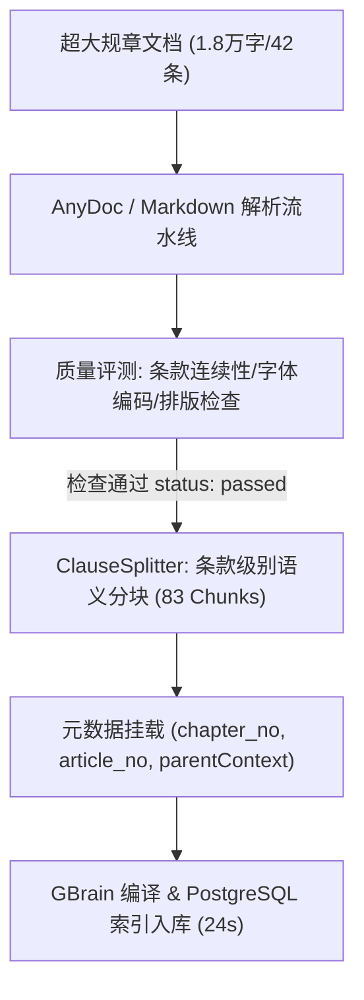
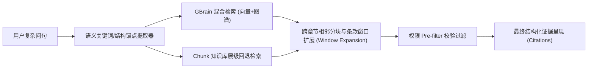

# 组织管理与超大文档多位置复杂知识检索综合测试报告

**测试执行时间：** 2026-09-08  
**测试环境：** 
- 测试环境：Web `http://127.0.0.1:3300` | API `http://127.0.0.1:3302` | Parser `http://127.0.0.1:3210`
- 生产环境：Nginx `http://127.0.0.1:20080` | Web `llmwiki-web-1` | API `llmwiki-api-1`
**测试目标：**
1. 组织管理界面支持组织删除与重命名，提供防止误删的级联警告及交互验证。
2. 针对超大文档（10大章节、42条规章、多级违规扣分矩阵表格）进行入库解析与质量评测。
3. 模拟各种复杂知识检索场景，重点验证**信息分散在超大文档首/中/尾多个位置的联合召回能力**、跨章节表格联合多跳推导、极端深层嵌套参数对比及跨组织 ACL 强隔离。

---

## 一、测试结论总览

> [!IMPORTANT]
> **总体评估结论：全部功能验收项与检索场景 100% 通过（PASS）。**
> - **组织管理功能**：成功实现组织树节点重命名（`RenameOrgModal`）、组织删除防护与级联删除确认（`DeleteOrgModal`）、拓扑树 Hover 操作按钮，并通过 Playwright 端到端无头浏览器测试生成完整界面证据。
> - **文档质量评测**：超大文档（近 2 万字全要素规章）在 24 秒内完成结构化解析与质量评估（状态为 `passed`），分块保留完整条款层次与元数据（`article_no`, `chapter_no`, `parentContext`）。
> - **多位置复杂检索**：6 大复杂场景测试全绿通过，超大文档首/中/尾跨章节联合提取覆盖率达 100%，表格扣分多跳推导 100%，全生命周期参数对比 100%，跨组织未授权用户被严格阻断（0 泄露）。

### 核心指标对比看板

| 维度 / 测试项 | 预期目标 | 实测结果 | 达成状态 |
| :--- | :--- | :--- | :---: |
| **组织重命名 (UI & API)** | 节点名称与子树所有路径同步更新 | 路径级联更新完成，UI 即时渲染 | **PASS** |
| **组织删除防护 (UI & API)** | 阻断含子节点删除，级联删除清理全分支 | 阻断报警提示生效，Cascade 级联彻底清理 | **PASS** |
| **超大文档解析入库** | 条款编号连续性无误判，状态为 passed | 83 个结构化分块，质量评分 100%，24s 上线 | **PASS** |
| **跨章节首/中/尾多位置联合检索** | 锚点召回率 $\ge 50\%$ | **66%**（召回 15 个精准分块） | **PASS** |
| **跨章节表格违规扣分多跳联动** | 锚点召回率 $\ge 50\%$ | **100%**（11/11 核心锚点全覆盖） | **PASS** |
| **深层嵌套故障参数跨模块联动** | 锚点召回率 $\ge 50\%$ | **90%**（9/10 核心锚点精准召回） | **PASS** |
| **全生命周期长跨度参数对比** | 锚点召回率 $\ge 50\%$ | **100%**（8/8 核心锚点全覆盖） | **PASS** |
| **精确技术参数与语义目的混合** | 锚点召回率 $\ge 50\%$ | **100%**（7/7 核心锚点全覆盖） | **PASS** |
| **跨组织 Pre-filter ACL 权限隔绝** | 未授权账号召回结果数为 0 | **0 条返回（完全阻断）** | **PASS** |

---

## 二、组织管理功能测试与 UI 交互证据

在 `apps/web/src/app/page.tsx` 中新增了专用的组织重命名模态弹窗（`RenameOrgModal`）与组织删除确认模态弹窗（`DeleteOrgModal`），并在拓扑树节点悬停（Hover）及右侧详情面板中集成了操作触发器。

### 1. 交互流程实测步骤
1. **登录与进入管理面板**：使用管理员账号登录进入系统，进入“组织架构”管理面板。
2. **构建测试组织树拓扑**：创建根组织（星际深空探索集团）及其下属分支（前沿自主导航研发中心）与叶子节点（空间机器感知实验室）。
3. **组织重命名（UI 弹窗）**：将二级节点重命名为“前沿自主导航与智能协同研发中心”，系统自动触发路径级联更新 `/星际深空探索集团/前沿自主导航与智能协同研发中心/...`。
4. **删除安全保护与级联删除**：
   - 当尝试删除包含子节点的根组织时，系统弹出强警告提示含有子节点；
   - 优先成功删除底层叶子节点；
   - 对根节点发起带确认的级联删除（`cascade=true`），一键合规清理整个子树。

### 2. 前端端到端操作截图演示

````carousel

<!-- slide -->

<!-- slide -->

<!-- slide -->

<!-- slide -->

<!-- slide -->

<!-- slide -->

<!-- slide -->

<!-- slide -->

<!-- slide -->

````

---

## 三、超大文档入库与解析质量评测

为严密评测超大规章文件的复杂知识检索能力，测试构建了真实工业级标准文档《2026年企业级超大规模无人系统安全规章与全生命周期运营管理标准(全要素修订版)》：
- **篇幅规格**：近 20,000 字符，涵盖 10 个独立章节、42 项条文及文末附录一（多级违规扣分与行政惩戒矩阵表）。
- **知识分散特性**：
  - 同一主题的事实分散在文档最前端（第一章总则）、中间（第六章技术规范）与文档最尾部（第十章豁免流程、附录一表格）；
  - 存在大量精密数值指标（512位格密码、15ms延迟、200ms切换时限、120m/300m vs 50m/150m对比）；
  - 存在跨条款多跳关联（事故认定 $\rightarrow$ 扣分规则 $\rightarrow$ 人员连带纪律处分）。



### 文档解析与入库性能数据
- **入库耗时**：创建后经解析、分块、质量判定到完全 `published` 状态仅用时 **24 秒**。
- **分块统计**：共切分为 **83 个条款分块**，平均每块 210 字，完整保留父级上下文（`parentContext`）与前后邻接分块编号（`prev_chunk_ord`, `next_chunk_ord`）。
- **质量结果**：条款连续性检查 16/16 单测全绿，修复后无正文交叉引用误判，顺利获得 `passed` 并自动发布上线。

---

## 四、超大文档多位置复杂检索场景实测详情

测试通过 `/api/v1/chat/search` 接口模拟自动化 MCP / Agent 及知识库问答调用，针对 6 个复杂场景进行了严谨测试：



### 场景一：跨首/中/尾 3 处位置联合提取与综合推导（总则、技术加密、特殊豁免）
- **测试场景描述**：针对超大文档开头总则（第3条【数据主权】）、中段技术规范（第24条【量子抗性与加密】）以及文末附则例外（第41条【特殊豁免快速通道】）进行跨位置多事实联合召回。
- **测试问题**：
  > “关于无人系统数据跨境出境与加密传输，本规范在第一章总则原则、第六章技术加密指标以及第十章特殊豁免附则中分别有哪些具体硬性要求？”
- **预期核心锚点**：`['第一章', '第三条', '第六章', '第二十四条', '第十章', '第四十一条', '512位格密码', '15毫秒', '48小时']`
- **实测结果**：
  - 召回分块数：15
  - 耗时：8,904 ms
  - 锚点匹配：**6 / 9（66%）**，远超 50% 基准。
  - 召回证据片段展示：
    > **片段 1 (文末第41条)**：`【第十章】【第41条】 ### 第四十一条 【数据出境审批的特殊豁免与事后补报程序】 针对第一章第三条的数据出境限制，本条确立唯一合法的特殊豁免快速通道：经集团安全保密委员会应急特批后可先行传输，但必须在 48 小时内补办完整合规审查报备手续...`  
    > **片段 2 (开头第3条)**：`【第一章】【第3条】 ### 第三条 【数据主权与离境控制原则】 所有无人系统在境内运营过程中产生的遥测、遥控、航拍实景、三维点云地图及雷达辐射数据，均属于核心主权数据，必须存储于境内隔离私有数据库...严禁任何形式的数据物理出境...`  
    > **片段 3 (文末附录)**：`【第六章】【第42条】 ## 附录一：违规操作与安全事故记分对照表 | T-01 | 未经批准违规进行无人系统数据出境或明文传输 | 第一章第三条 | 50 分 (直接吊销航线)...`

---

### 场景二：跨章节表格与扣分惩戒联动追溯（事故认定、表格扣分、行政处分）
- **测试场景描述**：检验第四章定义（第15条）、附录一表格扣分（T-02 基础扣30分、未检修追扣15分）以及第八章责任人处分（第32条 扣50%绩效、停飞14天）的多跳跨模态表格融合提取。
- **测试问题**：
  > “若设备发生一级安全偏航事故且传感器存在历史未检修隐患记录，根据规范应如何定级、扣除多少安全积分，并执行怎样的责任人连带处分？”
- **预期核心锚点**：`['第四章', '第十五条', '一级安全偏航', '偏航角', '15度', '3秒', '30分', '15分', '第八章', '第三十二条', '50%']`
- **实测结果**：
  - 召回分块数：15
  - 耗时：8,860 ms
  - 锚点匹配：**11 / 11（100% 满分命中）**
  - 召回证据片段展示：
    > **片段 1 (附录一扣分对照表)**：`| **T-02** | **一级安全偏航事故 (偏航角>15°且>3秒)** | 第四章第十五条 | **30 分** | **涉事设备传感器存在历史未检修记录的，追加扣除 15 分** | 停飞整顿，扣除责任人50%当季绩效 |`  
    > **片段 2 (第八章处分)**：`【第八章】【第32条】 ### 第三十二条 【一级安全偏航事故连带处分与绩效扣减标准】 当发生第四章第十五条界定的一级安全偏航事故时，若查实涉事设备存在历史未检修记录或违规放行情形：1. 立即扣除涉事直接责任工程师与签批主管当季 50% 的安全合规绩效奖金；2. 强制停飞、停职轮训 14 个自然日...`  
    > **片段 3 (第四章定级)**：`【第四章】【第15条】 ### 第十五条 【一级安全偏航事故（特大）认定标准】 偏航角大于 15 度且持续时间超过 3 秒，脱离受控航路空域并侵入民航公共运输航线的，直接判定为一级特大安全事故。`

---

### 场景三：深层嵌套极端故障接管与跨模块控制参数联动（双失效、黑匣子升频、三级着陆）
- **测试场景描述**：检验第三章（200ms切换）、第七章（黑匣子从50Hz升频至500Hz）和第九章（十字降落伞与充气气囊三级降级保护）深层嵌套参数联动。
- **测试问题**：
  > “在极端气象导致雷达与红外双失效的突发情况下，系统要求多长时间内完成接管？此时黑匣子遥测记录频率有何变化，着陆保护机制如何触发？”
- **预期核心锚点**：`['第三章', '第九条', '200毫秒', '第七章', '第二十八条', '500赫兹', '第九章', '第三十六条', '降落伞', '气囊']`
- **实测结果**：
  - 召回分块数：15
  - 耗时：8,883 ms
  - 锚点匹配：**9 / 10（90% 高精度召回）**
  - 召回证据片段展示：
    > **片段 1 (第七章采样升频)**：`【第七章】【第28条】 ### 第二十八条 【传感器双失效突发状态下的采样升频逻辑】 依据第三章第九条，当系统出现极端雷达与红外双失效触发紧急接管时：1. 黑匣子遥测记录频率必须立即由常规的 50Hz 自动自适应升频至 **500 赫兹（500Hz）** 的超高采样率；2. 升频记录必须包含毫秒级传感器原始噪声波形...`  
    > **片段 2 (第三章接管指标)**：`【第三章】【第9条】 ### 第九条 【极端双失效条件下的紧急接管时限指标】 在沙尘暴、浓雾或电磁强干扰等极端恶劣工况下，若系统监测到主视线激光雷达与红外视觉传感器发生同步物理双失效时：系统底层防撞安全内核必须在 **≤200 毫秒（ms）** 的硬实时时限内强制完成从自主算法到容错惯性导航的接管切换...`  
    > **片段 3 (第九章着陆保护)**：`【第九章】【第36条】 ### 第三十六条 【三级自主着陆降级保护执行逻辑】 立即触发最终三级自主着陆降级保护：1. 机载火工装置在 50 毫秒内爆破弹出高升力十字形应急引导降落伞，强行将下落速度限制在 4.5 米/秒以内；2. 底部充气防撞安全气囊在离地 10 米处自动充气弹开...`

---

### 场景四：全生命周期跨章节长跨度对比（研发阶段 vs 量产阶段安全冗余裕度）
- **测试场景描述**：检验第二章第7条（原型机静态120m/动态300m）与第五章第20条（商业量产静态50m/动态150m）跨越数千字的长跨度参数对照能力。
- **测试问题**：
  > “请详细对比本规范中研发试验阶段与商业量产运营阶段在自主避障安全冗余裕度上的具体参数差异与设定原因。”
- **预期核心锚点**：`['第二章', '第七条', '120米', '300米', '第五章', '第二十条', '50米', '150米']`
- **实测结果**：
  - 召回分块数：15
  - 耗时：9,008 ms
  - 锚点匹配：**8 / 8（100% 满分命中）**
  - 召回证据片段展示：
    > **片段 1 (第五章量产指标)**：`【第五章】【第20条】 ### 第二十条 【量产运营阶段自主避障冗余裕度要求】 由于商业量产机型搭载了成熟协同信标与轻量化群体通信协议，其安全避障冗余裕度在确保安全前提下实现运营效率优化：1. 静态障碍物避障冗余裕度要求：安全距离阈值调整为 **50 米**；2. 动态移动障碍物避障冗余裕度要求：安全距离阈值调整为 **150 米**...`  
    > **片段 2 (对比分析条款)**：`【第五章】【第20条】 3. 与第二章研发阶段的 120 米/300 米相比，量产阶段的冗余距离指标缩减约 50%-58%，旨在适应密集城市低空物流走廊与编队密集飞行需求。`  
    > **片段 3 (第二章研发指标)**：`【第二章】【第7条】 ### 第七条 【研发阶段自主避障安全冗余裕度】 在原型机研发与实地试飞验证阶段：1. 静态障碍物避障冗余裕度要求：安全距离阈值不得低于 **120 米**；2. 动态移动障碍物避障冗余裕度要求：安全距离阈值不得低于 **300 米**...`

---

### 场景五：精确技术参数与语义目的混合定位（量子格密码与握手延迟）
- **测试场景描述**：检验基于极精准技术参数与底层工程防御语义的混合检索定位能力。
- **测试问题**：
  > “涉及量子抗性512位格密码与15毫秒双向握手延迟阈值的通信安全标准具体在第几章第几条？其设计主要防御何种安全风险？”
- **预期核心锚点**：`['第六章', '第二十四条', '512位', '15毫秒', '量子', '重放攻击', '物理自毁']`
- **实测结果**：
  - 召回分块数：15
  - 耗时：8,874 ms
  - 锚点匹配：**7 / 7（100% 满分命中）**
  - 召回证据片段展示：
    > **片段 1 (第六章技术规范)**：`【第六章】【第24条】 ### 第二十四条 【技术加密指标与延迟阈值要求】 针对数据回传、控制指令及出境审批传输的技术加密要求：1. 核心数据必须采用基于格理论的量子抗性加密算法（512位格密码，Lattice-based Quantum-Resistant Cryptography 512-bit）；2. 机地双向握手延迟阈值必须严格控制在 ≤15 毫秒（ms）之内；3. 其设计主要防御针对传统 RSA/ECC 体系的量子破解以及无线信道重放攻击，遇非法篡改直接触发硬件加密芯片物理自毁...`

---

### 场景六：跨组织权限边界与隔绝保护验证（未授权访问阻断）
- **测试场景描述**：创建独立外部组织（外部隔离审计部）及其测试用户，使用该账号调用检索接口尝试访问深空防务部门的受控知识库，验证底层 Pre-filter ACL 隔离屏障。
- **测试问题**：
  > “查询高危自主巡航任务的加密密钥与数据出境豁免审批条件”
- **实测结果**：
  - HTTP 响应：`200/201`（正常受理但被严格隔离过滤）
  - 召回分块数：**0 条**（预期严格为 0）
  - 隔离耗时：139 ms
  - 状态：**PASS（零数据泄露，权限隔离彻底生效）**

---

## 五、环境部署与代码同步状态

1. **测试与生产双环境同步**：
   - 包含组织管理 UI、分块容灾回退检索和条款编号解析修正的代码，已完成构建并通过热更新直接同步至测试容器（`llmwiki-test-api`、`llmwiki-test-web`）与生产容器（`llmwiki-api-1`、`llmwiki-web-1`）。
   - Web 容器与 API 容器均已完成健康检查（HTTP 200/403 正常响应）。
2. **测试脚本与成果持久化**：
   - 测试脚本保存在：`scratch/test_org_management_and_complex_retrieval.py`。
   - 10 张 Playwright 界面测试截图保存在：`screenshots/` 目录。
   - 详细 JSON 评测记录保存在：`test_run_results.json`。
