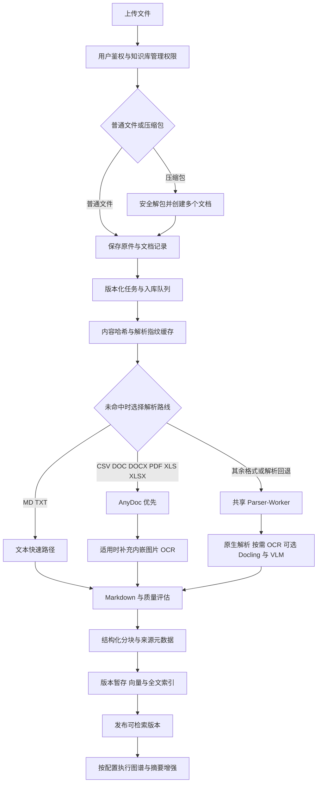

# GBrainKG 文档入库流程深度分析与优化建议

分析日期：2026 年 10 月 9 日。范围：当前工作区源码、官方公开产品文档和解析框架文档。本文用于建设评审，不包含代码实现、配置变更或生产操作；源码行为不等同于生产环境已开启的能力，性能结论需要测试环境实测。

## 核心判断

现有系统已具备较完整的入库基础：格式白名单、异步队列、原文保存、AnyDoc 原生解析、共享 Parser-Worker、PDF 按需 OCR、Office 图片识别、结构化分块、混合索引、版本发布与失败恢复。优化应优先解决**内容保真、来源定位、处理完整性和大文件资源控制**，再扩展格式。

最值得投入的六项工作如下。

| 优先方向 | 当前主要问题 | 建设目标 |
| --- | --- | --- |
| Excel 分流 | 表格最终压成 Markdown，原始类型、坐标和公式信息不足；大表多次全量物化 | 小表保留完整上下文，大表流式处理，事实计算读取完整结构化数据 |
| 图文关联 | AnyDoc 路径把补充 OCR 文本追加在文末；不同解析路径的定位能力不一致 | 图片、段落、表格、页面之间建立可追溯关系 |
| 内容完整性 | 当前主要以“存在文字”为发布条件，不能证明截图、所有页或所有表都被提取 | 保留宽松发布策略，同时显示覆盖率、遗漏和可重试单元 |
| QA 专用入库 | 通用文档切分不保证问题与答案保持一对一 | 原生 QA 对象、批量映射、审核、版本和问题检索 |
| 压缩包批处理 | 已有安全限制，但缺少完整导入清单和资源关联；部分条目会跳过 | 可解释的批次状态、逐项重试、MD 与图片依赖保留 |
| 资源与成本 | API、解析器、OCR 存在不同上限；多实例总并发可能放大负载 | 共享资源预算、背压、单元级缓存与增量更新 |

不建议整体替换现有系统，也不建议把所有文件交给视觉模型。应继续采用 BGE-M3 密集向量、BM25/pg_trgm、GraphRAG 与 Reranker 的通用架构；精确表格计算作为证据工具补充，所有授权由应用层执行。

## 现有入库链路

图示为逻辑流程；缓存命中会跳过解析。实际存在不可变版本与旧链路两个分支，不能假设所有实例走同一路径。

### 可以直接保留的能力

- 上传接口检查知识库可见性与管理权限，默认同内容也可创建独立文档，另有显式去重模式。
- 解析缓存包含内容哈希、实例及解析配置指纹；部分缓存复用要求配置版本号。已有能力应完善版本管理，不宜另建无身份边界的全局缓存。
- AnyDoc 对加密或资源超限的拒绝不会继续转交限制更弱的备用解析器。
- PDF Worker 已区分文本、扫描、混合类型，混合路线可仅对扫描页 OCR，再按原页序合并。
- DOCX Worker 保留段落与表格顺序，图片占位符可就地替换为 OCR；PPTX 已提取文本、表格、原生图表、分组形状和演讲备注，并按幻灯片组织结果。
- Markdown 分块已有标题层级、上下文、表头延续、行语义和部分位置元数据，不能简单描述为“固定长度切字符串”。
- 向量和全文索引已有就绪检查；慢速图谱和摘要已有独立增强安排。不可变版本发布已有覆盖率检查和原子切换基础。
- 已存在完整 Markdown 表格读取与 count、sum、min、max、avg 计算能力。应在这个责任层扩展结构化事实读取，避免重复建设一个无权限约束的 SQL Agent。

依据：[上传入口](../apps/api/src/ingestion/ingestion.controller.ts)、[入库编排](../apps/api/src/ingestion/ingestion.service.ts)、[解析 Worker](../apps/parser-worker/src/main.py)、[分块器](../apps/api/src/ingestion/markdown-chunker.ts)、[索引增强](../apps/api/src/ingestion/enrichment.processor.ts)、[版本发布](../apps/api/src/ingestion/document-version-store.ts)、[表格证据服务](../apps/api/src/retrieval/table-evidence.service.ts)。

### 当前格式与处理能力

下表是上传白名单及已追踪的代码路线；“接收”不代表格式内所有对象均被完整解析。

| 文件类型 | 当前入口 | 当前主要路线 | 主要边界 |
| --- | --- | --- | --- |
| `.xlsx` `.xls` | 接收 | AnyDoc；失败后 openpyxl/xlrd；必要时可选 Docling | Worker 每 Sheet 有单元格预算；整表转 Markdown |
| `.csv` | 接收 | AnyDoc；Worker 文本路线 | 需验证编码、引号内换行和超大记录；不等同原生 QA |
| `.docx` | 接收 | AnyDoc 加内嵌图片 OCR；或 python-docx 与图片占位处理 | 主路线与备用路线图文位置不同 |
| `.doc` | 接收 | AnyDoc；antiword 等回退 | 旧格式文本提取不保证图片与复杂布局保真 |
| `.pdf` | 接收 | AnyDoc；Worker 原生、按页 OCR、可选 Docling | AnyDoc 成功时不自动执行 Worker 全部版面判断 |
| `.pptx` | 接收 | python-pptx、图片 OCR 或 VLM、可选 Docling | 截图识字不等于 SmartArt、连线和空间关系理解 |
| `.ppt` | 未列入白名单 | 暂无被接纳的上传链路 | 已有 Office 预览转换器不代表上传支持旧 PPT |
| `.md` `.txt` | 接收 | API UTF-8 快速读取后分块 | 快速路径不处理外链或相对图片依赖，旧编码风险需验证 |
| `.html` `.htm` | 接收 | Worker 文本抽取 | 主体、表格和外部资源处理效果需样本验证 |
| `.png` `.jpg` `.jpeg` | 接收 | Worker 中 Docling 或云 OCR，条件满足时视觉增强 | 依赖部署配置，不是原生视觉向量检索 |
| `.zip` `.tar` `.tar.gz` `.tgz` | 接收 | 解包后每个受支持文件独立入库 | 不是压缩包整体语义理解；嵌套包不递归展开 |
| WebP TIFF BMP、JSON/JSONL、EPUB、EML/MSG、ODF、音视频 | 当前白名单未接收 | 暂无统一可用上传契约 | 底层库支持不应直接等同产品支持 |
| QA 文件 | 无独立 QA 上传类型 | 可作为 Excel、CSV 或 MD 普通文档上传 | 问题、答案、相似问与审核状态缺少专用入库契约 |

依据：[格式白名单](../apps/api/src/ingestion/parser-capabilities.ts)、[Office 转换工具](../apps/api/src/ingestion/office-converter.ts)、[数据模型](../packages/database/prisma/schema.prisma)。现有 `FeedbackCase` 保存问答反馈与纠错，不能据此认定已有审核后发布的 FAQ 知识库。

### 需要明确的资源上限

| 环节 | 源码默认值或行为 | 影响 |
| --- | --- | --- |
| 单文件上传与 Worker 输入 | 200 MiB | 只是接收上限，不能保证所有下游路径都能处理 |
| OCR 文件输入 | 默认 50 MiB | 大文件可能接收成功但 OCR 无法完成 |
| ZIP 解包 | 最多 500 个有效文件，合计 100 MiB，单文件 50 MiB | 应在上传前告知，不宜只显示 200 MiB |
| Worker Excel 原生路线 | 每 Sheet `max_row × max_column` 不超过 100 万 | 是矩形维度预算，不是有效单元格数；检查发生在加载工作簿后 |
| 完整表格证据读取 | Markdown 最大 32 MiB | 大表即便入库，也可能超过当前计算能力 |
| 入库任务 | 每实例默认并发 6 | 多实例合计负载不能按单实例估算 |
| Docling | 共享 Worker 默认并发 4 | 不是全部格式解析任务的统一内存限制 |

以上为代码默认值，部署环境可能覆盖。端到端产品限制应根据实际路线计算，并区分压缩大小、解压大小、页数、像素、单元格数和输出体积。

## Excel 表格的优化分析

### 已确认的问题与影响范围

1. **XLS 零值丢失。** `extract_excel` 的 xlrd 分支使用 `str(sheet.cell_value(r, c) or "")`，数值 `0` 会变为空串。仅在落入 Worker 的 xlrd 路线时触发，不能推断 AnyDoc 主路线也丢零。它会影响计数、汇总、QA 中的数字答案，属于优先修复候选。
2. **公式与显示值无法完整回溯。** XLSX Worker 以 `data_only=True` 读取缓存结果；没有缓存的公式可能成为空值，也没有同时保存公式表达式。金额格式、百分比、前导零标识符、日期类型与错误值应分别保留，不能只用一个字符串代替全部信息。
3. **合并区域被铺平。** 当前填充合并单元格有助于检索，但若把横向合并金额复制到每列，后续聚合可能重复计算。应同时保留原始锚点、合并范围及继承展示值；计算只使用真实事实单元格。
4. **第一行被当作表头。** 带封面说明、多级表头、同 Sheet 多张表的工作簿可能解析出错误字段语义。空行不能简单删除后再假定所有区域属于同一表。
5. **大表内存放大。** Worker 在加载工作簿后又生成行列表、Markdown 行列表与完整字符串；API 读取整份原件，分块和入库也保留完整数组。单纯提高文件上限会扩大峰值内存。
6. **坐标与覆盖信息不足。** CanonicalBlock 有字符、页、标题和 bbox 字段，但未形成完整的 Sheet、原始行列、公式、单元格类型契约。当前 Markdown 字符范围不能替代 Excel 的 `Sheet!B12`。

源码依据：[Excel 原生提取](../apps/parser-worker/src/main.py) 中 `extract_excel`、[CanonicalBlock](../apps/api/src/ingestion/canonical-block.ts)。

### 小表与大表应如何分流

大小应由有效行列数、输出长度、合并复杂度和预估内存共同决定，不应只看文件大小。下面是测试起点，不是已验证阈值：单表不超过约 200 行且结构简单，可优先完整表或小行组；超过约 5 万有效行或预估解析内存超过任务预算时，进入大表任务；中间区间根据实际结构选择。最终阈值由测试环境压测确定。

| 表格形态 | 建议入库单位 | 检索与回答方式 |
| --- | --- | --- |
| 小型规范表 | 表标题、解释、单位、表头与完整表；超长时按行组拆 | 召回行组后带回完整小表或相关邻行 |
| 大型明细表 | 工作簿目录、Sheet 描述、表结构、按批次保存的类型化记录 | 语义定位表与字段，精确过滤和聚合读取完整记录 |
| 同 Sheet 多个表 | 独立表区域及各自说明 | 按表区域召回，避免表头跨区域继承 |
| 交叉表、多层表头 | 行维度、列维度、值、单位、原始坐标 | 按维度查询；保留原始矩阵用于引用 |
| 表单式 Excel | 标签和值的区域块 | 保留区域布局，不强行把首行当列定义 |
| 图表或截图为主 | 原生图表数据优先，截图走图像路线 | 图表事实与视觉解释分开引用 |
| FAQ 工作簿 | 用户指定问题、答案、相似问等列 | 进入 QA 路线，不按通用表格切碎 |

大表建议流程：**预检 → 识别 Sheet 与表区域 → 类型与表头映射 → 流式分批存储 → 构建表结构与行组检索表示 → 完整性校验 → 发布版本。**

初期复用现有 PostgreSQL 和对象存储。先扩展 `TableEvidenceService` 的事实来源及确定性过滤，不急于引入独立分析数据库。是否将行数据存入 PostgreSQL 类型化结构，或将超大数据保存为列式文件，应通过真实行数、更新频率、查询负载评估；不为每个工作簿自动创建数据库实例。

### 表格必须守住的语义

- `0`、`false`、空白、缺失、公式错误分别表达；编号 `00123` 不得变成 `123`。
- 公式文本、缓存结果和结果是否可用分别记录；默认不执行宏、不刷新外部链接，不把缺失缓存当作零。
- 保留日期系统、时区约定、币种、百分比与数值单位。跨表汇总前校验单位和口径。
- 隐藏 Sheet、隐藏行列、批注和批次范围需要明示处理策略；隐藏不等于无权限，也不等于应该默认公开。
- 精确统计必须覆盖授权范围内的完整目标表，禁止把检索 Top-K 行的合计写成全表合计。
- 表头继承和合并填充属于解释信息；汇总行、明细行要区分，避免重复计入。
- 大表允许按 Sheet 或行批次恢复，不能失败一次就重新解析全部工作簿。

示例：一张 20 万行记录表中，用户问“某时间范围内总金额”。正确流程是定位表与日期/金额字段、应用权限和过滤、确定性求和、返回范围与来源。向量召回只负责定位，不负责覆盖所有参与计算的行。

## 带截图的 Word 与 PDF

### Word

当前 DOCX Worker 已有图文顺序和图片占位处理，优先复用。更突出的差异在 AnyDoc 成功路线：附加 OCR 内容统一放入文末“图片文字”区，图片与原段落、图题之间的关系被削弱。检索到按钮名称后，可能找不到它属于哪个操作步骤。

建议统一为：**解析段落和表格 → 提取图片及对象锚点 → 原生文本与图片识别分别保留 → 按锚点关联 → 按章节与语义块分块。** 图片应保存原始资产、段落/表格位置、前后文、图题、OCR 文本和可选视觉说明。图片块与所属步骤一起参与检索扩展，不应只追加到文末。

还应覆盖页眉页脚、文本框、表格内图片、嵌套表格、脚注、修订、批注、浮动图片和链接图片。这里是待验证清单，不代表所有对象当前均缺失。默认保留正文事实，重复页眉作去噪；修订视图和批注是否入库应有明确产品约定。

旧 DOC 建议先用受限的格式转换保留可提取结构，再复用 DOCX 或 PDF 路线。转换失败可保留文本降级，但需显示“图片/版式未覆盖”。现有 PDF 预览转换只能作为可复用基础，不能直接承诺 DOC 完整入库。

### PDF

现有混合 PDF 按扫描页 OCR 是值得保留的节省成本策略，但“文本页”仍可能包含重要截图；也可能只是页眉有文字、主体为扫描图。

建议页级处理进一步细化到区域级：

1. 读取文本层和页面结构，识别乱码、文字覆盖、图片区域及多栏布局。
2. 简单文本区域直接提取；扫描区域 OCR；复杂表格调用结构识别；图表和流程图按需调用视觉模型。
3. 为每个区域保留页码、bbox、阅读顺序和解析来源，避免 OCR 文本与原生文本重复。
4. 跨页表只在列结构与续表证据匹配时合并，保留每段原页范围，不能仅因列名相同就合并两张表。
5. 用原始页数、成功页面、待处理区域和失败页面描述完成度，支持局部重试。

需要重点验证：混合路线在只 OCR 扫描页后，原生文本页中的图片是否获得等价补充；AnyDoc 成功返回非空内容时，是否绕过必要版面增强；PDF 的矢量流程图不一定表现为可提取栅格图片，需局部或整页渲染识别。

“用户截图中的某按钮位于右上角”“流程图 A 通过箭头指向 B”都不能仅凭文字 OCR 确定。视觉解释应标记为模型派生内容，不能与原文逐字识别混成同一可信等级。

## PPT 与独立图片

### PPT

当前 PPTX 比基础文本提取更完整，已有演讲备注、图表数据和分组遍历。应保留这些能力，补足整页语义：对象位置排序能改善阅读顺序，但仍不能完整表示泳道图、组织图、SmartArt、箭头和左右对比关系。

建议以“幻灯片父块 + 文字/表格/图片子块”组织内容。原生图表优先提取系列、类别、数值和单位；视觉模型仅用于解释未结构化的布局关系。复杂页面保留渲染图与原对象坐标，回答可以定位到具体幻灯片和图表。

演讲备注单独标记来源；隐藏幻灯片和备注的默认入库范围在导入预览中说明。避免把每页重复公司名称和模板页脚都当作高价值文本。增加旧 `.ppt` 支持应经过受限转换、格式检测和回归后开放，不能只增加后缀。

### 图片

建议先补 WebP、TIFF、BMP 的明确支持，其中 TIFF 要处理多页和高分辨率限制。图片路线按内容选择：文字截图走 OCR，表格截图走结构识别，图表/流程图/照片在需要时走视觉描述。对手机拍照增加旋转、倾斜和模糊判断，对超长截图采用带重叠的分区识别并去重。

OCR 和视觉描述应复用同一图片资产与内容哈希缓存。同一 logo、重复截图只识别一次，但每次出现的位置仍保留。装饰图可以跳过，跳过规则需记录，避免误将小字号表格裁片当装饰。

当前 BGE-M3 主要索引提取后的文字；“可上传图片”不等于“以图搜图”。原生视觉向量检索可以后续评估，不作为本轮首要建设内容。

## Markdown 与压缩包

### Markdown

纯文本无需 OCR，但需要保护原始结构。现有快速路径可继续使用，优先补充编码检测及 AST 级结构保真：标题、列表、代码围栏、表格、链接、脚注和数学公式应有明确块边界。短代码或表格不宜从中间切开，超长块需有可回溯的内部切分。

Markdown 中的图片可能为相对路径、绝对 URL 或 data URI。现有 API 快速路径没有统一解析这些依赖。建议本地资源通过同批次受控资产清单关联，外部 URL 默认不主动抓取；如开放下载，必须限制协议、域名/IP、重定向、响应大小和超时，避免 SSRF 与无界下载。MDX 若开放，只按文本/语法解析，绝不执行组件代码。

正文哈希、解析投影哈希和派生说明哈希分开管理。嵌入时可以补标题上下文，引用仍应指向原始段落，不把生成的摘要当原句。

### ZIP 和其他压缩包

现有安全解包已有路径规范化、后缀过滤、文件数量和解压大小限制，必须保留。ZIP 使用 AdmZip，解压条目会物化为 Buffer，多个条目还一起保存在数组中；声明大小预检不能替代解压过程中的实际字节预算。

当前抽取器返回 `relativePath`，目录信息会部分保留在展平后的文件名与标题中；上传循环主要按 `filename` 创建独立文档，未建立明确的目录与资源关联契约。MD 和图片即使一起上传，也不会自然形成一份可追溯图文文档。ZIP 内加密或损坏条目在 `getData()` 异常时会跳过，需要避免用户把返回的 accepted 误认为包内全部成功。

建议流程：**生成批次清单 → 安全解包 → 文档与资产分类 → 关联相对依赖 → 逐文档入队 → 汇总逐项结果。**

批次清单至少记录原始路径、文档 ID、哈希、受理/跳过/失败原因、处理进度。普通批量包保持文件独立；MD 文档包将被引用图片作为资产关联，避免图片重复生成独立知识文档。目录结构用于来源和导航，不自动转化为权限。

压缩包原件当前按源码约定不持久化。本轮建议先保留轻量导入清单和子文件血缘，不擅自改变原包删除策略。嵌套压缩包初期继续不递归，明确显示“未展开”；RAR/7z 低于主要文档质量优化优先级。

安全和稳定性验收应覆盖路径穿越、符号链接、海量目录项、伪造大小、压缩炸弹、Unicode 重名、同名不同目录、加密文件，以及中途取消后的临时资源清理。

## 问答对如何入库

### 区分三种来源

| 来源 | 建议处理 | 发布原则 |
| --- | --- | --- |
| 人工整理的标准问答 | Excel/CSV/JSONL/表单字段映射，预览后导入 | 由有权限的维护者确认 |
| 从文档自动生成的 QA | 挂在原文块下作为检索增强或候选问答 | 默认不独立成为权威答案，保留生成与审核状态 |
| 聊天记录及用户纠错 | 从反馈流程挑选、补足上下文、脱敏、审核 | 不能把模型历史回答自动反灌成事实 |

### 建议的最小 QA 契约

复用现有文档、版本、块和索引责任层，增加 QA 类型及必要元数据；初期不必另造完整知识管理服务。

| 字段 | 作用 |
| --- | --- |
| 稳定 QA ID、版本、所属知识库 | 更新、回滚、幂等和授权 |
| 标准问题、相似问题 | 问题匹配与别名召回 |
| 标准答案 | 保留完整答案及 Markdown 结构 |
| 适用范围、语言、生效与失效时间 | 防止不同版本或场景的答案混用 |
| 来源文档/块及来源版本 | 证据溯源和失效联动 |
| 来源类别、维护者、审核状态 | 区分人工权威内容和模型生成候选 |
| 关联图片或附件 | 与 QA 使用相同权限及生命周期 |

建议导入顺序：**识别编码和表结构 → 用户映射字段 → 校验问题与答案 → 去重和冲突报告 → 预览 → 版本化入库 → 建索引 → 发布。**

不要仅凭列名中含“问”“答”就自动生成已发布 QA；多语言列名与任意业务字段应通过通用映射解决。答案 `0`、`false` 是有效值；空问题和真正空答案才属于校验失败。CSV 应支持引号内换行、逗号和转义，JSONL 需返回具体失败行。

### 检索和更新原则

- 以标准问题及相似问构建问题侧检索表示，答案另存；必要时增加问题加答案的辅助索引。多个相似问召回同一 QA 后去重，避免霸占结果。
- 一条 QA 保持原子性，禁止把问题与对应答案拆到没有关联的块。长答案使用子块，但检索必须回到同一 QA 父对象。
- 仍走混合召回和重排，不把 QA 变成绕过权限、版本和时效的特殊捷径。
- 只有审核通过、范围明确、无冲突且满足阈值的标准问答，才考虑直接回答；其余作为证据参与生成。阈值必须在真实问题集上校准。
- 同一问题答案不同不是可自动删除的重复，应区分生效时间、适用范围和来源，进入冲突处理。
- 文档派生 QA 随来源版本失效；人工独立 QA 保留自己的维护版本。批量更新采用稳定 ID 或来源键，避免每次导入不断增加副本。
- 自由聊天中的“这个”“上一项”等指代不能原样变成独立标准问题，必须补足语境。

## 主流开源产品与解析框架的借鉴

选取 Dify、RAGFlow、FastGPT、MaxKB 作为有代表性的开源知识库产品，不作市场份额排名。Docling、Unstructured 属于解析框架，单独比较。官方滚动文档、预发布文档和商业服务依赖不能等同于当前社区部署开箱可用；建设时仍需固定版本验证。

### 产品对照

| 项目与资料范围 | 公开资料中的格式与流程 | 对 GBrainKG 的具体借鉴 |
| --- | --- | --- |
| Dify 官方教程与 Knowledge Pipeline | 官方教程列有 PDF、DOC/DOCX、PPT/PPTX、XLS/XLSX、CSV、TXT、MD/MDX、HTML、XML、EPUB、邮件及 VTT 等；Pipeline 支持处理节点和 General、Parent-Child、Q&A 模式 | 按材料组织块；提供导入预览。初期采用内置路线，不复制完整可视化编排器。[格式教程](https://dify.ai/blog/create-knowledge-in-dify-for-beginners)、[Pipeline](https://dify.ai/blog/introducing-knowledge-pipeline) |
| RAGFlow 1.0.0-rc1 官方配置文档 | 按 General、Table、Q&A、Presentation 等方式处理；Table 通常按行，QA 按对，Presentation 按页；支持 PDF、Office、图片等对应解析配置 | 以表、页、QA 为语义边界，分离简单解析与视觉增强；该页面为候选版本资料。[配置文档](https://ragflow.io/docs/v1.0.0-rc1/dataset_configuration) |
| FastGPT 官方知识库 FAQ 与 4.16.2 发布说明 | FAQ 确认 XLSX 导入、PDF OCR 与问答拆分；4.16.2 扩展 DOC、PPT、XLS、宏容器、ODF、RTF、EPUB 等解析，并保留可识别内嵌图片引用，改进解析资源调度 | 图片先成为可引用资产；文件队列携带轻量来源，按资源预算调度；工作流媒体输入不能直接当作知识库支持。[知识库 FAQ](https://doc.fastgpt.io/zh-CN/guide/dataset/faq)、[发布说明](https://doc.fastgpt.io/zh-CN/self-host/upgrading/4-16/4162) |
| MaxKB v2 官方文档 | 列明 TXT、Markdown、PDF、DOCX、HTML、XLS/XLSX、CSV、ZIP；支持分段关联问题、生成问题与直接回答设置 | 一段答案可关联多个问题；提供逐段维护和命中策略。不能由此推断完整视觉理解。[文档管理](https://maxkb.cn/docs/v2/user_manual/dataset/doclist.html) |

MaxKB 官方页面本次直接打开异常，上表采用搜索索引返回的官方 v2 页面正文；相关内容仅用于方向对照，选型前应再次核对。各产品“可上传”“可解析文字”“可理解图片”“可执行表格统计”是不同能力，不能用后缀数量代替质量比较。

### 解析框架对照

| 框架 | 可借鉴能力 | 采用边界 |
| --- | --- | --- |
| Docling | 多格式转换为统一 Docling Document，支持 JSON 与 Markdown 等输出；官方当前列表包含 PDF、Office、常见图片等 | 本仓库已存在可选 Docling 回退，优先评估保留结构化结果和来源位置。当前官方能力不代表项目已安装版本具备全部功能。[支持格式](https://docling-project.github.io/docling/usage/supported_formats/) |
| Unstructured | `partition_xlsx` 按 Sheet 产生 Table，并提供 HTML 表格表示 | 借鉴结构与文本双表示；整 Sheet 一个 Table 仍需进一步处理大表，不代表可直接做精确统计。[开源 Partition 文档](https://docs.unstructured.io/open-source/core-functionality/partitioning) |

建议优先吸收四项共性：**结构先于分块、按材料选择处理路线、图片作为资产、问题与答案建立显式关系。** 不建议为了格式覆盖再常驻部署多套重型解析服务；新增解析能力仍归共享 Parser-Worker 管理。

## 建议的统一处理契约

### 扩展现有 CanonicalBlock

当前 CanonicalBlock 已有文档版本、字符范围、标题层级、表头和 bbox，是正确扩展位置。建议增加 sheet/table/row/cell、slide/shape、image/region、QA ID 等位置与类型信息，并连接原件和派生资产。

每个块区分三种内容：原始提取事实、用于检索的规范化表示、模型生成的说明。Markdown 保留为人可读投影，不再承担全部事实存储责任。原文定位必须使用原件坐标或稳定来源映射，不能直接拿补写标题、OCR、上下文后的偏移回指原始文件。

### 处理状态与质量状态分开

建议分别表达：任务是否完成、基础索引是否就绪、内容覆盖是否完整、可选增强是否完成。OCR 失败不必阻止已有正文可查，但界面和检索结果应能说明哪些图片未覆盖。

当前 API 与 Worker 的质量策略明确采用“主要阻止空提取”，这是已有产品决策，不应在优化中默默改成严格拦截。近期先补真实内容计数、失败区域列表和提示；如需要低置信度强制审核，再单独评审发布策略。

需要特别防止生成的标题、页码和“未识别”说明被当作有效正文，导致仅有页面骨架也通过“有字”检查。建议把真实提取文本与系统说明分别计量，而不是简单提高最低字数，因为短 QA 或只有数字的合法表格也可能很短。

### 复用缓存与局部重试

缓存键应绑定实例、内容哈希、解析器及模型版本、解析选项；图片还需绑定 OCR/视觉处理参数。图像字节复用与来源位置应分开：可共享识别产物，不共享原文访问权限或文档私有元数据。

当前持久化解析缓存查询按内容和解析指纹跨文档复用，没有在该 SQL 中以知识库权限收敛。相同原件复用本身不等于泄露，但来源路径、标题相关派生内容和元数据继承值得专项核查；不能因为哈希相同就复用另一个资源的引用身份。

重复上传复用解析与嵌入，内容变化只重做受影响的页、表或 QA；修改展示标题是否需要重建上下文向量应由明确的内容依赖决定。解析配置版本号应随发布更新，避免使用 `unversioned` 难以判断缓存有效性。

### 共享资源调度

同一共享 Worker 面向多个隔离实例，应按资源类型限制 CPU、内存、OCR/VLM 并发和临时磁盘，而不只是限制任务个数。大表和高分辨率扫描件使用不同估算；小任务可优先，但需为大任务保留公平调度，避免长期饥饿。

优先优化流式上传/读取、按批次分块与持久化、有界队列、分阶段产物引用。重型子进程已有基础；需要验证 Excel 等线程路线在超时后是否仍继续占用资源，不能把等待超时等同于任务已被终止。

继续维持每实例专属数据库与 Redis DB，共享 PostgreSQL 服务、Redis 服务、Parser-Worker、MinIO 与 Nginx，不新增每实例 Python 服务。

## 文件支持范围的建设顺序

| 层级 | 建议格式范围 | 对外承诺 |
| --- | --- | --- |
| 第一层 先做可靠 | 现有 PDF、DOCX、XLSX/XLS、CSV、PPTX、MD/TXT、HTML、PNG/JPEG、ZIP/TAR 系列 | 明示文本、表格、图片、引用和规模边界；优先解决内容丢失 |
| 第二层 补高频缺口 | PPT、WebP、TIFF、BMP、QA CSV/XLSX/JSONL、MD 资源包 | 完成对应转换、类型检测、资产关联、权限和回归后开放 |
| 第三层 按需求扩展 | ODT/ODS/ODP、RTF、EPUB、EML/MSG、通用 JSON/JSONL/XML、Markdown 别名 | 具备明确用户场景再引入；邮件附件按文档子资源处理 |
| 第四层 专项能力 | 音频、视频、RAR/7z、宏容器、工程设计及专业版式 | 独立预算和验收；视频需区分仅音轨转写与画面理解 |

宏格式即使接收也只提取静态内容，不能执行宏。JSON/XML 必须有结构映射和安全解析，不能因后缀可读就任意展开无限嵌套。受密码保护文件需要明确拒绝或受控解密入口。

## 分阶段建设与验收

### 第一阶段 纠正事实损失并提高可观测性

范围：XLS 零值、解析路径覆盖差异、系统说明与正文区分、ZIP 逐项清单、端到端限制提示、编码及公式风险可见化。

复用位置：现有 parser、content-quality、archive-extractor 与入库状态字段。质量提示与是否发布分开，保留当前宽松策略。验收重点是事实不被悄悄改写、失败可解释、已有格式不退化。

### 第二阶段 表格和图文的结构化来源

范围：CanonicalBlock 扩展、表格区域与原始坐标、图片资产与正文锚点、小表/大表分流、表格证据服务扩展。

依赖：版本化产物与权限规则先明确，再增加派生资产读取接口。新数据入口必须登记应用层访问边界，所有范围约束在分页和 Top-K 前应用。

### 第三阶段 QA 和增量导入

范围：字段映射与模板、标准问题及相似问、答案原子性、来源绑定、冲突审核、稳定 ID 更新、来源变更失效联动。

先完成手工标准 QA，再引入文档生成问题。生成 QA 数量应由召回收益评估决定，不为每个块机械生成大量问答。

### 第四阶段 性能与格式扩展

范围：流式大表、单元级重试、共享资源调度、图片识别缓存、缺口格式支持。

扩展前建立固定基线，不预先承诺吞吐翻倍或成本下降比例。缓存、视觉按需调用、精确任务路由都应以每份文档的实际处理费用与质量收益评估。

### 必须建立的回归样本

| 类别 | 样本 | 核心检查 |
| --- | --- | --- |
| 小 Excel | 普通表、多 Sheet、多表、多级表头、合并、空白、0/false、前导零、日期、公式 | 单元格事实、表头与坐标准确，合并值不重复计数 |
| 大 Excel/CSV | 逐级增加到万行、十万行及超预算；稀疏格式、大字段、多行 CSV | 峰值内存、耗时、背压、取消、恢复及完整聚合 |
| Word | 文字加截图、表格内截图、文本框、旧 DOC、修订备注 | 图片文字能与对应步骤一并召回 |
| PDF | 文本、扫描、混合、多栏、矢量图、跨页表、乱码、加密 | 页面/区域覆盖、阅读顺序、数值与引用坐标 |
| PPT | 原生图表、截图、分组、SmartArt、备注、隐藏页、旧 PPT | 页级关系、图表数据、来源与范围策略 |
| MD/HTML | 代码围栏、长表格、脚注、相对图片、外链、旧编码 | 结构、依赖关联、显示安全及下载约束 |
| ZIP | 多目录同名、文档包、嵌套包、损坏/加密、路径攻击、超限 | 每项有结果，资源依赖可追溯，取消后无残留 |
| 图片 | 长截图、低清拍照、旋转、多页 TIFF、重复图片、图表 | 覆盖率、置信度、事实与生成解释区分 |
| QA | 多问一答、长答案、零值答案、冲突版本、失效、聊天纠错 | 问答绑定、权限、更新幂等、直接回答准确性 |
| 多实例与权限 | 并行导入、撤权、重传、取消、重试、原文与资产访问 | 无越权、无跨实例抢任务、旧任务不覆盖新版本 |

功能不变量应要求确定性样本全部通过：零值不丢失、QA 不串答案、完整表聚合等于基准、越权请求全部拒绝。OCR 字符准确率、表格结构准确率、引用正确率、检索 Recall@K、QA 正确率按格式分组统计；数值关键单元格单独报告，不能被平均字符准确率掩盖。

性能记录排队时长、解析时长、到可检索时长、峰值内存、失败与重试率、单位文档处理费用。用同一批文件对比现有路线、结构优化路线和视觉增强路线，才能判断收益来自哪里。

## 结论与实施边界

建议先把 Excel 和图文文档的事实与来源保存完整，再建设 QA 专用语义和可恢复批处理。系统已具备大部分基础组件，重点是统一产物契约和补齐端到端完整性，而不是继续叠加解析器。

本文中的阈值是实验起点，路线建议尚未实现；已定位的源码问题也未在本次修改。后续实施必须先在测试环境完成构建、单元/集成及专项样本验证，再按项目流程提交审查；生产部署仍需明确书面指令。
