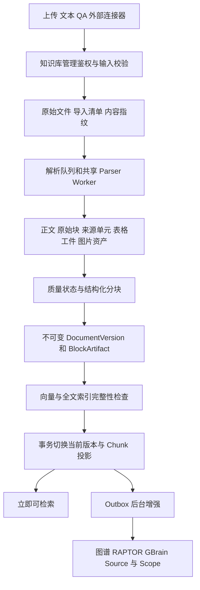
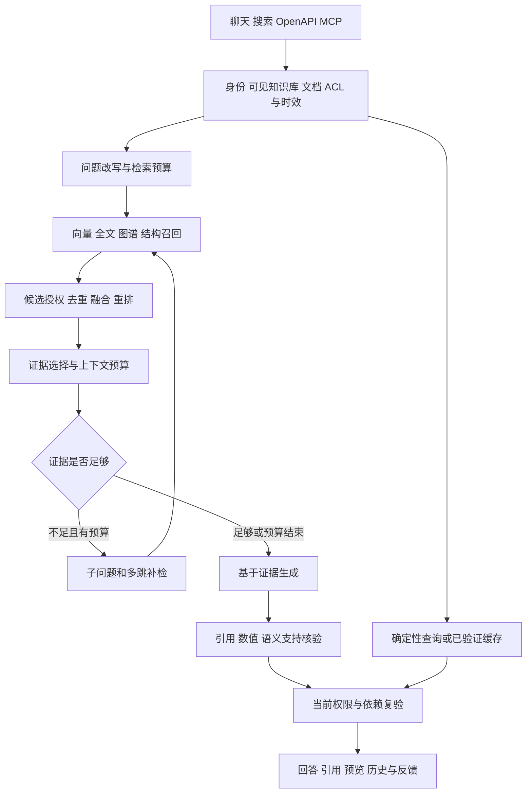

# GBrainKG 核心业务流程对标评估与优化建议

评估日期：2026年10月9日。代码基线：`8b87764`。对象：当前开发工作区的业务实现，不代表生产环境已部署相同版本。

## 1 核心结论

**项目已经具备完整企业知识库的主要业务闭环，架构方向合理，但尚不能认定核心流程达到最佳方案，也没有充分证据支持整体达到 SOTA。** 主要矛盾已经从“缺少检索算法”转为“现有算法是否产生可重复的净收益，以及权限、版本、来源、任务恢复能否贯穿所有分支”。

值得保留的能力是：原始资料与检索表示分离、不可变版本及原子发布、dense 与全文检索协同、图谱回到原文证据、结构化表格完整计算、引用依赖复验、持久化变更事件及共享基础设施。这些能力比继续增加一种检索算法更有长期价值。

优先解决的事项是：连接器崩溃恢复、检索入口间的范围语义一致性、可选 sparse 通道的过滤位置、缓存读写策略不一致、图实体身份粒度，以及质量与时延之间缺少充分配对评测。无需整体推翻架构，也不建议为追赶功能清单引入额外向量库、图数据库或每实例独立解析服务。

| 评估维度 | 当前判断 | 距离最佳方案的关键条件 |
| --- | --- | --- |
| 文件入库与版本发布 | 设计较完整，近期已有隔离环境验证 | 将解析覆盖率带入回答完整性判断，补真实模型及混合负载证据 |
| 混合检索与重排 | 主干符合成熟 RAG 模式 | 证明多通道净收益，统一范围与预算，避免候选过早截断 |
| GraphRAG 与知识编译 | 能力丰富，来源约束较强 | 完成实体消歧及增益审计，控制多种摘要的重叠成本 |
| 回答与引用 | 防护较多，偏向准确性 | 量化误拒答、引用支持率、完整性和用户可见等待时间 |
| 权限与知识时效 | 应用层设计明确，存在严格复验机制 | 所有入口与可选分支必须一致，有限测试不能替代边界证明 |
| 外部数据同步 | 有游标、幂等处理和 ACL 映射 | 缺连接器运行租约及崩溃回收，持续同步产品化不足 |
| 评测与运维 | 工具链丰富、证据边界已有改进 | 将小规模结果、模拟闭环和真实规模结果分开验收 |

本报告属于源码审阅、调用链核对与官方资料对标；未重跑全套测试、未访问生产、未修改业务代码。文中历史实测均注明来源。对竞品比较的是官方公开能力和工作流，不把功能存在等同于质量胜出，不作未经同条件测试的准确率排名。

## 2 对标对象及比较边界

选取 Dify、RAGFlow、Onyx、FastGPT、WeKnora 作为有代表性的产品参照，Microsoft GraphRAG 作为图检索方法参照。它们定位不同，不能用“功能数量”直接排序。官方资料检索日期为本报告日期；其中 RAGFlow 引用页面明确属于 `1.0.0-rc1`，不能把该页面所有能力视作任意稳定版都已具备。

| 项目 | 官方资料支持的能力 | 对本项目最有价值的参照 | 不宜直接作出的推断 |
| --- | --- | --- | --- |
| Dify | 通用及父子分块、向量/全文/混合检索、可选 rerank；检索测试与应用检索共用 API | 让管理员能预览分块、试验检索、理解配置效果；收敛测试与真实请求差异 | 配置项丰富不代表默认准确率更高；其云端说明不自动等同所有自部署版本。见 [分块](https://docs.dify.ai/en/cloud/use-dify/knowledge/create-knowledge/chunking-and-cleaning-text)、[检索设置](https://docs.dify.ai/en/cloud/use-dify/knowledge/create-knowledge/setting-indexing-methods)、[检索测试](https://docs.dify.ai/en/cloud/use-dify/knowledge/test-retrieval) |
| RAGFlow | 分块查看、修改、启停及原文定位；知识编译区分文档级 Graph/Tree/PageIndex 等与知识库级 Wiki | 入库结果可检查、可纠错；区分原文索引与派生产物生命周期 | 当前官方文档仍有历史 RAPTOR 页面，不能只据旧页面判断现状。见 [分块管理](https://ragflow.io/docs/v1.0.0-rc1/chunk_parsing_results_and_knowledge_fragment_management)、[知识编译](https://ragflow.io/docs/v1.0.0-rc1/knowledge_compilation/faq) |
| Onyx | 连接器同步资料与元数据；搜索和问答两种体验；用户级源权限能力标注为 Enterprise Edition | 知识新鲜度、外部 ACL 同步和文档发现是一等业务流程 | 不能把企业版权限同步算作社区版默认能力。见 [连接器](https://docs.onyx.app/overview/core_features/connectors)、[搜索](https://docs.onyx.app/overview/core_features/internal_search) |
| FastGPT | 数据处理、RAG 检索、可视化 AI 工作流 | 通用流程对业务维护者的可理解性与可配置性 | 本项目若定位可信知识问答，无需因此扩成通用低代码平台。见 [官方仓库](https://github.com/labring/FastGPT) |
| WeKnora | 混合检索、rerank、父子分块、GraphRAG；资料连接器、FAQ、Wiki 及带来源的知识组织 | 中文企业资料场景、检索与知识整理协同、入库与任务可观测性 | 官方功能说明不能证明相同语料下优于本项目。见 [官方仓库](https://github.com/Tencent/WeKnora) |
| Microsoft GraphRAG | Local 将实体图与原文结合；Global 使用社区报告；DRIFT 用社区信息扩展检索 | 按问题类型选择图检索策略，并为全局综述设置独立资源预算 | GraphRAG 是方法/库参照，不是完整企业权限与连接器产品。见 [Query Engine](https://microsoft.github.io/graphrag/query/overview/) |

由此得到的产品判断：**GBrainKG 的竞争重点应是“资料可追溯、权限可信、版本明确、复杂问题能验证”，而不是堆叠所有竞品的工作流、Agent 和连接器。** Dify/FastGPT 适合借鉴运营配置体验，RAGFlow 适合借鉴解析治理，Onyx 适合借鉴同步与权限，WeKnora 适合借鉴中文知识组织，GraphRAG 适合借鉴查询分型。

## 3 实际核心业务链路

### 3.1 入库与版本更新

以上不可变版本链路以 `CORE_VERSIONING_ENABLED=1` 为条件。代码还保留非版本化分支；评估和测试不能把两者混为一个模式。

1. 入库入口校验管理权限，保存原始资料，支持导入批次及失败项重试。连接器复用入库服务，避免独立实现另一套索引逻辑。
2. 解析按格式走文本快速路径或共享 Worker，产生 Markdown、来源单元、资产和结构化表格；部分来源可单独重试。
3. 分块保留原文与用于检索的增强文本区别。QA 有映射、预览和审核流程，依赖来源的 QA 还绑定源文档版本。
4. 版本先暂存，向量构建完成后校验清单及覆盖率；发布事务锁定文档、验证待发布版本，更新 Chunk、全文索引和 activeVersion，再写入变更事件。
5. 图谱、摘要等增强异步执行，核心可检索状态不必等待所有增强结束。旧作业通过版本检查避免覆盖新版本。

关键依据：[IngestionService](../apps/api/src/ingestion/ingestion.service.ts) 第232、539、631行附近；[DocumentVersionStore](../apps/api/src/ingestion/document-version-store.ts) 第27、105行；[EnrichmentProcessor](../apps/api/src/ingestion/enrichment.processor.ts) 第90行附近；[QA Controller](../apps/api/src/ingestion/qa.controller.ts) 第97、148行。

**评价：主干合理，应保留。** 原子切换避免重建期间新旧检索结果混用，异步增强降低发布的依赖数量。但“已发布”“核心索引完整”“解析覆盖完整”“派生知识已更新”是四种状态，不应合并成一个绿色成功标志。

当前质量策略明确偏向可用性：普通文档只要提取到有效文字且无显式拒绝状态即可发布，编码、OCR 和缺失来源单元等主要记录为质量信息；QA 未审核另行进入待审核。这是已存在的业务选择，不能误报为质量门禁不存在，也不应擅自改为严格阻断。改进重点是把不完整性传到检索及回答语义，而不只是入库界面。[质量规则](../apps/api/src/ingestion/content-quality.ts) 第66至118行附近。

### 3.2 查询与回答

常规召回已经包括 pgvector、全文 BM25、图谱与结构候选，融合后再重排；还存在子查询、摘要扩展、RAPTOR、GBrain 派生知识及多跳补检。摘要和图谱通过来源绑定约束使用，不应视作脱离原文的独立权威事实。主要实现在 [ChatService](../apps/api/src/chat/chat.service.ts) 第2024行之后、[RetrievalArms](../apps/api/src/chat/retrieval-arms.ts) 第1280行之后、[CitationAssembly](../apps/api/src/chat/citation-assembly.ts)。

**评价：算法组件足够丰富，缺口在统一执行语义和收益证明。** 当前并非只有一条严格一致的查询流水线：面向 Agent 的搜索另有知识库路由与候选补充逻辑，聊天还有表格、目录、缓存等专门分支。共享一些函数不等于不同入口拥有相同的范围、预算及失败语义。

父子检索也需避免只看文件名下结论：仓库有 `parent-document-retriever.ts` 及测试，但源码搜索未见业务调用其 `buildParentBundle`、`expandSiblings`；实际链路使用章节、邻块、摘要回原文等补全。可以认定已有结构上下文扩展，不能仅据辅助模块认定标准父子检索已经完整接入。

### 3.3 权限与输出

权限模型包含知识库可见性、管理权、文档 ACL、组织与角色、版本和生效区间。用户路径先确定可见知识库，再裁剪文档；严格路径使用主数据库授权修订快照，模型调用和输出阶段有复验，缓存、历史与派生产物依赖源清单校验。

数据库 RLS 已移除，`withPermissionRead`、`withAdminInventory`、`withSystemWrite` 等只是普通事务包装。任何推荐方案都必须继续由应用层负责完整授权，不把恢复 RLS 当成本报告的默认改造。[事务上下文](../apps/api/src/db/tenant-context.service.ts) 第7行；[授权修订](../apps/api/src/permission/authorization-revision.ts) 第15、64行；[严格输出](../apps/api/src/permission/strict-output-permit.ts) 第25行；[边界清单](RLS-BOUNDARIES.md)。

**评价：正确地把权限延伸到模型输入、缓存和历史，但边界数量很大。** 权限必须在候选分页/TopK 前落实，并在输出前重验；二者分别保证有效召回和当前可读性，不能相互替代。授权异常不能被降级成普通空结果，检索预算也不能取消必要授权检查。

### 3.4 知识维护与外部同步

连接器目前注册 Git、飞书 Drive、飞书 Wiki、通用 Webhook。同步创建运行记录，拉取变化，逐条入库；部分失败时保留旧游标，全部成功后推进。外部 ACL 未映射时采用受限状态，不把源 ACL 不明自动理解为公开。这些选择合理。[连接器](../apps/api/src/connector/connector.service.ts) 第48、143行；[外部 ACL](../apps/api/src/connector/external-acl.ts) 第6行。

文档变化经 Outbox 驱动编译及派生索引维护，已有重试、死信、重放和作业状态对账；删除路径也处理全文统计、图谱、摘要与文件。应复用这些机制改善连接器恢复，而不是新增一套调度基础设施。[Outbox](../apps/api/src/brain-compiler/brain-outbox.service.ts) 第75、125行；[文档删除](../apps/api/src/ingestion/document-lifecycle.service.ts) 第197行。

### 3.5 反馈与对外服务

聊天有持久化 ChatRun、阶段反馈、轮询租约、取消及过期回收，引用支持原文预览。用户负反馈进入 FeedbackCase，管理员可转为纠正样本，已有回放评测入口，因此不能再把“完全没有反馈闭环”作为缺口。OpenAPI/MCP 凭证映射回用户身份；对外入口应与 Web 共享相同资源范围和证据规则。

依据：[ChatRun](../apps/api/src/chat/chat-run.service.ts) 第55、87、336行；[反馈入口](../apps/api/src/chat/conversation.controller.ts) 第180行附近；[反馈管理](../apps/api/src/admin.controller.ts) 第239行附近；[反馈回放](../tests/evaluation/feedback-regression.ts)；[OpenAPI Guard](../apps/api/src/open-api/open-api.guard.ts)；[MCP 身份](../apps/api/src/mcp/mcp-authentication.ts)。

## 4 需要优先处理的具体问题

P1 表示优先修正正确性或业务可恢复性；P2 表示需要受控改造或实测决定。以下均区分代码事实、影响推断与验证条件，不把静态风险写成已发生的生产事故。

### F01 连接器同步缺少崩溃恢复 P1

**代码事实：** `syncLocked` 用事务 advisory lock 防止并发创建任务，再以持久化 `ConnectorRun.status=running` 阻止重复同步。正常完成和可捕获异常会更新终态，但运行记录没有租约或心跳，仓库未找到该类运行的过期回收。进程在写入 running 后被强制终止，后续同步会持续冲突，直至人工或外部修复状态。

**影响：** 来源停更，旧知识继续被查询；用户反复点击同步无法恢复。

**建议：** 在现有同步编排层增加运行归属、租约、心跳及 CAS 回收，或将执行纳入现有 BullMQ 持久任务模式。过期回收必须防止旧执行者恢复后覆盖新游标；重复入库仍依赖已有来源身份与内容指纹。

**验收：** 同步中途终止进程并重启，能够自动续跑；两个进程竞争仅有一个有效执行者；失败项不丢失，游标不跳过未持久化变化。

依据：[connector.service.ts](../apps/api/src/connector/connector.service.ts) 第159至175、211至263行；[ConnectorRun 模型](../packages/database/prisma/schema.prisma) 第396行。

### F02 Agent 搜索可能过早缩小知识库范围 P1

**代码事实：** 未显式指定范围且可见库超过3个时，Agent 搜索按库名、描述、domainTerms 的词面匹配路由。只要存在达到阈值的库，就最多选3个并覆盖后续 scope；无匹配才保留全范围。之后的补检沿用缩小后的范围。

**影响推断：** 跨库问题可能因库名相似而漏掉真正证据；返回一些相关结果后尤其难以发现被排除库中的必要事实。这是相关性路由，不是权限问题，也不应推广为所有聊天路径都受影响。

**建议：** 保持授权范围不变，路由结果仅分配优先预算；为其他可读库保留少量召回预算，或在证据不足时回到原始范围。用户显式选择的库始终遵守现有授权校验。

**验收：** 设置4个以上知识库，必要证据故意放在低名称匹配库；比较无路由与路由后的证据链召回和延迟。显式范围查询、跨库对比及否定问题分别覆盖。

依据：[chat.service.ts](../apps/api/src/chat/chat.service.ts) 第1390至1407行；[kb-intent-router.ts](../apps/api/src/retrieval/kb-intent-router.ts) 第128至189行。

### F03 可选 sparse 通道在授权过滤前截断候选 P1 条件触发

**代码事实：** `searchSparse` 的 SQL 先按 KB、published、模型指纹过滤并 LIMIT，没有使用主干的 `readableDocumentSql`；也没有使用 `boundedReadSql` 的服务端查询截止。上层候选汇总后仍在融合及重排前做 ACL 过滤。

**准确边界：** 可能发生不可读文档挤占 sparse TopK、可读证据召回不足；不能据此断言未授权内容已发送给模型或用户。只有显式开启 `BGE_M3_HYBRID_ENABLED=true` 才触发；版本化模式同时开启 hybrid 会被启动检查拒绝。因此这不是当前推荐版本化组合的常规路径。

**建议：** 在 sparse SQL 的排名和 LIMIT 前复用授权及时效谓词，并接入统一数据库预算；保留上层最终复验。不要通过关闭最终过滤来补召回。

**验收：** 同库大量受限文档得分高于少量可读文档时，结果与“先构造可读语料再检索”的参考实现一致；慢 SQL 到期后确认数据库执行也结束。

依据：[hybrid-retrieval.service.ts](../apps/api/src/retrieval/hybrid-retrieval.service.ts) 第78至112行；[retrieval-arms.ts](../apps/api/src/chat/retrieval-arms.ts) 第1667、1717至1737行；[embedding.service.ts](../apps/api/src/embedding/embedding.service.ts) 第61至64行。

### F04 答案缓存的读写策略不一致 P2

**代码事实：** exact 缓存未命中后会尝试向量近邻，默认余弦阈值0.96；近邻命中经来源权限复验后直接复用完整回答，未验证问题中的实体、时间、数值、否定和操作是否等价。但当前唯一业务写入调用明确传入 `queryEmbedding=null`，新写入行不具备近邻命中条件。

**影响边界：** 新缓存主要表现为 exact 缓存；近邻逻辑仍可能尝试 query embedding 和数据库查询，其额外费用取决于 embedding 缓存。若同一命名空间存在历史非空向量行，则存在语义相近但答案不同的问题被复用的条件风险。本次未查询实际缓存表，未证明线上误答。

**建议：** 最简单的一致方案是保留严格 exact 答案缓存，关闭未形成完整契约的答案近邻路径；需要复用时优先缓存检索候选或模型工件。若坚持完整答案近邻缓存，必须补问题等价性、embedding 模型指纹和历史行隔离，不能只提高相似度阈值。

**验收：** 使用日期不同、对象不同、肯定/否定、数量不同的近邻问题对；exact 回放应正确，近邻错误复用为0。记录 cache miss 阶段是否调用模型及其实际耗时。

依据：[semantic-cache.service.ts](../apps/api/src/chat/semantic-cache.service.ts) 第65、140、190行；[缓存范围键](../apps/api/src/chat/retrieval-arms.ts) 第231行；[回放](../apps/api/src/chat/chat.service.ts) 第2286行；[写入调用](../apps/api/src/chat/citation-assembly.ts) 第1770至1792行。

### F05 图实体以名称作为身份 P2

**代码事实：** `GraphEntity` 唯一约束是 `(kbId,name)`。普通写入按名称归并并更新类型；增量投影也按名称合并，类型冲突归为 concept，同时保留 sourceContexts。来源上下文是必要保护，但不等于同名实体拥有独立身份。普通别名匹配中，高相似度分支亦未强制类型兼容。

**影响推断：** 同名不同人、系统与概念等可能共享节点，影响关系遍历、社区划分和检索扩展。不能据此认定现有语料已经产生错误答案；原文来源校验仍提供保护。

**建议：** 先运行现有只读图质量审计，统计冲突与实际问答影响；对确认需要区分的对象引入明确实体身份，名称作为可重名标签，别名归并保留可复核依据。仅增加 type 不能解决同类型同名实体，不能把改唯一键当作完整消歧。

**验收：** 同名异类、同名同类不同主体、简称和全称、跨文档更名样本；测误合并、误拆分及最终证据链正确率，删除单一来源不破坏其他来源事实。

依据：[schema.prisma](../packages/database/prisma/schema.prisma) 第782至798行；[普通写入](../apps/api/src/graph-rag/graph-rag.service.ts) 第755至823、1056至1086行；[增量投影](../apps/api/src/graph-rag/incremental-projection.ts) 第24至89行；[图质量审计](../apps/api/scripts/graph-quality-audit.ts)。

### F06 解析部分成功与回答完整性尚未形成同一契约 P1

**代码事实：** 入库保留来源单元和 coverage，前端有覆盖信息组件；普通文档缺失部分来源可继续发布。所审阅回答证据主链未见把文档解析 coverage 作为统一的完整性判定条件。回答中的“语义覆盖率”主要衡量输出语句与选定证据的支持，不能替代“原文有多少已成功解析”。

**影响推断：** 回答“所有条目”“是否存在”“总共有多少”时，检索证据可能忠实，却仅覆盖成功解析的部分。严格表格聚合已经校验完整工件，但不能由此推出其他正文、图片或页级查询也完整。

**建议：** 保留当前允许部分发布的策略；在证据包中携带来源覆盖与失败范围。局部事实可正常回答，完整枚举、排除性结论和全量统计必须有范围证明，否则明确限定已解析范围。复用现有 coverage 数据，不另建重复状态系统。

**验收：** 10页中1页失败，事实恰位于失败页；系统不能把未检索到说成不存在，也不能称剩余9页枚举为全文完整清单。

依据：[content-quality.ts](../apps/api/src/ingestion/content-quality.ts) 第66行；[解析元数据保存](../apps/api/src/ingestion/ingestion.service.ts) 第650至663行；[覆盖展示](../apps/web/src/components/preview/IngestionCoverage.tsx)；[表格聚合](../apps/api/src/retrieval/structured-table-aggregation.ts) 第53至90行。

### F07 多路检索的复杂度超过已有收益证明 P2

主干已经引入 dense、全文、图谱、结构召回、摘要、Scope、子查询及补检。`chat.service.ts` 为6104行，`retrieval-arms.ts` 为2194行，`citation-assembly.ts` 为1851行，`fusion-rerank.ts` 为732行，共10881行。这只是维护复杂度信号，不是代码质量评分。

已有 QueryExecution 记录通道、候选、授权、重排、上下文、最终引用及模型用量，已有配对消融工具；缺口不是再造一套 tracing，而是将结果用于决定哪些通道值得在什么问题上启用。代码中 fast/standard/deep 主要按问题长度和分句初始化，不能把标签等同于真实复杂度。[QueryExecution](../apps/api/src/retrieval/query-execution.ts) 第5至27、109行；[消融说明](../tests/evaluation/intl-benchmark/ABLATION.md)。

建议把 dense+全文+rerank 作为测量基线，分别增加 graph、RAPTOR、Scope、HyDE/子查询、多跳补检，再测关键组合。保留项目要求的混合架构，以证据贡献分配预算；不要未经消融直接删除 GraphRAG，也不要把所有增强强制放进每个请求。

后续重构应围绕已有 `QueryExecution`、证据包和授权工具统一执行计划，使聊天、搜索、OpenAPI、MCP 共用范围及预算契约。避免仅把大文件机械拆小，或新增平行的“统一检索服务”再保留旧路径长期并行。

### F08 准确性优先配置缺少可见时延目标 P2

`QUALITY_FIRST_PLANS` 的 standard/deep 检索预算分别为60秒/90秒，调用预算为24/48次；初始化时 fast 会提升到 standard。`.env.example` 推荐 quality-first。它们是资源上限，不是每个请求实际耗时，更不是完整回答 SLA。[执行预算](../apps/api/src/retrieval/query-execution.ts) 第14至18、64至69行；[配置示例](../.env.example) 第251行。

答案默认先缓冲，增量输出需显式开启；这是为防止后验核验改写已显示内容而作的合理取舍，但用户可能直到生成和核验后才看到首段。已有 providerFirstText、answerPrepared、transport、浏览器渲染时序，应以用户可见首段和完整回答 p95 做验收，不使用供应商首 token 代替体验。[answer-stream.ts](../apps/api/src/chat/answer-stream.ts) 第92至109行；[ChatTiming](../apps/api/src/observability/chat-timing.ts)。

建议通过实际题型的质量增益决定提前停止，压缩重复补检和重复核验；保留阶段进度与取消。先优化已经验证不影响质量的计算，再评估按已核验段落输出，不能为首 token 牺牲权限或引用一致性。

### F09 原子发布事务内工作量应按大文档验证 P2

版本发布在同一事务内读取全部块、校验 manifest、删除旧投影、插入新投影、重建词法贡献并快照向量。正确性较强，但锁和事务持续时间随分块数量增长；10万表格行的流式工件测试不能证明10万检索块的切换也轻量。[document-version-store.ts](../apps/api/src/ingestion/document-version-store.ts) 第105至152行。

建议先测最大文档块数下的事务时长、WAL、锁等待和并发读延迟。只有确认成为瓶颈后，才将更多索引工件提前构建并以代际指针切换；所有通道必须读取同一 activeVersion，不能通过拆散事务制造新旧混用。

### F10 严格配置组合与普通测试入口证明范围不同 P1 验收项

API 普通测试脚本设置 `CORE_AUTH_ENFORCE=0`、`CORE_VERSIONING_ENABLED=0`、`CORE_GRAPH_INCREMENTAL_ENABLED=0`；专门集成测试另行覆盖新模式。这不意味着没有新模式测试，但普通单测全绿不足以证明推荐组合已经通过真实数据库、队列和模型链路。[API package.json](../apps/api/package.json) 第24行附近；[集成测试入口](../tests/integration/README.md)。

建议保留快速单测，同时将推荐部署组合的权限、版本发布、撤权历史、派生依赖和失败恢复集成矩阵设为独立必过项。无凭据跳过的 live gate 必须保持“未测”状态，不汇总成质量通过。

## 5 分领域优化判断

### 5.1 入库治理应继续做深

目前已有结构化表格全量工件、有限预览、哈希及行数检查，计算采用确定性路径；这比让模型对检索到的少数表格片段求和更可靠。该能力应成为优势，但必须明确“某张表完整计算”与“所有相关表均被发现”是两个条件。

管理体验可借鉴 Dify/RAGFlow：原文、解析结果、分块、召回测试放在同一检查流程。本项目已具备导入批次、QA、来源预览和覆盖组件，优先把它们连接成可诊断工作流。纠错应生成新版本或有来源的修订，不直接篡改已发布不可变块。

### 5.2 知识编译应服务不同问题

RAPTOR、图社区、GBrain Source/Scope 都在压缩或组织信息，重叠并不自动意味着冗余：它们可能分别帮助文档概览、实体关系、跨源综合。应通过“独有证据贡献、答案改进、索引成本和更新滞后”决定保留策略。

图谱还应明确抽取范围：普通模式受文档块上限与 LLM 抽样预算约束；full 模式另有显式安全上限。“图已生成”不等于所有原文关系都已抽取。增量投影可以复用未变化文档的抽取结果，但仍读取知识库文档并重组投影，不能把模型调用增量化等同于所有计算都只随变更量增长。应分别记录源块覆盖、实际抽取块、模型复用率和投影重建耗时。[抽取预算](../apps/api/src/graph-rag/extraction-budget.ts)、[增量投影](../apps/api/src/graph-rag/incremental-projection.ts)。

精确条款优先原文；局部关系查询可用图扩展到原文；跨文档综述再使用社区或 Scope。任何派生回答仍需验证原始来源版本与权限。Microsoft GraphRAG 官方也区分 Local、Global 与 DRIFT，而非要求每次执行所有策略。[官方方法说明](https://microsoft.github.io/graphrag/query/overview/)

### 5.3 模型核验应覆盖支持与遗漏

现有字符、词面、数值和 LLM entailment 校验能拦截一部分错误，但不能证明回答完全正确。至少应分开衡量：引用是否存在、引用是否支持该句、所问要点是否遗漏、来源冲突是否保留、无法回答时是否合理拒答。

当前支持性启发式明显包含中英文规则；能按用户语言生成不等于其他语言具有同等核验能力。先覆盖实际使用语言的金标，避免凭多语言 embedding 就宣称全面跨语言质量。[支持性判断](../apps/api/src/chat/retrieval-arms.ts) 第77至218行；[回答规则](../apps/api/src/chat/answer-prompt.ts)。

### 5.4 权限优化应减少重复而不减少裁决

继续维护应用层唯一鉴权模型。将可读文档范围的 SQL/ORM 表达、依赖验证和对外入口共享契约统一维护；用等价性回归保证 PermissionService、列表分页、全文、向量、图谱、QA、预览、历史一致。

缓存失效通知可降低延迟，但不能代替主库授权事实；Redis DB 隔离保证任务不串实例，也不能单独证明所有消息通道、对象前缀、Parser 工件或模型配额都隔离。此处已有专项测试和身份机制，后续应补故障矩阵而非新增权限服务。

### 5.5 共享部署符合当前约束

维持全局 PostgreSQL、Redis、Parser、MinIO 与 Nginx；每实例数据库和 Redis DB 独立。Parser 已有队列容量和实例公平性控制，模型 admission 已有按实例分摊配额机制，不能把“完全没有资源限制”作为问题。[Parser 调度](../apps/parser-worker/src/controlled_jobs.py)；[模型配额](../apps/api/src/retrieval/model-admission.ts)。

还需证明实例数量配置一致、忙闲实例混跑、索引与查询竞争时的性能。Redis 逻辑 DB 不隔离 CPU/内存，共享数据库和 Worker 故障影响多个实例；这是共享模式必须测量的可用性与容量边界，不是自动改成每实例重型中间件的理由。

## 6 现有测试证据能够证明什么

| 已有材料 | 可以据此陈述 | 不能据此外推 |
| --- | --- | --- |
| 10月9日入库验收记录 | 当时隔离环境 `pnpm test` 为182套通过、1套跳过，1583测试通过、5跳过；Parser 78 passed | 本次审阅重新运行成功，或生产已运行该版本 |
| 最终入库真实 API/Worker 闭环 | 10001条源数据行、确定性向量和测试队列下，覆盖完整聚合、撤权、重试等场景 | 真实模型效果或真实 Redis 队列吞吐 |
| 独立 Worker 工件 benchmark | 100000源数据行冷运行23.279秒、暖运行20.507秒、峰值RSS 71544 KiB | 优化后10万行生产型端到端时延与容量 |
| SOTA20 报告 | 20个集合的限定语料检索实验，每集最多100文档、查询最多40 | 全量公开榜单、与竞品同条件优胜或整体 SOTA |
| 10月7日同条件优化复测 | 报告记载 nDCG 约+0.008、Recall约−0.023，并明确不能据此宣布显著提升 | 新增所有增强均有效且无回归 |
| ANN 专项记录 | 5206块、100条同语料来源向量查询的特定实验 | 百万级、全新用户查询、严苛 ACL 过滤后的稳定 Recall |
| 普通 CI | 工程检查及被启用的测试层通过 | 未启用或无数据而跳过的 live quality gate 通过 |

数据来源：[10月9日验收报告](入库优化实施验收报告-2026-10-09.md)、[SOTA20](SOTA20-BENCHMARK-REPORT-2026-10-07.md)、[优化复测说明](SOTA-OPTIMIZATION-REPORT-2026-10-07.md)、[可靠性评测](SOTA-RELIABILITY-EVALUATION-2026-10-07.md)、[CI](../scripts/ci.sh) 第85至144行。

“已达到最佳方案”至少需要同时满足正确性、质量、效率、可靠性和可维护性。当前证据能支持“具备较完整能力并有针对性验证”，还不足以支持上述五方面都最优。尤其不能用 Worker 行数规模代替检索语料规模，也不能用 citation presence 或词面 overlap 代替真实事实支持率。

## 7 推荐目标流程

在现有模块上收敛为以下契约，不新增平行技术栈：

1. **摄取契约**：输入有来源身份、内容指纹、版本与覆盖信息；解析重试幂等，原文可追溯。
2. **发布契约**：核心索引完整才能切换当前版本；派生增强有独立就绪状态、来源清单和失败恢复。
3. **查询契约**：授权范围不被相关性路由覆盖；dense、全文、图谱等候选在范围内生成，统一预算和取消。
4. **证据契约**：原文证据、派生摘要和确定性计算带明确类型，携带版本、来源、权限及完整性；重排和生成消费同一证据身份。
5. **回答契约**：局部事实、全量计算、跨源综合采用对应完整性要求；输出前复验，缓存和历史沿用同一依赖规则。
6. **维护契约**：删除、撤权、更新触发可重放变更；连接器与派生作业都具备可恢复执行身份。
7. **评测契约**：每个可选增强必须说明适用问题、相对基线收益、额外时延与成本，不能只展示成功示例。

## 8 优化实施顺序与验收标准

以下是实施建议，不是已完成变更或发布承诺。阶段按依赖推进，未估算缺乏负载数据支持的工期。

| 阶段 | 工作 | 预期收益 | 退出条件 |
| --- | --- | --- | --- |
| 第一阶段 正确性与恢复 | F01 连接器恢复；F02 路由保留原始范围；F03 可选通道前置过滤；F06 解析覆盖传播；F10 推荐配置验证 | 消除停更、漏检和完整性误判的明确路径 | 对应故障与范围矩阵通过，未授权证据进入模型/输出为0，旧作业不能覆盖新版本 |
| 第二阶段 基线与成本 | 整理 F04 缓存；固定 dense+全文+rerank 基线；采集通道消融与用户可见时序 | 清楚知道复杂度花在哪里、带来什么 | 同语料同模型同预算的配对报告；列出失败、超时、置信区间和实际模型用量 |
| 第三阶段 按证据优化 | F05 实体消歧；F07 收敛执行路径；F08 降低无效补检；F09 大版本切换压力验证 | 提高复杂查询稳定性和资源效率 | 关键题型无不可接受回归；达到预先约定质量与时延目标；规模测试含并发更新和 ACL 过滤 |
| 第四阶段 运营体验 | 原文与解析对照、检索诊断、连接器新鲜度告警、反馈样本审核及回放看板 | 降低维护和定位成本 | 维护者能从一次错误回答追到来源、解析、召回、选择或生成阶段，并验证修复 |

建议最小验收集覆盖下列相互独立的失败模式，而非只增加同质题数：

| 场景 | 关键指标或断言 |
| --- | --- |
| 精确事实、语义改写、同主题干扰 | Recall/nDCG 与答案正确率分别计分 |
| 多跳、跨库、多版本冲突 | 必要证据链完整率、版本与适用范围保真 |
| 缺资料、错误前提、局部解析失败 | 无依据断言率、误拒答率、完整性边界表达 |
| 表格统计及过滤 | 相关表发现完整性、全量行覆盖、单位与精度正确性 |
| 同名实体、别名、跨语言 | 实体误合并/误拆分、跨语言分项质量 |
| 撤权、归档、源删除、版本替换 | 模型输入、SSE、轮询、历史、缓存和预览全部遵守当前权限 |
| 崩溃、队列中断、重复作业 | 可恢复、幂等、游标正确、无永久 running |
| 多实例混合负载 | 入库吞吐、查询p50/p95/p99、池占用、Worker内存、公平性、失败恢复时间 |

质量比较建议同时给出两种协议：组件消融固定语料、分块、模型、预算和缓存；产品比较允许各自合理配置，但固定任务、权限约束和资源上限，完整披露差异。训练/调参集与最终测试集分离，避免在同一小集合反复调参后称通用提升。

## 9 决策建议

**保留现有技术主干，先补业务正确性与恢复缺口，再用配对评测决定复杂增强的投入。** 短期最有价值的成果不是再增加一个检索通道，而是每次回答都能说明来源是否完整、采用哪个版本、为何有权读取、哪条检索路径有贡献，以及异常后是否能恢复。

达到第一阶段退出条件后，可以认为关键业务不变量更加可靠；完成第二、三阶段的真实质量和负载验证后，才有依据讨论“针对本项目目标语料与资源约束的最佳方案”。生产发布仍遵循仓库要求：测试环境验证、成果审查、用户明确书面发布指令。
