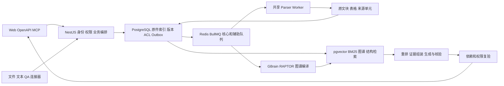

# GBrainKG 知识库架构全面审查与开源产品源码对标

审查日期：2026年10月10日。代码基线：`ad263dd258b9ff7afdcd195224463bcb3356d958`。适用对象：架构、研发、测试及产品负责人。审查覆盖核心业务调用链，不等于逐行安全审计或生产验收。

## 1 结论与优先级

**保留现有 PostgreSQL 混合检索、不可变版本、原文证据及异步编译架构，优先修复版本与连接器的一致性缺口。** 项目已经具备企业知识库的完整主干；相对成熟产品，当前更需要提升同步可信度、关联资源鉴权、图谱身份一致性和效果成本的可验证性，而非增加检索算法或中间件。

本轮确认 **6 项缺陷**：5 项有真实函数或控制器加受控依赖的最小复现，1 项由并发写入调用链确认。尚未修复业务代码。既有测试通过不能排除这些未覆盖的场景。

| 编号 | 优先级 | 缺陷 | 证据强度 |
| --- | --- | --- | --- |
| B01 | P1 | 版本链接口返回不可读相邻文档的标题和 ID | 控制器及服务最小复现 |
| B02 | P1 | 新版尚在解析，旧版已失效；入队失败后仍存在空窗 | 服务最小复现 |
| B03 | P1 | 连接器失去租约后仍可执行旧快照撤销和文档写入 | 源码调用链；待真实并发故障注入 |
| B04 | P1 | 飞书某文件下载失败，中断后续 ACL 同步，却记为成功 | 真实连接器函数最小复现，成功状态由服务调用链确认 |
| B05 | P1 | 图谱节点按名称和类型区分，关系仍按原始名称合并，导致错连或丢边 | 两组纯函数复现 |
| B06 | P2 | 最近同步失败仍显示 fresh | 纯函数复现 |

P1 表示权限、知识正确性或核心可用性问题；P2 表示状态表达和运营可靠性问题。不是漏洞评分，也不表示已观察到生产事故。

本轮 `pnpm test` 通过：API **1647 passed、5 skipped**，Web **86 passed**；解析器 **114 passed、20 subtests passed**。未进行生产操作、真实模型质量评测或完整系统集成。详细边界见第7节。

## 2 审查边界与竞品版本

本轮实际读取六个官方仓库的 **17 个实现文件及6个许可证文件**，固定到下列提交。提交是访问时默认分支快照，**不代表稳定发行版**。选择的是有代表性的知识库和企业搜索产品，并非经市场份额验证的排名；Microsoft GraphRAG 是方法与框架参照。

| 项目 | 固定提交 | 本轮源码重点 |
| --- | --- | --- |
| RAGFlow | `1dc6f3ea638bd3af76a7b2fc48c397f0bdc7fcd8` | Go 入库执行、检索候选与重排、上下文组装 |
| Dify | `f0a0ea807c4260996ead632d5b8080a876673563` | 多库检索、父子分块、数据集访问策略 |
| Onyx | `ab2e6bbe74d968853c67730040123b3b0878a91a` | 用户搜索过滤、候选去重、连接器检查点 |
| WeKnora | `8125ed250f5ea404445e7952359a6ac686d90afc` | 多库授权、模型与存储分组、融合 |
| FastGPT | `d5dfebbfc53d9e61c831760a54ef89ecb6d75da7` | 工作流检索入口、多路召回、重排与结果裁剪 |
| Microsoft GraphRAG | `5faaaf4f5685fa2056fa8c3bf9342cb089f2942f` | 社区全局查询、实体关系抽取 |

每个文件的永久链接和 SHA256 见 [源码清单](validation/2026-10-10/architecture-review/upstream-sources.json)。不以 README 的功能声明代替源码接线，也不据局部代码推断竞品不存在其他实现。

公开源码与纯开源许可需分开理解：RAGFlow 为 Apache 2.0，GraphRAG 为 MIT；WeKnora 的许可证说明主体为 MIT、第三方组件另有条款；Onyx 将 `ee` 目录单独授权；Dify、FastGPT 的许可证包含 Apache 2.0 之外的附加条件。这里借鉴机制，不建议直接搬运实现；准确范围以清单中的固定版本 LICENSE 为准。

Glean、Notion 只作公开产品行为参照，未审查其闭源实现。也未做同语料、同模型、同预算的跨产品实验，因此不提供准确率排名或“已达到 SOTA”的判断。

## 3 当前架构与核心业务流程

### 3.1 责任划分和必须保持的不变量

知识空间分为个人库、组织库和行业库：个人库按所有者隔离，组织库按组织关系确定范围，行业库使用显式授权，再叠加文档 ACL 和生效时间。查询、预览、版本关系和派生知识都必须遵守同一可见范围；系统管理员身份不自动赋予他人个人知识的读取权。

| 不变量 | 当前机制及审查结论 |
| --- | --- |
| 新版本未可用时，原有知识应继续服务 | `DocumentVersionStore` 的同文档发布满足这一方向；另一个跨文档版本链入口破坏它，见 B02 |
| 用户可见范围在分页和 TopK 前收敛 | 常规检索已有 `readableDocumentSql/Where`；关联版本链仍漏裁剪，见 B01 |
| 摘要和图谱不能独立制造事实 | 有来源版本、hash、依赖清单与原文绑定；图关系身份仍有错配，见 B05 |
| 同步成功必须表达完整处理范围 | 有游标、租约、ACL 映射；部分下载失败被吞掉，见 B04、B06 |
| 旧执行者不能覆盖新执行者 | 发布有版本检查；连接器终态有 CAS，但业务写入缺少同一守卫，见 B03 |
| 实例隔离和资源共享同时成立 | 专属数据库及 Redis DB，共享 PostgreSQL、Redis、Parser、MinIO、Nginx；不建议为每实例复制重型服务 |

数据库 RLS 已移除。`withPermissionRead`、`withAdminInventory`、`withSystemWrite` 只是事务入口，不能替代调用方鉴权。权限修复应同步维护 [应用访问边界清单](RLS-BOUNDARIES.md)。

### 3.2 入库和发布

文件、文本、QA、外部连接器最终复用解析和索引流程。解析产物不仅有 Markdown，还包括原始块、来源单元、结构化表格和覆盖信息。版本化模式下，解析结果写入带版本和内容 hash 的文件，暂存 `DocumentVersion/BlockArtifact`；dense 覆盖通过后，在事务中替换 Chunk 与全文索引，切换 activeVersion，再写 Outbox 驱动派生增强。

这一主干值得保留：模型调用在发布事务之外，核心索引与昂贵增强分开，失败任务不应破坏当前可读版本。依据：[解析与暂存](../apps/api/src/ingestion/ingestion.service.ts) L673–701；[原子发布](../apps/api/src/ingestion/document-version-store.ts) L117–168；[核心及辅助增强](../apps/api/src/ingestion/enrichment.processor.ts) L91–117、L284起。

普通文档质量策略是“提取到有效文字即可发布，缺失来源和 OCR 问题附告警”；它并非严格拒绝部分解析。QA 审核有独立规则。不能把 `published` 当作解析完整，也不能擅自把现有可用性策略改为全部阻断。[质量策略](../apps/api/src/ingestion/content-quality.ts) L74–107。

**优化方向：** 在同一文档状态页分别表达解析覆盖、核心索引、派生增强、当前可读版本和待构建版本；让失败来源单元可重试，避免用户重复整份上传。现有来源单元和批次机制已经具备基础，应复用。

### 3.3 检索和回答

主链路包含身份与知识库范围、查询改写、dense/全文/图谱/结构候选、融合重排、证据选择、必要补检、生成、引用核验及当前权限复验。Scope、GBrain、RAPTOR 是增强表示。整答案缓存已经严格限制精确问题，并对私有历史上下文和依赖设置门禁；不能沿用旧报告把近义整答案复用当作现存缺陷。

表格计算和完整目录枚举走专门的确定性路径，避免用 TopK 样本冒充全量。结构化表格执行读取完整事实源；检索预览行只辅助理解结构。依据：[问答编排](../apps/api/src/chat/chat.service.ts) L2038起、L2159–2294；[表格证据服务](../apps/api/src/retrieval/table-evidence.service.ts) L15–92；[缓存](../apps/api/src/chat/semantic-cache.service.ts) L66–110、L138–207。

**评价：** 检索组件已经足够丰富。下一阶段应统一各入口的范围、失败和预算语义，并按题型衡量增强通道的净收益。仓库中的 `parent-document-retriever.ts` 只有辅助定义、未发现业务调用其 `buildParentBundle/expandSiblings`；现有章节和邻块扩展不能据此包装成完整父子检索接线。

### 3.4 证据 权限 缓存和历史

PermissionService 定义知识库范围；DocumentAclService 裁决文档；检索前置谓词保护候选范围；派生工件与历史回答通过 evidence dependency manifest 绑定来源。授权修订快照用于模型输入和输出复验。这样既要避免不可读内容进入模型，也要避免撤权后继续展示历史摘要。

授权机制存在，不等于每个控制器均正确使用。B01 是典型的“入口文档已鉴权、关联对象未鉴权”。应把对象引用本身也视作受保护数据，包括标题、版本、图边和预览地址。依据：[文档裁决](../apps/api/src/permission/document-acl.service.ts)、[授权快照](../apps/api/src/permission/authorization-revision.ts)、[依赖复验](../apps/api/src/permission/evidence-dependencies.ts)。

### 3.5 编译 图谱和知识维护

文档变更经持久化 Outbox 驱动 Source/Scope、图谱和其他增强。图增量编译缓存文档抽取输入，提交时检查版本集合；删除、ACL 变更具有独立事件。方向正确，不必再建一套任务系统。[Outbox](../apps/api/src/brain-compiler/brain-outbox.service.ts) L177–212；[图增量投影](../apps/api/src/graph-rag/incremental-projection.ts) L82起。

节点的名称和类型只是表面身份；同类型同名实体仍可能指不同对象，这一点代码已明确记录。B05 进一步证明，连已有的跨类型区分都没有完整传播到关系层。先修正关系身份，再评估更复杂的消歧，避免引入业务专用同义词表。

### 3.6 同步 对外接口 体验和运维

连接器有 Git、飞书 Drive/Wiki 和持久化 Webhook 队列；运行记录、租约、游标和外部 ACL 映射已实现。OpenAPI/MCP 复用搜索及 `KnowledgeOperationsService`，比每个入口自行实现 CRUD 更合理。近期统一路径的收益应继续扩展到版本链和生命周期入口。

Web 常用问答路径提交 `stream:false`，拿 ChatRun 后轮询；历史页、轮询、引用预览构成同一用户体验。严格输出会延迟用户看见正文，因此“模型首 token”不是用户首段延迟。已有 `render-timing` 和 ChatTiming 应继续复用。[前端问答](../apps/web/src/components/chat/ChatScreen.tsx) L272–314、L394–416；[运行状态](../apps/api/src/chat/chat-run.service.ts) L198–241。

多实例共享底座符合项目目标。容量验证应覆盖混合解析、查询、重编译和模型配额争用，不能从“可部署10个实例”推断10个实例都达到目标吞吐。共享 Parser 的一次升级也影响多个实例，需要用来源工件契约验收兼容性；发布仍须遵守 [AGENTS.md](../AGENTS.md) 的测试及明确书面批准要求。

## 4 开源核心源码对照

### 4.1 RAGFlow 入库恢复和候选预算

本次快照的关键实现是 Go，不能套用旧 Python 路径。[检索服务][r1] L94–205 分离 KNN 候选窗口、重排窗口和返回分页，并透传 KB、文档及过滤条件；搜索后还剔除已删除块。[入库执行器][r2] L306–372 将编译产物与原文分开处理，索引写失败执行补偿，关键持久化步骤成功后才清任务缓存。

**对应决策：** GBrainKG 已有强原子发布，不必替换存储架构；将这一语义覆盖 B02 的第二个版本入口。复用 embedding/解析工件降低重试成本，分别记录原文覆盖与派生产物数。候选窗口与上下文预算分开调参，避免把“返回更多条”当作“检索更深”。

### 4.2 Dify 多库分数兼容和父子分块

[多库检索][d1] L793–845 对索引技术和 embedding 模型兼容性设置约束；不兼容时要求适当的模型重排策略，避免直接加权不可比较的分数。[父子索引][d2] L336–356 保存父子结构，将子块送入向量索引；这是数据建模和查询职责分离，不只是扩大 chunk 长度。

**对应决策：** 保留本项目的模型指纹及重排来源标记；模型切换要验证重建与激活全过程。若父子检索能改善长文，应接入已有结构与原文 block，明确“子块用于召回，父块用于有预算的上下文扩展”，按真实长文金标证明价值后再启用。

### 4.3 Onyx 连接器检查点和用户过滤

[搜索工具][o1] L711–737 构造用户访问过滤，并校验用户指定的 document set；[检索执行][o2] L28–91 传递 filters，按文档和 chunk 标识去重。[检查点][o3] L33起将检查点与索引运行绑定，恢复时校验配置 hash 和时间窗口，避免配置变化后复用不适用的进度。

**对应决策：** 把同步视为持续维护的状态机，记录内容进度、ACL 进度及完整扫描边界；B03 要保护业务副作用，B04 要暴露部分失败。Onyx 官方将连接器用户权限同步标为企业版能力，不能据社区源码中存在过滤函数就认定完整外部权限同步免费可用。[官方连接器说明](https://docs.onyx.app/overview/core_features/connectors)。

### 4.4 WeKnora 多库授权和融合身份

[多库搜索][w1] L173起将可跨租户读取的资源加载与原调用者授权分开；[授权函数][w2]逐库检查权限，授权服务出错不会当作空结果继续。[融合][w3]按原检索列表保留 rank，以 RRF 融合；单独处理 BM25 的无界分数，避免与其他信号直接混算。

**对应决策：** 用户允许范围与执行位置、路由优先级是三种不同概念。复用已有授权范围和 score provenance，避免路由缩库。融合排名仅用于排序，不能解释为答案正确概率；“0.9分”须标清来自 dense、reranker 还是融合。

### 4.5 FastGPT 统一检索出口和显式降级

[检索主流程][f1] L88–172 将多模式召回汇入公共流程，文本重排与视觉候选分开，最终依次去重、阈值过滤和 token 裁剪。[重排实现][f2]失败后保留原候选，并返回 `usingReRank:false`；[工作流入口][f3]接入可读集合解析。

**对应决策：** GBrainKG 不必扩建通用低代码平台，但可借鉴统一出口和可解释的降级状态。复用已有 QueryExecution/Failopen 记录“实际未重排”，不以配置开启代替执行成功。授权失败必须继续终止，不能照搬普通重排故障的降级方式。

### 4.6 Microsoft GraphRAG 全局综述的成本边界

[Global Search][g1] L142–213 对社区上下文批次执行 map，再 reduce，分阶段统计调用和 tokens；并发由 semaphore 限制。[图抽取][g2]包含有上限的追加抽取及是否继续的判断。

**对应决策：** 本项目图谱更适合作为导航和多跳证据辅助；“全库有哪些趋势”需要明确社区或文档覆盖，而“某条规定是什么”优先回原文。不要每题都执行全局综述，也不要把社区数量当作知识覆盖率。按题型比较图谱增加的正确答案数与额外调用成本。

### 4.7 商业产品给出的产品标准

Glean 将内容、身份、权限和活动同步放入同一知识底座，搜索、问答与 Agent 共用；官方同时区分索引、实时读取和混合访问。它提供的产品启示是先让管理员验证同步覆盖和权限，再信任生成回答。[Glean 连接器机制](https://docs.glean.com/connectors/connectors-power-glean)。

Notion 的官方说明将权限同步、查询时访问控制和连接器状态作为企业搜索的一部分，并说明源权限变化存在同步时间窗口。对 GBrainKG 的启示是明确“源系统撤权传播时间”和“本地授权提交后的生效时间”，不能把两者合并为“实时权限”。[Notion 企业搜索安全说明](https://www.notion.com/help/enterprise-search-security-and-privacy-practices)。

**对标落点：** 本项目应优先交付“这份知识是否新鲜、为何可见、引用的是哪一版、失败后如何恢复”的可验证体验。商业产品的界面或宣传不能作为本项目吞吐、准确率和安全性的证明。

## 5 已确认缺陷及修复验收

### B01 版本链未裁剪相邻文档权限

**位置：** [DocumentVersionController](../apps/api/src/ingestion/document-version.controller.ts) L101–105；[VersionChainService](../apps/api/src/ingestion/version-chain.service.ts) L142–150。

入口只对请求文档执行 `assertCanRead`，随后 `listChain` 直接返回两端文档的 ID、title、version、状态和时间。创建时复制 ACL 不能保证日后两端权限相同；文档标题本身也可能敏感。

**最小复现：** 建立 A→B，reader 可读 A、不可读 B，请求 A 的 chain。真实控制器配合 ACL fixture 仍返回 B 的 `restricted-new-title` 和 ID。此证据确认的是关联元数据暴露，不是正文读取成功。

**修复：** 让链读取显式接收用户上下文，复用知识库范围和 DocumentAclService，对关联端逐一裁决后再构造响应。不可读端默认不返回标识和标题；若产品需要“存在其他版本”提示，须另行确定最小可公开语义。

**验收：** 双向链、不同 ACL、撤权、时效失效及历史版本入口均不返回禁止元数据；可读关联仍正常。更新 RLS-BOUNDARIES 的关联读取条目。不能只在前端隐藏标题。

### B02 新版本就绪前关闭旧版本

**位置：** [VersionChainService](../apps/api/src/ingestion/version-chain.service.ts) L84–138；[入口](../apps/api/src/ingestion/document-version.controller.ts) L126–142。

跨文档升版入口在创建 `status=parsing` 的新文档时，立即把旧文档设为 `superseded`，并将原本为空的 `effectiveTo` 设置为当前时间；入队发生在事务提交之后。当前时点检索因旧版时效结束而排除它，新版又尚未发布。队列失败、解析失败或待审核会延长空窗；已有未来 `effectiveTo` 的旧文档则另有重叠语义。传入 `translation` 也没有阻止这一替代动作。

**最小复现：** 令 queue.add 抛错。真实服务调用返回失败后，旧记录已为 `superseded` 且写入 effectiveTo，新记录仍是 `parsing`。同文档 DocumentVersionStore 的原子发布保护不到这个入口。

**修复：** 复用当前发布责任层，把旧版退役与新版激活放在成功发布事务内；新旧关系可先记录为待发布意图。版本任务投递用持久化 outbox 或现有恢复机制确保最终可达。翻译关联是否替代原版应有明确语义，不能无条件等同 supersedes。

**验收：** 新版排队、失败、待审核时旧版保持可用；成功发布只切换一次；重复请求或重试不产生两个 current 版本；定时生效与 translation 有独立用例。

### B03 租约只保护运行记录和游标

**位置：** [ConnectorService](../apps/api/src/connector/connector.service.ts) L299–316、L347–370、L445–458、L466–578。

10月9日修复已加入租约、心跳和终态 CAS，但 `fetchChanges` 返回后，代码先按 snapshotIds 批量撤销文档，之后才检查内存 `lostOwnership`。`ingestChange` 的文档及 ACL 写入也未绑定运行所有权。心跳出错仅记录日志，终态 CAS 无法撤销此前的副作用。

**确定的失败时序：** R1 拉取被阻塞且续租失败→租约过期→R2 回收并完成更新→R1 恢复，旧快照缺少 R2 新增文档→R1 的 snapshot update 将新文档标记为 repealed。即使最终 R1 不能推进游标，错误撤销已提交。此项未执行真实多进程故障注入。

**修复：** 使用现有 run ID/owner 作为写入守卫。在同一事务中锁定并校验仍有效的运行，再执行文档、ACL、快照撤销及其 outbox 写入；回收方与写入方必须遵守同一锁/CAS 协议。仅在写前额外查一次 lease 仍有检查后竞争窗口。外部 HTTP 和文件处理放在事务外。

**验收：** 延迟旧 fetch、心跳故障、过期回收、旧执行恢复后，旧 run 对业务行与事件的提交数必须为0；新版本、ACL 和游标不回退。覆盖“已经进入单条 ingest 后才失主”的情况。

### B04 飞书下载失败使后续权限持续陈旧

**位置：** [FeishuConnector](../apps/api/src/connector/feishu-connector.ts) L185–208；[同步编排](../apps/api/src/connector/connector.service.ts) L316–319、L345–369、L496–500。

现代 ACL 同步模式下，逐文件先读取 ACL，再下载正文。正文失败时，当前文件变为 ACL unavailable，随后直接 `break`；函数仍正常返回全部 snapshotIds，没有部分失败标志。服务将 aclOnly 视为 skipped，失败数保持0，最终记录 success 并清空 lastError。

**最小复现：** 文件 a、b；a 正文下载失败。真实 fetchChanges 只返回 a 的 aclOnly，calls 中没有 b 的权限或正文请求，但 snapshotIds 为 `[a,b]`。若 a 持续失败，每次同步都会阻塞 b；b 的源权限已撤销时，本地旧 ACL 可一直保留。a 自身会被限制访问，不能将这一局部防护误认为整个扫描已安全完成。

**修复：** 把内容更新与权限同步结果分开。正文失败不能阻断后续文档的 ACL 刷新；未能验证权限的对象按已有拒绝策略处理。FetchChangesResult 应能表达未完成范围及失败项，run 标记 partial/failed，仅在完整成功后推进相应检查点和成功时间。

**验收：** 任一位置的下载失败不跳过其他对象的撤权；完整扫描标志真实；错误可重试；一次失败不能被记录成全部成功。保留分页不完整时拒绝把缺失项解释为删除的现有原则。

### B05 图谱关系身份未跟随节点身份

**位置：** [graphProjection](../apps/api/src/graph-rag/incremental-projection.ts) L31–77；[entityIdentityKey](../apps/api/src/graph-rag/graph-identity.ts) L16–19。

节点使用规范化名称和类型作为 key；关系先按原始 sourceName、targetName、relationType 合并，再按首个来源文档解析端点。名称查找表又只保留首次出现的原始拼写。两种可复现错误：

1. A 有 `Mercury/planet → X`，B 有 `Mercury/element → X`，关系类型相同。输出有两个 Mercury 节点，却只有一条 planet 边，携带 A、B 两份 provenance；element 的事实被挂到 planet。
2. A 使用 Alpha，B 使用 alpha，同类型节点被规范化合并。B 的原始关系名查不到节点而被删除，丢失该来源的关系证据。

这与已记录的“同类型同名实体尚未消歧”不同：已有类型隔离本应能区分，却在关系层失效。下游原文核验降低错误回答概率，但不能修复已损坏的导航和图展示。

**修复：** 先在每个来源上下文内解析规范化的端点身份，再以 `(sourceEntityKey,targetEntityKey,relationType)` 合并关系。无法确定类型的端点保留未决状态或跳过并计量，不能用排序第一个节点充当实体裁决。无需引入业务词表或新图数据库。

**验收：** 两组 fixture 分别保留2条正确跨类型边、保留大小写变体的完整来源；来源删除与 ACL 隔离仍准确。同类型同名消歧作为后续独立问题。

### B06 失败后新鲜度仍显示正常

**位置：** [assessConnectorFreshness](../apps/api/src/connector/connector.service.ts) L53–84；失败写入 L398–415。

只要 lastSyncAt 距现在小于阈值，函数直接返回 fresh，不检查 lastError；而失败处理也会把 lastSyncAt 写为当前时间。结果是刚发生的显式同步失败会显示正常，默认要等24小时后才可能成为 last_run_failed。这与 B04 的“错误被吞掉”是不同根因，即使错误已正确记录也会误报。

**最小复现：** 输入 `lastSyncAt=now,lastError='network unavailable'`，实际返回 `stale:false,state:'fresh'`。

**修复：** 将最近尝试时间和最近完整成功时间区分。失败状态优先展示；陈旧程度从成功时间计算。若先做小修，可先按 lastError 展示失败，但不能将失败时间继续解释为知识已更新。新建但从未同步的来源也应显示 never_synced。

**验收：** 刚失败、持续失败、部分失败、从未同步、恢复成功、超过阈值六类状态正确；管理员能看到错误与最新成功时间。

## 6 架构优化及成本控制

下列为设计风险或优化项，不混入已确认缺陷数量。

| 方向 | 已有能力与剩余问题 | 建议及验收指标 |
| --- | --- | --- |
| 生命周期统一 | 同文档不可变版本、跨文档版本链和连接器撤销存在不同写入路径 | 共享发布、退役和事件契约；连接器 tombstone 补齐派生失效事件，避免只靠查询过滤长期留下旧投影；以所有入口同一生命周期矩阵验收 |
| 授权表达统一 | PermissionService、SQL、ORM、嵌套关联各有裁决位置 | 复用现有裁决与谓词，增加同一主体/资源组合的等价测试；不要再加一个竞争的权限服务 |
| 图谱质量 | 名称加类型仍不能识别同类型同名对象 | B05先修；后续用来源身份属性和显式连接判定归并，记录歧义与依据；抽样量化误合并率、多跳完整链召回 |
| 核心与增强分工 | Source、Scope、RAPTOR、社区摘要可能重复消耗模型 | 保留 dense+全文+图谱+reranker 主架构；按问题和证据缺口分配增强预算，配对测量各通道净增益，不凭单次零贡献关闭通道 |
| 解析可解释性 | 覆盖信息与局部重试已存在，但发布不代表完整 | 使用格式金标衡量正文/表格/图像覆盖；回答“全部、总数”时检查完整事实源，展示缺失范围 |
| 热路径成本 | 有 QueryExecution、模型工件缓存、精确答案缓存和共享配额 | 缓存解析/embedding/候选；来源版本、权限、模型指纹必须参与有效性；保留精确答案缓存的上下文隔离，避免恢复近义整答案捷径 |
| 配置组合 | 版本化模式禁止 sparse/MaxSim 组合；仍有非版本化路径 | 在管理界面暴露实际支持矩阵；每种宣称支持的组合设必过检查，不以关闭核心开关的单测代表推荐部署 |
| 运维容量 | 共享服务降低实例成本，也形成争用点 | 用解析+查询+编译混合负载测队列等待、P95/P99、连接池、内存、模型配额；复用 admission 和指标，先测再调并发 |

### 6.1 最有价值的 token 成本优化顺序

1. **先消除错误重试和重复编译。** B02–B04 会制造无效任务、人工重传或重复同步；修复状态机比压缩提示词更可靠。
2. **用已有计量定位成本。** [QueryExecution](../apps/api/src/retrieval/query-execution.ts) 已记录候选贡献、调用及实际用量；按重写、嵌入、重排、生成、核验和后台编译分别归因。未获得 provider usage 的请求标记缺失，不填0。
3. **控制进入模型的有效证据量。** 在授权后去重，保留标题、版本、必要上下文与稳定引用 ID；父上下文和补检只填补明确缺口。保留权限检查和事实核验。
4. **用配对消融确定策略。** 固定语料、模型、预算、缓存冷热和并发，比较基线与单通道、联合通道；同时观察正确率、错误拒答、完整证据链、成本及用户可见延迟。
5. **再简化提示词。** 合并重复约束，按任务追加表格、目录、多跳规则；保留语言、范围、冲突、证据不足和引用契约。用已有金标防止压缩后主体范围泛化或漏关键条件。

每个有效答案的成本应计入失败请求、辅助模型和后台编译摊销：`总成本 = 查询模型成本 + 重试成本 + 编译/索引成本 + 基础设施成本`。不能只报生成模型 token，也不能预先承诺节省百分比。

已有 [配对消融协议](../tests/evaluation/intl-benchmark/ABLATION.md) 包含模型价格、哈希、完整题目集合、失败请求和置信区间。应执行并使用它，而非重复搭建评测框架。

### 6.2 需要单独验证的条件风险

- **同一逻辑实例的多进程轮询：** ChatRun 在数据库续租，同时在持有执行器的进程内设到期计时器；若续租请求长期落到其他进程，旧进程计时器未读取新租约就可能中止任务。[chat-run.service.ts](../apps/api/src/chat/chat-run.service.ts) L92–106。触发还要求任务时长超过租约；当前是否存在该拓扑未验证。不要把数据库隔离的 inst1/inst2 与同库副本混淆。
- **授权修订影响范围：** 全局 AuthorizationState 和全局最早时效边界实现简单、保守，但无关知识变更也可能中止正在进行的回答。[authorization-revision.ts](../apps/api/src/permission/authorization-revision.ts) L23–49。先统计中止率；达到实测瓶颈后再考虑按授权范围细化，不提前增加复杂状态。
- **图谱删除收敛：** 连接器 snapshot/deleted 分支目前主要改 lifecycleStatus/effectiveTo，常规读取会过滤；仍需验证所有派生投影、社区及编译工件是否及时收敛。不能据此直接断言最终答案已泄漏。

## 7 验证结果与证据边界

验证由 `gpt-6-luna` 执行。数据库变量覆盖为 localhost 的审查用占位连接，相关生产连接及模型环境覆盖项取消；没有访问生产或付费模型。

| 命令或验证 | 本轮结果 | 能证明的范围 |
| --- | --- | --- |
| `pnpm test` | 退出0，墙钟46.58秒；Turbo 6任务成功、其中4项缓存 | 根测试编排；缓存构建不等于重新构建 |
| API Jest | 188套件通过、1套件跳过；1647通过、5跳过、0失败 | 主要为 mock 单测；跳过的是 lexical 真实数据库集成套件 |
| Web Node tests | 29套件、86通过、0失败 | 组件和函数测试；本轮未运行浏览器 E2E |
| `pnpm test:parser` | 114通过、20 subtests通过，无失败或跳过；墙钟33.88秒 | 本地解析与受控 HTTP/子进程测试 |
| B01 B02 最小复现 | 真实控制器/服务及受控 DB、queue；均呈现上述错误 | 可确认分支行为；不证明生产事务竞争表现 |
| B04 B05 B06 最小复现 | 真实函数及固定 fixture；均呈现上述错误 | 可重复的控制流、身份和状态错误 |
| B03 | 静态调用链确认未受保护的业务写入 | 待隔离数据库、多进程和故障注入验证 |

原始测试日志在 `/tmp/gbrainkg-review-tests-20261010.log` 和 `/tmp/gbrainkg-review-parser-tests-20261010.log`。持久化摘要及最小复现说明见 [验证证据](validation/2026-10-10/architecture-review/verification-summary.json)。临时目录不是长期日志仓库。

根 API test 脚本显式将 `CORE_AUTH_ENFORCE`、`CORE_VERSIONING_ENABLED`、`CORE_GRAPH_INCREMENTAL_ENABLED` 设为0；部分单测自行覆盖开关，但这不能替代推荐组合的真实库测试。仓库已有 `tests/integration/run-core-checks.py --recommended`，本轮未执行，因为不把常规单测扩展成未配置的数据库集成。

修复后的必要验收应覆盖：推荐三开关组合、真实 PostgreSQL/Redis、正常与故障解析、ACL 在模型输入及输出前撤销、版本切换中的查询、历史/预览/OpenAPI/MCP 一致性，以及连接器旧执行者恢复。真实模型质量、生产尾延迟、OCR/VLM效果、混合负载及备份恢复均仍需独立实测。

## 8 实施顺序和完成条件

| 阶段 | 工作 | 完成条件 |
| --- | --- | --- |
| 第一阶段 权限和同步可信度 | B01、B03、B04；同步修复B06 | 禁止关联元数据不返回；旧run不能写业务行；后续ACL不被单文件故障阻塞；失败可见 |
| 第二阶段 版本和图谱正确性 | B02、B05；统一发布与来源事件契约 | 新版失败旧版可用；关系端点、类型和provenance一致；删除/撤权回归通过 |
| 第三阶段 质量与成本 | 按第6节执行配对消融、解析金标、推荐组合和混合负载 | 有可复查结果和失败样本；质量、误拒答、成本、用户可见时延同时报告 |
| 第四阶段 产品治理 | 统一状态页、同步成功时间、覆盖缺口、版本差异与来源查看 | 管理员能定位并重试失败；用户能理解当前答案的版本、来源与不完整范围 |

本轮已完成源码分析、竞品机制对照、缺陷取证和文档交付；没有修改业务实现或执行部署。后续开发可按本表拆分，生产发布仍需测试环境验收及用户明确书面指令。

[r1]: https://github.com/infiniflow/ragflow/blob/1dc6f3ea638bd3af76a7b2fc48c397f0bdc7fcd8/internal/service/nlp/retrieval.go#L94
[r2]: https://github.com/infiniflow/ragflow/blob/1dc6f3ea638bd3af76a7b2fc48c397f0bdc7fcd8/internal/ingestion/task/pipeline_executor.go#L306
[d1]: https://github.com/langgenius/dify/blob/f0a0ea807c4260996ead632d5b8080a876673563/api/core/rag/retrieval/dataset_retrieval.py#L793
[d2]: https://github.com/langgenius/dify/blob/f0a0ea807c4260996ead632d5b8080a876673563/api/core/rag/index_processor/processor/parent_child_index_processor.py#L336
[o1]: https://github.com/onyx-dot-app/onyx/blob/ab2e6bbe74d968853c67730040123b3b0878a91a/backend/onyx/tools/tool_implementations/search/search_tool.py#L711
[o2]: https://github.com/onyx-dot-app/onyx/blob/ab2e6bbe74d968853c67730040123b3b0878a91a/backend/onyx/context/search/retrieval/search_runner.py#L28
[o3]: https://github.com/onyx-dot-app/onyx/blob/ab2e6bbe74d968853c67730040123b3b0878a91a/backend/onyx/background/indexing/checkpointing_utils.py#L33
[w1]: https://github.com/Tencent/WeKnora/blob/8125ed250f5ea404445e7952359a6ac686d90afc/internal/application/service/knowledgebase_search.go#L173
[w2]: https://github.com/Tencent/WeKnora/blob/8125ed250f5ea404445e7952359a6ac686d90afc/internal/application/access/kb_search.go#L21
[w3]: https://github.com/Tencent/WeKnora/blob/8125ed250f5ea404445e7952359a6ac686d90afc/internal/application/service/knowledgebase_search_fusion.go#L14
[f1]: https://github.com/labring/FastGPT/blob/d5dfebbfc53d9e61c831760a54ef89ecb6d75da7/packages/service/core/dataset/search/defaultRecall/index.ts#L88
[f2]: https://github.com/labring/FastGPT/blob/d5dfebbfc53d9e61c831760a54ef89ecb6d75da7/packages/service/core/dataset/search/defaultRecall/rerank.ts#L55
[f3]: https://github.com/labring/FastGPT/blob/d5dfebbfc53d9e61c831760a54ef89ecb6d75da7/packages/service/core/workflow/dispatch/dataset/search.ts
[g1]: https://github.com/microsoft/graphrag/blob/5faaaf4f5685fa2056fa8c3bf9342cb089f2942f/packages/graphrag/graphrag/query/structured_search/global_search/search.py#L142
[g2]: https://github.com/microsoft/graphrag/blob/5faaaf4f5685fa2056fa8c3bf9342cb089f2942f/packages/graphrag/graphrag/index/operations/extract_graph/graph_extractor.py#L85
